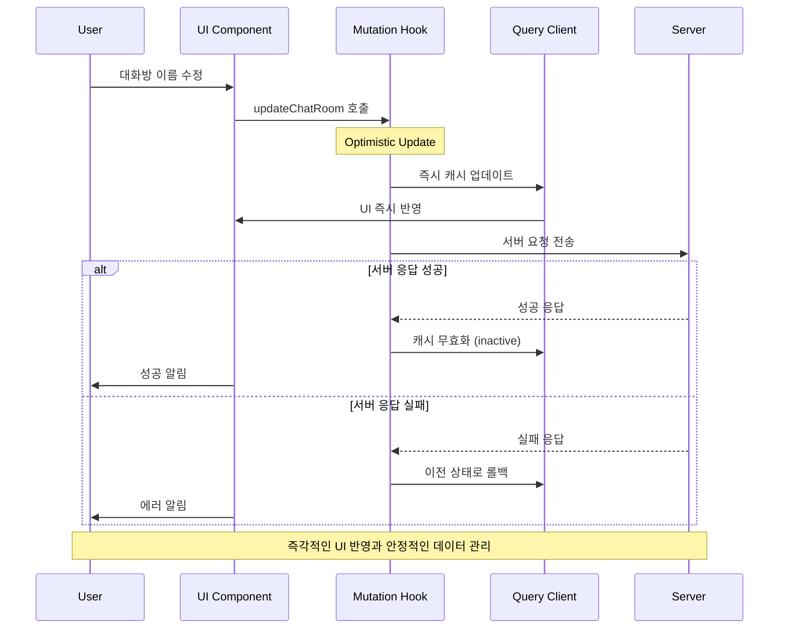

## 개요

AI 캐릭터와의 대화 기록을 효율적으로 관리할 수 있는 대화방 수정/삭제 시스템을 개발했습니다. React Query의 Optimistic Update를 활용하여 즉각적인 UI 반영과 데이터 일관성을 보장했습니다.

## 배경/문제

- **관리 기능 부재**: 누적된 대화방을 정리하거나 이름을 변경할 수 있는 기능이 없어 사용자 불편
- **네트워크 지연 문제**: 서버 응답을 기다리는 동안 사용자가 작업 완료 여부를 확인하기 어려운 상황
- **데이터 손실 위험**: 수정 중 실수로 페이지를 벗어날 경우 변경사항이 손실되는 문제
- **캐시 불일치**: 여러 화면에서 동일한 대화방 정보를 표시할 때 데이터 동기화 이슈

## 목표

1. **즉각적 UI 반영**: 서버 응답 이전에 UI를 먼저 업데이트하여 체감 성능 향상
2. **데이터 일관성 보장**: 여러 캐시 간 데이터 동기화 및 오류 시 자동 롤백
3. **사용자 실수 방지**: 변경사항 손실을 막는 내비게이션 차단 시스템
4. **효율적 캐시 관리**: 필요한 부분만 선택적으로 무효화하여 성능 최적화

## 역할

- **Optimistic Update 시스템 설계**: 서버 응답 이전 UI 선반영 및 실패 시 롤백 로직 구현
- **캐시 무효화 전략 수립**: React Query 기반 효율적인 데이터 동기화 시스템 구축

## 해결과정

### Optimistic Update 기반 즉각적 UI 반영

#### 대화방 수정 시스템

```typescript
// useChatRoomUpdate.ts
import { useMutation, useQueryClient } from "@tanstack/react-query";
import { toast } from "react-hot-toast";

interface ChatRoom {
  id: string;
  name: string;
  characterId: string;
  lastMessage?: string;
  updatedAt: string;
  messageCount: number;
}

interface UpdateChatRoomParams {
  chatRoomId: string;
  name: string;
}

export const useChatRoomUpdate = () => {
  const queryClient = useQueryClient();

  const updateMutation = useMutation({
    mutationFn: async ({ chatRoomId, name }: UpdateChatRoomParams) => {
      const response = await fetch(`/api/chat-rooms/${chatRoomId}`, {
        method: "PATCH",
        headers: {
          "Content-Type": "application/json",
        },
        body: JSON.stringify({ name }),
      });

      if (!response.ok) {
        throw new Error("Failed to update chat room");
      }

      return response.json();
    },
    onMutate: async ({ chatRoomId, name }) => {
      // 진행 중인 쿼리 취소
      await queryClient.cancelQueries({ queryKey: ["chat-rooms"] });

      // 이전 데이터 백업
      const previousChatRooms = queryClient.getQueryData(["chat-rooms"]);

      // Optimistic Update 적용
      queryClient.setQueryData(
        ["chat-rooms"],
        (old: ChatRoom[] | undefined) => {
          if (!old) return old;

          return old.map((room) =>
            room.id === chatRoomId
              ? { ...room, name, updatedAt: new Date().toISOString() }
              : room,
          );
        },
      );

      // 개별 대화방 캐시도 업데이트
      queryClient.setQueryData(
        ["chat-room", chatRoomId],
        (old: ChatRoom | undefined) => {
          if (!old) return old;
          return { ...old, name, updatedAt: new Date().toISOString() };
        },
      );

      return { previousChatRooms };
    },
    onError: (error, variables, context) => {
      // 에러 발생 시 이전 상태로 롤백
      if (context?.previousChatRooms) {
        queryClient.setQueryData(["chat-rooms"], context.previousChatRooms);
      }

      toast.error("대화방 이름 변경에 실패했습니다.");
    },
    onSuccess: (data, variables) => {
      toast.success("대화방 이름이 변경되었습니다.");
    },
    onSettled: () => {
      // 성공/실패 관계없이 캐시 무효화
      queryClient.invalidateQueries({
        queryKey: ["chat-rooms"],
        refetchType: "inactive", // 현재 사용하지 않는 캐시만 재요청
      });
    },
  });

  return {
    updateChatRoom: updateMutation.mutate,
    isUpdating: updateMutation.isPending,
    error: updateMutation.error,
  };
};
```

#### 무한 스크롤 대응 캐시 관리

```typescript
// useInfiniteChatRooms.ts
import { useInfiniteQuery, useQueryClient } from "@tanstack/react-query";

interface InfiniteChatRoomsData {
  pages: ChatRoom[][];
  pageParams: string[];
}

export const useInfiniteChatRooms = () => {
  const queryClient = useQueryClient();

  const infiniteQuery = useInfiniteQuery({
    queryKey: ["chat-rooms", "infinite"],
    queryFn: async ({ pageParam = "" }) => {
      const response = await fetch(
        `/api/chat-rooms?cursor=${pageParam}&limit=20`,
      );
      return response.json();
    },
    getNextPageParam: (lastPage) => lastPage.nextCursor,
    initialPageParam: "",
  });

  const updateChatRoomInInfinite = (
    chatRoomId: string,
    updates: Partial<ChatRoom>,
  ) => {
    queryClient.setQueryData(
      ["chat-rooms", "infinite"],
      (old: InfiniteChatRoomsData | undefined) => {
        if (!old) return old;

        return {
          ...old,
          pages: old.pages.map((page) =>
            page.map((room) =>
              room.id === chatRoomId ? { ...room, ...updates } : room,
            ),
          ),
        };
      },
    );
  };

  const removeChatRoomFromInfinite = (chatRoomId: string) => {
    queryClient.setQueryData(
      ["chat-rooms", "infinite"],
      (old: InfiniteChatRoomsData | undefined) => {
        if (!old) return old;

        return {
          ...old,
          pages: old.pages
            .map((page) => page.filter((room) => room.id !== chatRoomId))
            .filter((page) => page.length > 0), // 빈 페이지 제거
        };
      },
    );
  };

  return {
    ...infiniteQuery,
    updateChatRoomInInfinite,
    removeChatRoomFromInfinite,
  };
};
```

### 벌크 삭제 및 데이터 정리

#### 다중 대화방 삭제 시스템

```typescript
// useChatRoomBulkDelete.ts
import { useMutation, useQueryClient } from "@tanstack/react-query";

interface BulkDeleteParams {
  chatRoomIds: string[];
}

export const useChatRoomBulkDelete = () => {
  const queryClient = useQueryClient();

  const bulkDeleteMutation = useMutation({
    mutationFn: async ({ chatRoomIds }: BulkDeleteParams) => {
      const response = await fetch("/api/chat-rooms/bulk-delete", {
        method: "DELETE",
        headers: {
          "Content-Type": "application/json",
        },
        body: JSON.stringify({ chatRoomIds }),
      });

      if (!response.ok) {
        throw new Error("Failed to delete chat rooms");
      }

      return response.json();
    },
    onMutate: async ({ chatRoomIds }) => {
      // 진행 중인 쿼리 취소
      await queryClient.cancelQueries({ queryKey: ["chat-rooms"] });

      // 이전 데이터 백업
      const previousChatRooms = queryClient.getQueryData(["chat-rooms"]);
      const previousInfiniteChatRooms = queryClient.getQueryData([
        "chat-rooms",
        "infinite",
      ]);

      // Optimistic Update: 삭제할 대화방들을 즉시 제거
      queryClient.setQueryData(
        ["chat-rooms"],
        (old: ChatRoom[] | undefined) => {
          if (!old) return old;
          return old.filter((room) => !chatRoomIds.includes(room.id));
        },
      );

      // 무한 스크롤 캐시에서도 제거
      queryClient.setQueryData(
        ["chat-rooms", "infinite"],
        (old: InfiniteChatRoomsData | undefined) => {
          if (!old) return old;

          return {
            ...old,
            pages: old.pages
              .map((page) =>
                page.filter((room) => !chatRoomIds.includes(room.id)),
              )
              .filter((page) => page.length > 0),
          };
        },
      );

      // 개별 대화방 캐시들 제거
      chatRoomIds.forEach((chatRoomId) => {
        queryClient.removeQueries({ queryKey: ["chat-room", chatRoomId] });
        queryClient.removeQueries({ queryKey: ["chat-messages", chatRoomId] });
      });

      return { previousChatRooms, previousInfiniteChatRooms };
    },
    onError: (error, variables, context) => {
      // 에러 발생 시 이전 상태로 롤백
      if (context?.previousChatRooms) {
        queryClient.setQueryData(["chat-rooms"], context.previousChatRooms);
      }
      if (context?.previousInfiniteChatRooms) {
        queryClient.setQueryData(
          ["chat-rooms", "infinite"],
          context.previousInfiniteChatRooms,
        );
      }

      toast.error("대화방 삭제에 실패했습니다.");
    },
    onSuccess: (data, variables) => {
      toast.success(
        `${variables.chatRoomIds.length}개의 대화방이 삭제되었습니다.`,
      );
    },
    onSettled: () => {
      // 관련 캐시들 무효화
      queryClient.invalidateQueries({
        queryKey: ["chat-rooms"],
        refetchType: "inactive",
      });
      queryClient.invalidateQueries({
        queryKey: ["recent-chats"],
        refetchType: "inactive",
      });
    },
  });

  return {
    bulkDeleteChatRooms: bulkDeleteMutation.mutate,
    isDeleting: bulkDeleteMutation.isPending,
    error: bulkDeleteMutation.error,
  };
};
```

### 내비게이션 차단 시스템

#### 변경사항 감지 및 경고

```typescript
// useNavigationGuard.ts
import { useEffect, useRef } from "react";
import { useLocation, useNavigate } from "react-router-dom";

interface NavigationGuardOptions {
  hasUnsavedChanges: boolean;
  message?: string;
}

export const useNavigationGuard = ({
  hasUnsavedChanges,
  message = "저장되지 않은 변경사항이 있습니다. 정말 나가시겠습니까?",
}: NavigationGuardOptions) => {
  const location = useLocation();
  const navigate = useNavigate();
  const hasUnsavedChangesRef = useRef(hasUnsavedChanges);

  useEffect(() => {
    hasUnsavedChangesRef.current = hasUnsavedChanges;
  }, [hasUnsavedChanges]);

  useEffect(() => {
    const handleBeforeUnload = (event: BeforeUnloadEvent) => {
      if (hasUnsavedChangesRef.current) {
        event.preventDefault();
        event.returnValue = message;
        return message;
      }
    };

    const handlePopState = (event: PopStateEvent) => {
      if (hasUnsavedChangesRef.current) {
        const confirmed = window.confirm(message);
        if (!confirmed) {
          event.preventDefault();
          // 현재 상태를 다시 푸시하여 뒤로가기 취소
          window.history.pushState(null, "", location.pathname);
        }
      }
    };

    window.addEventListener("beforeunload", handleBeforeUnload);
    window.addEventListener("popstate", handlePopState);

    return () => {
      window.removeEventListener("beforeunload", handleBeforeUnload);
      window.removeEventListener("popstate", handlePopState);
    };
  }, [message, location.pathname]);

  const navigateWithGuard = (to: string) => {
    if (hasUnsavedChangesRef.current) {
      const confirmed = window.confirm(message);
      if (confirmed) {
        navigate(to);
      }
    } else {
      navigate(to);
    }
  };

  return { navigateWithGuard };
};
```

### 대화방 수정 컴포넌트

#### 편집 가능한 대화방 이름

```typescript
// EditableChatRoomName.tsx
import React, { useState, useRef, useEffect } from 'react';
import { useChatRoomUpdate } from './useChatRoomUpdate';
import { useNavigationGuard } from './useNavigationGuard';

interface EditableChatRoomNameProps {
  chatRoom: ChatRoom;
  onSave?: () => void;
  onCancel?: () => void;
}

export const EditableChatRoomName: React.FC<EditableChatRoomNameProps> = ({
  chatRoom,
  onSave,
  onCancel,
}) => {
  const [isEditing, setIsEditing] = useState(false);
  const [editName, setEditName] = useState(chatRoom.name);
  const [hasUnsavedChanges, setHasUnsavedChanges] = useState(false);

  const inputRef = useRef<HTMLInputElement>(null);
  const { updateChatRoom, isUpdating } = useChatRoomUpdate();

  useNavigationGuard({ hasUnsavedChanges });

  useEffect(() => {
    if (isEditing && inputRef.current) {
      inputRef.current.focus();
      inputRef.current.select();
    }
  }, [isEditing]);

  const handleStartEdit = () => {
    setIsEditing(true);
    setEditName(chatRoom.name);
    setHasUnsavedChanges(false);
  };

  const handleSave = () => {
    if (editName.trim() && editName !== chatRoom.name) {
      updateChatRoom(
        { chatRoomId: chatRoom.id, name: editName.trim() },
        {
          onSuccess: () => {
            setIsEditing(false);
            setHasUnsavedChanges(false);
            onSave?.();
          },
          onError: () => {
            setEditName(chatRoom.name);
          },
        }
      );
    } else {
      handleCancel();
    }
  };

  const handleCancel = () => {
    setIsEditing(false);
    setEditName(chatRoom.name);
    setHasUnsavedChanges(false);
    onCancel?.();
  };

  const handleKeyDown = (e: React.KeyboardEvent) => {
    if (e.key === 'Enter') {
      handleSave();
    } else if (e.key === 'Escape') {
      handleCancel();
    }
  };

  const handleChange = (e: React.ChangeEvent<HTMLInputElement>) => {
    setEditName(e.target.value);
    setHasUnsavedChanges(e.target.value !== chatRoom.name);
  };

  if (isEditing) {
    return (
      <div className="editable-name-container">
        <input
          ref={inputRef}
          type="text"
          value={editName}
          onChange={handleChange}
          onKeyDown={handleKeyDown}
          onBlur={handleSave}
          disabled={isUpdating}
          className="editable-name-input"
          placeholder="대화방 이름을 입력하세요"
        />
        {isUpdating && (
          <div className="saving-indicator">
            <div className="spinner" />
            <span>저장 중...</span>
          </div>
        )}
      </div>
    );
  }

  return (
    <div className="chat-room-name" onClick={handleStartEdit}>
      <span className="name-text">{chatRoom.name}</span>
      <button className="edit-button" type="button">
        ✏️
      </button>
    </div>
  );
};
```

### 체계적인 캐시 무효화 전략

#### 캐시 무효화 매니저

```typescript
// CacheInvalidationManager.ts
import { QueryClient } from "@tanstack/react-query";

export class CacheInvalidationManager {
  constructor(private queryClient: QueryClient) {}

  invalidateChatRoomRelatedCaches(chatRoomId: string) {
    // 관련된 모든 캐시 무효화
    const queriesToInvalidate = [
      ["chat-rooms"],
      ["chat-rooms", "infinite"],
      ["recent-chats"],
      ["chat-room", chatRoomId],
      ["chat-messages", chatRoomId],
    ];

    queriesToInvalidate.forEach((queryKey) => {
      this.queryClient.invalidateQueries({
        queryKey,
        refetchType: "inactive", // 현재 사용하지 않는 캐시만 재요청
      });
    });
  }

  invalidateBulkChatRoomCaches(chatRoomIds: string[]) {
    // 벌크 삭제 시 관련 캐시들 무효화
    this.queryClient.invalidateQueries({
      queryKey: ["chat-rooms"],
      refetchType: "inactive",
    });

    this.queryClient.invalidateQueries({
      queryKey: ["recent-chats"],
      refetchType: "inactive",
    });

    // 개별 대화방 캐시들 제거
    chatRoomIds.forEach((chatRoomId) => {
      this.queryClient.removeQueries({
        queryKey: ["chat-room", chatRoomId],
      });
      this.queryClient.removeQueries({
        queryKey: ["chat-messages", chatRoomId],
      });
    });
  }

  updateChatRoomInAllCaches(chatRoomId: string, updates: Partial<ChatRoom>) {
    // 모든 관련 캐시에서 대화방 정보 업데이트
    const cacheKeys = [
      ["chat-rooms"],
      ["chat-rooms", "infinite"],
      ["recent-chats"],
      ["chat-room", chatRoomId],
    ];

    cacheKeys.forEach((queryKey) => {
      this.queryClient.setQueryData(queryKey, (old: any) => {
        if (!old) return old;

        if (Array.isArray(old)) {
          return old.map((item: any) =>
            item.id === chatRoomId ? { ...item, ...updates } : item,
          );
        }

        if (old.pages) {
          // 무한 스크롤 데이터 구조
          return {
            ...old,
            pages: old.pages.map((page: any[]) =>
              page.map((item: any) =>
                item.id === chatRoomId ? { ...item, ...updates } : item,
              ),
            ),
          };
        }

        if (old.id === chatRoomId) {
          return { ...old, ...updates };
        }

        return old;
      });
    });
  }
}
```

## 시스템 아키텍처



## 주요 기능

### 1. Optimistic Update

- **즉각적 UI 반영**: 서버 응답 이전에 UI를 먼저 업데이트
- **자동 롤백**: 서버 요청 실패 시 이전 상태로 자동 복구
- **무한 스크롤 대응**: 페이지별로 분할된 데이터 구조에서 정확한 아이템 찾기

### 2. 체계적인 캐시 관리

- **선택적 무효화**: `refetchType: 'inactive'`로 현재 사용하지 않는 캐시만 재요청
- **다중 캐시 동기화**: 무한 스크롤 목록, 최근 대화 목록, 개별 대화방 상세 정보 동시 관리
- **벌크 처리**: 여러 대화방을 한 번의 API 호출로 삭제

### 3. 사용자 경험 보호

- **내비게이션 차단**: 변경사항 손실을 막는 경고 시스템
- **실시간 피드백**: 저장 중 상태 표시 및 진행률 안내
- **에러 복구**: 네트워크 오류 시 자동 롤백 및 사용자 안내

### 4. 성능 최적화

- **불필요한 API 호출 감소**: 선택적 캐시 무효화로 네트워크 효율성 향상
- **메모리 관리**: 삭제된 대화방의 관련 캐시 자동 정리
- **배치 처리**: 여러 작업을 하나의 트랜잭션으로 처리

## 결과

- **체감 성능 향상**: Optimistic Update로 사용자가 느끼는 응답 속도가 즉시 반영 수준으로 개선되었습니다
- **데이터 일관성 확보**: 여러 화면 간 대화방 정보가 항상 동기화되어 사용자 혼란이 해소되었습니다
- **네트워크 효율성**: 선택적 캐시 무효화로 불필요한 API 호출이 대폭 감소했습니다
- **사용자 실수 방지**: 내비게이션 차단 시스템으로 변경사항 손실 위험을 최소화했습니다

## 기술 스택

- **State Management**: React Query (TanStack Query)
- **Optimistic Updates**: useMutation with onMutate
- **Cache Management**: QueryClient, invalidateQueries
- **Navigation Guard**: beforeunload, popstate events
- **UI/UX**: Real-time feedback, Loading states, Error handling
- **Performance**: Selective cache invalidation, Batch operations
