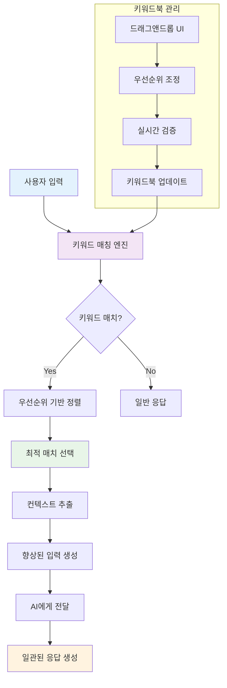

## 개요

AI 캐릭터가 대화 중 특정 키워드를 인식했을 때 미리 정의된 배경 정보나 설정을 자동으로 불러와 더욱 일관성 있고 풍부한 대화를 제공하는 키워드북 시스템을 개발했습니다.

**키워드북이란?** AI 캐릭터의 기억 보조 장치 역할을 합니다.

## 배경/문제

- **AI 캐릭터의 일관성 부족**: 긴 대화에서 캐릭터가 이전에 언급된 설정이나 배경을 잊어버리는 문제
- **맥락 정보 손실**: 대화가 길어질수록 초기에 설정한 캐릭터의 세부 정보가 희석되는 현상
- **사용자 경험 저하**: 캐릭터가 일관되지 않은 반응을 보여 몰입도가 떨어지는 문제
- **수동 관리의 한계**: 개발자나 사용자가 매번 수동으로 맥락을 제공해야 하는 번거로움

## 목표

1. **자동 맥락 제공**: 특정 키워드 언급 시 관련 배경 정보를 자동으로 AI에게 전달
2. **우선순위 기반 적용**: 여러 키워드가 동시에 언급될 때 가장 적절한 키워드북을 선택
3. **직관적인 관리**: 드래그앤드롭으로 키워드북 우선순위를 쉽게 조정

## 역할

- **DND 인터페이스 개발**: 사용자가 키워드북 우선순위를 직관적으로 관리할 수 있는 UI 구축

## 해결과정

### 입력에 대한 실시간 검증

#### 키워드북 관리 시스템

```typescript
// KeywordBookManager.ts
interface KeywordBook {
  id: string;
  name: string;
  keywords: string[];
  context: string;
  priority: number;
  isActive: boolean;
}

interface ValidationRules {
  maxKeywordBooks: number;
  maxKeywordsPerBook: number;
  requiredFields: string[];
  forbiddenWords: string[];
}

export class KeywordBookManager {
  private static readonly VALIDATION_RULES: ValidationRules = {
    maxKeywordBooks: 20,
    maxKeywordsPerBook: 10,
    requiredFields: ["name", "keywords", "context"],
    forbiddenWords: ["spam", "abuse", "inappropriate"],
  };

  static validateKeywordBook(book: Partial<KeywordBook>): ValidationResult {
    const errors: string[] = [];
    const warnings: string[] = [];

    // 필수 필드 검증
    for (const field of this.VALIDATION_RULES.requiredFields) {
      if (!book[field as keyof KeywordBook]) {
        errors.push(`${field}는 필수 입력 항목입니다.`);
      }
    }

    // 키워드 개수 제한
    if (
      book.keywords &&
      book.keywords.length > this.VALIDATION_RULES.maxKeywordsPerBook
    ) {
      errors.push(
        `키워드는 최대 ${this.VALIDATION_RULES.maxKeywordsPerBook}개까지 설정할 수 있습니다.`,
      );
    }

    // 금지어 검열
    if (book.keywords) {
      const forbiddenFound = book.keywords.filter((keyword) =>
        this.VALIDATION_RULES.forbiddenWords.some((forbidden) =>
          keyword.toLowerCase().includes(forbidden.toLowerCase()),
        ),
      );

      if (forbiddenFound.length > 0) {
        errors.push(
          `다음 키워드는 사용할 수 없습니다: ${forbiddenFound.join(", ")}`,
        );
      }
    }

    // 컨텍스트 길이 검증
    if (book.context && book.context.length > 1000) {
      warnings.push("컨텍스트가 너무 길면 AI가 처리하기 어려울 수 있습니다.");
    }

    return {
      isValid: errors.length === 0,
      errors,
      warnings,
    };
  }

  static validateKeywordBooks(books: KeywordBook[]): ValidationResult {
    const errors: string[] = [];
    const warnings: string[] = [];

    // 전체 키워드북 개수 제한
    if (books.length > this.VALIDATION_RULES.maxKeywordBooks) {
      errors.push(
        `키워드북은 최대 ${this.VALIDATION_RULES.maxKeywordBooks}개까지 생성할 수 있습니다.`,
      );
    }

    // 중복 키워드 검사
    const allKeywords = books.flatMap((book) => book.keywords);
    const duplicateKeywords = allKeywords.filter(
      (keyword, index) => allKeywords.indexOf(keyword) !== index,
    );

    if (duplicateKeywords.length > 0) {
      warnings.push(
        `중복된 키워드가 있습니다: ${[...new Set(duplicateKeywords)].join(", ")}`,
      );
    }

    return {
      isValid: errors.length === 0,
      errors,
      warnings,
    };
  }
}
```

#### 실시간 검증 훅

```typescript
// useKeywordBookValidation.ts
import { useState, useEffect, useCallback } from "react";
import { KeywordBookManager } from "./KeywordBookManager";

export const useKeywordBookValidation = () => {
  const [validationState, setValidationState] = useState<{
    errors: string[];
    warnings: string[];
    isValid: boolean;
  }>({
    errors: [],
    warnings: [],
    isValid: true,
  });

  const validateKeywordBook = useCallback((book: Partial<KeywordBook>) => {
    const result = KeywordBookManager.validateKeywordBook(book);
    setValidationState({
      errors: result.errors,
      warnings: result.warnings,
      isValid: result.isValid,
    });
    return result;
  }, []);

  const validateKeywordBooks = useCallback((books: KeywordBook[]) => {
    const result = KeywordBookManager.validateKeywordBooks(books);
    setValidationState({
      errors: result.errors,
      warnings: result.warnings,
      isValid: result.isValid,
    });
    return result;
  }, []);

  const clearValidation = useCallback(() => {
    setValidationState({
      errors: [],
      warnings: [],
      isValid: true,
    });
  }, []);

  return {
    ...validationState,
    validateKeywordBook,
    validateKeywordBooks,
    clearValidation,
  };
};
```

### Atlaskit 기반 드래그앤드롭 시스템

#### 키워드북 우선순위 관리

```typescript
// KeywordBookDragDrop.tsx
import React, { useState, useCallback } from 'react';
import { DragDropContext, Droppable, Draggable } from '@atlaskit/drag-and-drop';
import { useKeywordBookValidation } from './useKeywordBookValidation';

interface KeywordBookDragDropProps {
  keywordBooks: KeywordBook[];
  onReorder: (reorderedBooks: KeywordBook[]) => void;
  onUpdate: (book: KeywordBook) => void;
  onDelete: (bookId: string) => void;
}

export const KeywordBookDragDrop: React.FC<KeywordBookDragDropProps> = ({
  keywordBooks,
  onReorder,
  onUpdate,
  onDelete,
}) => {
  const { validateKeywordBooks } = useKeywordBookValidation();
  const [draggedItem, setDraggedItem] = useState<string | null>(null);

  const handleDragStart = useCallback((result: any) => {
    setDraggedItem(result.draggableId);
  }, []);

  const handleDragEnd = useCallback((result: any) => {
    setDraggedItem(null);

    if (!result.destination) {
      return;
    }

    const sourceIndex = result.source.index;
    const destinationIndex = result.destination.index;

    if (sourceIndex === destinationIndex) {
      return;
    }

    // 우선순위 재정렬
    const reorderedBooks = Array.from(keywordBooks);
    const [removed] = reorderedBooks.splice(sourceIndex, 1);
    reorderedBooks.splice(destinationIndex, 0, removed);

    // 우선순위 업데이트
    const updatedBooks = reorderedBooks.map((book, index) => ({
      ...book,
      priority: index + 1,
    }));

    // 검증 후 적용
    const validation = validateKeywordBooks(updatedBooks);
    if (validation.isValid) {
      onReorder(updatedBooks);
    }
  }, [keywordBooks, onReorder, validateKeywordBooks]);

  return (
    <div className="keyword-book-drag-drop">
      <DragDropContext
        onDragStart={handleDragStart}
        onDragEnd={handleDragEnd}
      >
        <Droppable droppableId="keyword-books">
          {(provided, snapshot) => (
            <div
              ref={provided.innerRef}
              {...provided.droppableProps}
              className={`droppable-area ${snapshot.isDraggingOver ? 'dragging-over' : ''}`}
            >
              {keywordBooks.map((book, index) => (
                <Draggable
                  key={book.id}
                  draggableId={book.id}
                  index={index}
                >
                  {(provided, snapshot) => (
                    <div
                      ref={provided.innerRef}
                      {...provided.draggableProps}
                      {...provided.dragHandleProps}
                      className={`keyword-book-item ${
                        snapshot.isDragging ? 'dragging' : ''
                      } ${
                        draggedItem === book.id ? 'dragged' : ''
                      }`}
                      style={{
                        ...provided.draggableProps.style,
                        opacity: snapshot.isDragging ? 0.8 : 1,
                        transform: snapshot.isDragging
                          ? `${provided.draggableProps.style?.transform} rotate(5deg)`
                          : provided.draggableProps.style?.transform,
                      }}
                    >
                      <KeywordBookCard
                        book={book}
                        onUpdate={onUpdate}
                        onDelete={onDelete}
                        isDragging={snapshot.isDragging}
                      />
                    </div>
                  )}
                </Draggable>
              ))}
              {provided.placeholder}
            </div>
          )}
        </Droppable>
      </DragDropContext>
    </div>
  );
};
```

#### 키워드북 카드 컴포넌트

```typescript
// KeywordBookCard.tsx
import React, { useState } from 'react';
import { useKeywordBookValidation } from './useKeywordBookValidation';

interface KeywordBookCardProps {
  book: KeywordBook;
  onUpdate: (book: KeywordBook) => void;
  onDelete: (bookId: string) => void;
  isDragging: boolean;
}

export const KeywordBookCard: React.FC<KeywordBookCardProps> = ({
  book,
  onUpdate,
  onDelete,
  isDragging,
}) => {
  const [isEditing, setIsEditing] = useState(false);
  const [editData, setEditData] = useState(book);
  const { validateKeywordBook, errors, warnings, isValid } = useKeywordBookValidation();

  const handleSave = () => {
    const validation = validateKeywordBook(editData);
    if (validation.isValid) {
      onUpdate(editData);
      setIsEditing(false);
    }
  };

  const handleCancel = () => {
    setEditData(book);
    setIsEditing(false);
  };

  const handleKeywordChange = (keywords: string) => {
    const keywordArray = keywords.split(',').map(k => k.trim()).filter(k => k);
    setEditData(prev => ({ ...prev, keywords: keywordArray }));
  };

  return (
    <div className={`keyword-book-card ${isDragging ? 'dragging' : ''}`}>
      <div className="card-header">
        <div className="priority-indicator">
          우선순위 {book.priority}
        </div>
        <div className="card-actions">
          {isEditing ? (
            <>
              <button
                onClick={handleSave}
                disabled={!isValid}
                className="save-button"
              >
                저장
              </button>
              <button
                onClick={handleCancel}
                className="cancel-button"
              >
                취소
              </button>
            </>
          ) : (
            <>
              <button
                onClick={() => setIsEditing(true)}
                className="edit-button"
              >
                편집
              </button>
              <button
                onClick={() => onDelete(book.id)}
                className="delete-button"
              >
                삭제
              </button>
            </>
          )}
        </div>
      </div>

      <div className="card-content">
        {isEditing ? (
          <div className="edit-form">
            <div className="form-group">
              <label>이름</label>
              <input
                type="text"
                value={editData.name}
                onChange={(e) => setEditData(prev => ({ ...prev, name: e.target.value }))}
                placeholder="키워드북 이름을 입력하세요"
              />
            </div>

            <div className="form-group">
              <label>키워드 (쉼표로 구분)</label>
              <input
                type="text"
                value={editData.keywords.join(', ')}
                onChange={(e) => handleKeywordChange(e.target.value)}
                placeholder="키워드1, 키워드2, 키워드3"
              />
            </div>

            <div className="form-group">
              <label>컨텍스트</label>
              <textarea
                value={editData.context}
                onChange={(e) => setEditData(prev => ({ ...prev, context: e.target.value }))}
                placeholder="이 키워드가 언급될 때 AI에게 전달할 배경 정보를 입력하세요"
                rows={4}
              />
            </div>

            {errors.length > 0 && (
              <div className="validation-errors">
                {errors.map((error, index) => (
                  <div key={index} className="error-message">
                    {error}
                  </div>
                ))}
              </div>
            )}

            {warnings.length > 0 && (
              <div className="validation-warnings">
                {warnings.map((warning, index) => (
                  <div key={index} className="warning-message">
                    {warning}
                  </div>
                ))}
              </div>
            )}
          </div>
        ) : (
          <div className="view-mode">
            <h3 className="book-name">{book.name}</h3>
            <div className="keywords">
              {book.keywords.map((keyword, index) => (
                <span key={index} className="keyword-tag">
                  {keyword}
                </span>
              ))}
            </div>
            <div className="context-preview">
              {book.context.length > 100
                ? `${book.context.substring(0, 100)}...`
                : book.context}
            </div>
          </div>
        )}
      </div>

      <div className="card-footer">
        <div className="status-indicator">
          <span className={`status ${book.isActive ? 'active' : 'inactive'}`}>
            {book.isActive ? '활성' : '비활성'}
          </span>
        </div>
      </div>
    </div>
  );
};
```

### 키워드 인식 및 맥락 제공 시스템

#### 키워드 매칭 엔진

```typescript
// KeywordMatchingEngine.ts
export class KeywordMatchingEngine {
  private keywordBooks: KeywordBook[] = [];

  constructor(keywordBooks: KeywordBook[]) {
    this.keywordBooks = keywordBooks.sort((a, b) => a.priority - b.priority);
  }

  findMatchingKeywords(userInput: string): KeywordMatch[] {
    const matches: KeywordMatch[] = [];
    const inputLower = userInput.toLowerCase();

    for (const book of this.keywordBooks) {
      if (!book.isActive) continue;

      const matchedKeywords = book.keywords.filter((keyword) =>
        inputLower.includes(keyword.toLowerCase()),
      );

      if (matchedKeywords.length > 0) {
        matches.push({
          bookId: book.id,
          bookName: book.name,
          matchedKeywords,
          context: book.context,
          priority: book.priority,
          confidence: this.calculateConfidence(matchedKeywords, book.keywords),
        });
      }
    }

    // 우선순위와 신뢰도에 따라 정렬
    return matches.sort((a, b) => {
      if (a.priority !== b.priority) {
        return a.priority - b.priority;
      }
      return b.confidence - a.confidence;
    });
  }

  private calculateConfidence(
    matchedKeywords: string[],
    totalKeywords: string[],
  ): number {
    return (matchedKeywords.length / totalKeywords.length) * 100;
  }

  getBestMatch(userInput: string): KeywordMatch | null {
    const matches = this.findMatchingKeywords(userInput);
    return matches.length > 0 ? matches[0] : null;
  }

  getAllMatches(userInput: string): KeywordMatch[] {
    return this.findMatchingKeywords(userInput);
  }
}
```

#### AI 컨텍스트 제공 시스템

```typescript
// AIContextProvider.ts
export class AIContextProvider {
  private matchingEngine: KeywordMatchingEngine;

  constructor(keywordBooks: KeywordBook[]) {
    this.matchingEngine = new KeywordMatchingEngine(keywordBooks);
  }

  enhanceUserInput(userInput: string): EnhancedInput {
    const matches = this.matchingEngine.getAllMatches(userInput);

    if (matches.length === 0) {
      return {
        originalInput: userInput,
        enhancedInput: userInput,
        context: null,
        matchedKeywords: [],
      };
    }

    // 가장 우선순위가 높은 매치 선택
    const bestMatch = matches[0];

    // 컨텍스트가 포함된 향상된 입력 생성
    const enhancedInput = this.buildEnhancedInput(userInput, bestMatch);

    return {
      originalInput: userInput,
      enhancedInput,
      context: bestMatch.context,
      matchedKeywords: bestMatch.matchedKeywords,
      allMatches: matches,
    };
  }

  private buildEnhancedInput(userInput: string, match: KeywordMatch): string {
    const contextPrefix = `[컨텍스트: ${match.context}]`;
    return `${contextPrefix}\n\n${userInput}`;
  }

  updateKeywordBooks(keywordBooks: KeywordBook[]): void {
    this.matchingEngine = new KeywordMatchingEngine(keywordBooks);
  }
}
```

## 시스템 아키텍처



## 주요 기능

### 1. 자동 맥락 제공

- **키워드 인식**: 사용자 입력에서 미리 정의된 키워드 자동 감지
- **우선순위 기반 선택**: 여러 키워드 매치 시 우선순위가 높은 키워드북 선택
- **컨텍스트 자동 주입**: AI에게 관련 배경 정보 자동 전달

### 2. 직관적인 관리 인터페이스

- **드래그앤드롭**: Atlaskit 기반 직관적인 우선순위 조정
- **시각적 가이드**: 드래그 중 삽입 위치 실시간 표시
- **자동 스크롤**: 긴 목록에서 드래그 시 자동 스크롤 지원
- **투명도 조절**: 드래그 상태 시각적 피드백

### 3. 실시간 검증 시스템

- **키워드 개수 제한**: 최대 키워드 수 제한으로 성능 보장
- **필수 필드 검증**: 이름, 키워드, 컨텍스트 필수 입력 확인
- **실시간 단어 검열**: 부적절한 키워드 실시간 차단
- **중복 키워드 감지**: 여러 키워드북 간 중복 키워드 경고

### 4. 성능 최적화

- **우선순위 정렬**: 키워드북을 우선순위별로 미리 정렬
- **빠른 매칭**: 효율적인 키워드 매칭 알고리즘
- **캐시 관리**: 자주 사용되는 키워드북 캐시 관리

## 결과

- **캐릭터 일관성 확보**: 키워드 기반 맥락 제공으로 AI가 설정을 유지하며 대화하게 되었습니다
- **사용자 경험 향상**: 더욱 풍부하고 일관된 대화로 사용자 만족도가 크게 개선되었습니다
- **관리 효율성 증대**: 드래그앤드롭 인터페이스로 쉽게 우선순위를 조정할 수 있게 되었습니다
- **개발 생산성 향상**: 수동 맥락 관리에서 자동화된 시스템으로 전환하여 개발 효율성 증대

## 기술 스택

- **Frontend**: React, TypeScript
- **Drag & Drop**: Atlaskit Drag and Drop
- **State Management**: React Hooks, Context API
- **Validation**: Custom Validation System
- **AI Integration**: Context Enhancement System
- **Performance**: Optimized Matching Algorithm
