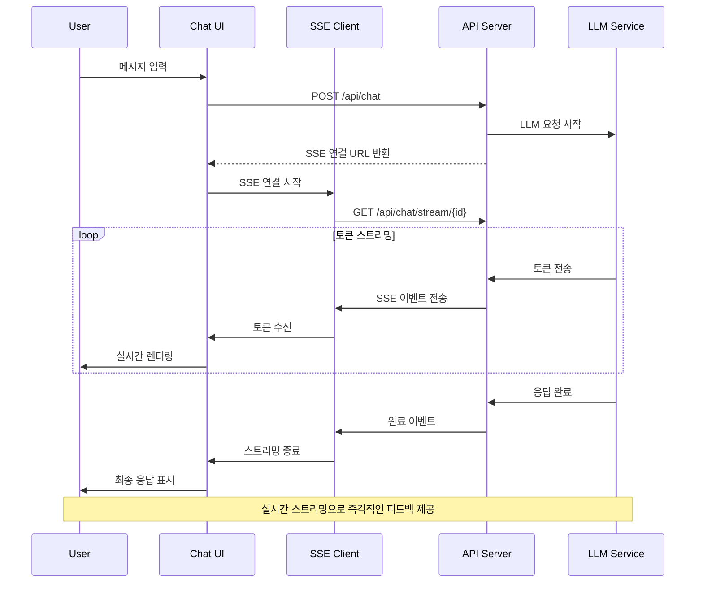

## 개요

AI 캐릭터와 대화할 수 있는 플랫폼에서 LLM(Large Language Model) 응답을 실시간 스트리밍으로 제공하여 사용자 경험을 개선하기 위해 PoC를 진행했습니다. 기존 JSON 기반 일괄 응답 방식에서 SSE(Server-Sent Events) 기반 토큰 단위 스트리밍 방식으로 전환하여 체감 응답 속도를 대폭 개선했습니다.

## 배경 / 문제

- **기존 시스템의 한계**: LLM이 완전한 응답을 생성할 때까지 사용자가 빈 화면을 보며 대기해야 했고, 이로 인해 AI 작동 여부를 알 수 없어 반복적인 재요청이 발생했습니다
- **긴 응답의 문제**: 특히 긴 응답의 경우 네트워크 타임아웃으로 인한 오류가 빈번하게 발생하여 사용자 만족도가 저하되고 플랫폼 이탈률이 증가하는 문제가 있었습니다

## 목표

1. LLM 응답을 토큰 단위로 실시간 스트리밍하여 즉각적인 피드백 제공
2. 안정적인 SSE 연결 관리 및 에러 복구 시스템 구축
3. 마크다운 및 코드 블록의 실시간 렌더링 지원
4. 적응형 쓰로틀링을 통한 부드러운 스트리밍 경험

## 역할

- Frontend Developer로서 SSE 클라이언트 구현, 실시간 UI 렌더링 시스템 개발, 연결 상태 관리 및 에러 복구 로직 구축을 담당했습니다.

## 해결 과정

### SSE 기반 스트리밍 아키텍처 구축

#### useSSE 훅 개발

EventSource를 통한 SSE 연결을 관리하고 5단계 상태를 체계적으로 관리했습니다.

```typescript
// useSSE.ts
import { useState, useEffect, useRef, useCallback } from "react";

export enum SSEStatus {
  IDLE = "idle",
  CONNECTING = "connecting",
  STREAMING = "streaming",
  DONE = "done",
  ERROR = "error",
}

interface SSEOptions {
  maxRetries?: number;
  retryInterval?: number;
  onMessage?: (data: any) => void;
  onError?: (error: Error) => void;
  onComplete?: () => void;
}

export const useSSE = (url: string, options: SSEOptions = {}) => {
  const {
    maxRetries = 3,
    retryInterval = 20000, // 20초
    onMessage,
    onError,
    onComplete,
  } = options;

  const [status, setStatus] = useState<SSEStatus>(SSEStatus.IDLE);
  const [data, setData] = useState<string>("");
  const [error, setError] = useState<Error | null>(null);

  const eventSourceRef = useRef<EventSource | null>(null);
  const retryCountRef = useRef(0);
  const retryTimeoutRef = useRef<number | null>(null);

  const connect = useCallback(() => {
    if (eventSourceRef.current) {
      eventSourceRef.current.close();
    }

    setStatus(SSEStatus.CONNECTING);
    setError(null);

    try {
      const eventSource = new EventSource(url);
      eventSourceRef.current = eventSource;

      eventSource.onopen = () => {
        setStatus(SSEStatus.STREAMING);
        retryCountRef.current = 0;
      };

      eventSource.onmessage = (event) => {
        try {
          const parsedData = JSON.parse(event.data);

          if (parsedData.type === "token") {
            setData((prev) => prev + parsedData.content);
            onMessage?.(parsedData);
          } else if (parsedData.type === "done") {
            setStatus(SSEStatus.DONE);
            onComplete?.();
            eventSource.close();
          } else if (parsedData.type === "error") {
            throw new Error(parsedData.message || "Unknown error");
          }
        } catch (parseError) {
          console.error("SSE data parsing error:", parseError);
        }
      };

      eventSource.onerror = (event) => {
        console.error("SSE connection error:", event);

        if (retryCountRef.current < maxRetries) {
          retryCountRef.current++;
          setStatus(SSEStatus.CONNECTING);

          retryTimeoutRef.current = setTimeout(() => {
            connect();
          }, retryInterval);
        } else {
          setStatus(SSEStatus.ERROR);
          setError(new Error("Maximum retry attempts reached"));
          onError?.(new Error("Connection failed after maximum retries"));
        }
      };
    } catch (error) {
      setStatus(SSEStatus.ERROR);
      setError(error as Error);
      onError?.(error as Error);
    }
  }, [url, maxRetries, retryInterval, onMessage, onError, onComplete]);

  const disconnect = useCallback(() => {
    if (eventSourceRef.current) {
      eventSourceRef.current.close();
      eventSourceRef.current = null;
    }

    if (retryTimeoutRef.current) {
      clearTimeout(retryTimeoutRef.current);
      retryTimeoutRef.current = null;
    }

    setStatus(SSEStatus.IDLE);
    setData("");
    setError(null);
    retryCountRef.current = 0;
  }, []);

  useEffect(() => {
    return () => {
      disconnect();
    };
  }, [disconnect]);

  return {
    status,
    data,
    error,
    connect,
    disconnect,
    isConnected: status === SSEStatus.STREAMING,
    isConnecting: status === SSEStatus.CONNECTING,
    isDone: status === SSEStatus.DONE,
    hasError: status === SSEStatus.ERROR,
  };
};
```

#### 실시간 토큰 누적 시스템

서버에서 전송되는 토큰 단위 데이터를 실시간으로 누적하여 UI에 반영하는 로직을 구현했습니다.

```typescript
// StreamingMessage.tsx
import React, { useEffect, useState } from 'react';
import { useSSE, SSEStatus } from './useSSE';
import { StreamableValue } from '@llm-ui/react';

interface StreamingMessageProps {
  messageId: string;
  onComplete: (content: string) => void;
  onError: (error: Error) => void;
}

export const StreamingMessage: React.FC<StreamingMessageProps> = ({
  messageId,
  onComplete,
  onError
}) => {
  const [streamingContent, setStreamingContent] = useState<string>('');
  const [isStreaming, setIsStreaming] = useState(false);

  const { status, data, error, connect, disconnect } = useSSE(
    `/api/chat/stream/${messageId}`,
    {
      onMessage: (tokenData) => {
        setStreamingContent(prev => prev + tokenData.content);
      },
      onComplete: () => {
        setIsStreaming(false);
        onComplete(streamingContent);
      },
      onError: (error) => {
        setIsStreaming(false);
        onError(error);
      }
    }
  );

  useEffect(() => {
    if (messageId) {
      setIsStreaming(true);
      setStreamingContent('');
      connect();
    }

    return () => {
      disconnect();
    };
  }, [messageId, connect, disconnect]);

  useEffect(() => {
    setStreamingContent(data);
  }, [data]);

  if (error) {
    return (
      <div className="message error">
        <div className="error-content">
          <span className="error-icon">⚠️</span>
          <span className="error-text">
            {error.message === 'Maximum retry attempts reached'
              ? '연결에 실패했습니다. 잠시 후 다시 시도해주세요.'
              : '응답 생성 중 오류가 발생했습니다.'}
          </span>
        </div>
      </div>
    );
  }

  return (
    <div className={`message streaming ${isStreaming ? 'streaming' : 'completed'}`}>
      <div className="message-content">
        <StreamableValue
          value={streamingContent}
          isStreaming={isStreaming}
        />
        {isStreaming && (
          <div className="streaming-indicator">
            <div className="typing-dots">
              <span></span>
              <span></span>
              <span></span>
            </div>
          </div>
        )}
      </div>
    </div>
  );
};
```

### 자동 재연결 및 에러 복구 시스템

#### 상황별 에러 처리

네트워크 불안정 상황을 대비해 최대 3회까지 20초 간격으로 자동 재연결하는 시스템을 구축했습니다.

```typescript
// ErrorHandler.ts
export class SSEErrorHandler {
  private static readonly ERROR_TYPES = {
    NETWORK_ERROR: "network_error",
    TIMEOUT_ERROR: "timeout_error",
    SERVER_ERROR: "server_error",
    RATE_LIMIT_ERROR: "rate_limit_error",
    UNKNOWN_ERROR: "unknown_error",
  };

  static classifyError(error: Error): string {
    const message = error.message.toLowerCase();

    if (message.includes("network") || message.includes("fetch")) {
      return this.ERROR_TYPES.NETWORK_ERROR;
    }

    if (message.includes("timeout")) {
      return this.ERROR_TYPES.TIMEOUT_ERROR;
    }

    if (message.includes("429")) {
      return this.ERROR_TYPES.RATE_LIMIT_ERROR;
    }

    if (
      message.includes("500") ||
      message.includes("502") ||
      message.includes("503")
    ) {
      return this.ERROR_TYPES.SERVER_ERROR;
    }

    return this.ERROR_TYPES.UNKNOWN_ERROR;
  }

  static getErrorMessage(errorType: string): string {
    switch (errorType) {
      case this.ERROR_TYPES.NETWORK_ERROR:
        return "네트워크 연결을 확인해주세요.";
      case this.ERROR_TYPES.TIMEOUT_ERROR:
        return "응답 시간이 초과되었습니다. 다시 시도해주세요.";
      case this.ERROR_TYPES.RATE_LIMIT_ERROR:
        return "요청이 너무 많습니다. 잠시 후 다시 시도해주세요.";
      case this.ERROR_TYPES.SERVER_ERROR:
        return "서버에 일시적인 문제가 발생했습니다.";
      default:
        return "알 수 없는 오류가 발생했습니다.";
    }
  }

  static shouldRetry(errorType: string, retryCount: number): boolean {
    const maxRetries = 3;

    if (retryCount >= maxRetries) {
      return false;
    }

    // Rate limit과 server error는 재시도
    return [
      this.ERROR_TYPES.NETWORK_ERROR,
      this.ERROR_TYPES.TIMEOUT_ERROR,
      this.ERROR_TYPES.SERVER_ERROR,
    ].includes(errorType);
  }

  static getRetryDelay(errorType: string, retryCount: number): number {
    const baseDelay = 20000; // 20초

    switch (errorType) {
      case this.ERROR_TYPES.RATE_LIMIT_ERROR:
        return baseDelay * (retryCount + 1); // 점진적 지연
      case this.ERROR_TYPES.SERVER_ERROR:
        return baseDelay * Math.pow(2, retryCount); // 지수 백오프
      default:
        return baseDelay;
    }
  }
}
```

### 실시간 렌더링 및 성능 최적화

#### @llm-ui/react 통합

마크다운과 코드 블록을 실시간으로 파싱하고 렌더링할 수 있도록 했습니다.

````typescript
// StreamingRenderer.tsx
import React, { useMemo } from 'react';
import { StreamableValue } from '@llm-ui/react';
import { Markdown } from '@llm-ui/markdown';

interface StreamingRendererProps {
  content: string;
  isStreaming: boolean;
  onComplete?: () => void;
}

export const StreamingRenderer: React.FC<StreamingRendererProps> = ({
  content,
  isStreaming,
  onComplete
}) => {
  const processedContent = useMemo(() => {
    // 스트리밍 중일 때는 불완전한 마크다운 블록 처리
    if (isStreaming) {
      return content + (content.endsWith('```') ? '' : '```');
    }
    return content;
  }, [content, isStreaming]);

  return (
    <div className="streaming-renderer">
      <StreamableValue
        value={processedContent}
        isStreaming={isStreaming}
        onComplete={onComplete}
      >
        <Markdown
          content={processedContent}
          isStreaming={isStreaming}
          className="message-markdown"
        />
      </StreamableValue>

      {isStreaming && (
        <div className="streaming-cursor">
          <span className="cursor-blink">|</span>
        </div>
      )}
    </div>
  );
};
````

#### 적응형 쓰로틀링

부드러운 스트리밍 경험을 위한 적응형 쓰로틀링을 구현했습니다.

```typescript
// ThrottledRenderer.tsx
import React, { useState, useEffect, useRef } from 'react';

interface ThrottledRendererProps {
  content: string;
  isStreaming: boolean;
  throttleMs?: number;
  children: (displayedContent: string) => React.ReactNode;
}

export const ThrottledRenderer: React.FC<ThrottledRendererProps> = ({
  content,
  isStreaming,
  throttleMs = 50,
  children
}) => {
  const [displayedContent, setDisplayedContent] = useState('');
  const throttleTimeoutRef = useRef<number | null>(null);
  const lastUpdateRef = useRef(0);

  useEffect(() => {
    if (!isStreaming) {
      setDisplayedContent(content);
      return;
    }

    const now = Date.now();
    const timeSinceLastUpdate = now - lastUpdateRef.current;

    if (timeSinceLastUpdate >= throttleMs) {
      setDisplayedContent(content);
      lastUpdateRef.current = now;
    } else {
      if (throttleTimeoutRef.current) {
        clearTimeout(throttleTimeoutRef.current);
      }

      throttleTimeoutRef.current = setTimeout(() => {
        setDisplayedContent(content);
        lastUpdateRef.current = Date.now();
      }, throttleMs - timeSinceLastUpdate);
    }

    return () => {
      if (throttleTimeoutRef.current) {
        clearTimeout(throttleTimeoutRef.current);
      }
    };
  }, [content, isStreaming, throttleMs]);

  return <>{children(displayedContent)}</>;
};
```

### 상태 관리 및 UI 통합

#### 채팅 상태 관리

스트리밍 중인 메시지를 기존 채팅 목록에 실시간으로 업데이트하거나 새로 추가하는 상태 관리 로직을 구현했습니다.

```typescript
// ChatStore.ts
import { create } from "zustand";
import { subscribeWithSelector } from "zustand/middleware";

interface Message {
  id: string;
  content: string;
  role: "user" | "assistant";
  timestamp: Date;
  isStreaming?: boolean;
  isComplete?: boolean;
  error?: string;
}

interface ChatState {
  messages: Message[];
  currentStreamingMessage: Message | null;
  isGenerating: boolean;

  addMessage: (message: Omit<Message, "id" | "timestamp">) => string;
  updateMessage: (id: string, updates: Partial<Message>) => void;
  startStreaming: (messageId: string) => void;
  updateStreamingContent: (content: string) => void;
  completeStreaming: () => void;
  setStreamingError: (error: string) => void;
  clearMessages: () => void;
}

export const useChatStore = create<ChatState>()(
  subscribeWithSelector((set, get) => ({
    messages: [],
    currentStreamingMessage: null,
    isGenerating: false,

    addMessage: (messageData) => {
      const message: Message = {
        ...messageData,
        id: crypto.randomUUID(),
        timestamp: new Date(),
        isStreaming: false,
        isComplete: true,
      };

      set((state) => ({
        messages: [...state.messages, message],
      }));

      return message.id;
    },

    updateMessage: (id, updates) => {
      set((state) => ({
        messages: state.messages.map((msg) =>
          msg.id === id ? { ...msg, ...updates } : msg,
        ),
      }));
    },

    startStreaming: (messageId) => {
      const message: Message = {
        id: messageId,
        content: "",
        role: "assistant",
        timestamp: new Date(),
        isStreaming: true,
        isComplete: false,
      };

      set((state) => ({
        messages: [...state.messages, message],
        currentStreamingMessage: message,
        isGenerating: true,
      }));
    },

    updateStreamingContent: (content) => {
      set((state) => {
        if (!state.currentStreamingMessage) return state;

        const updatedMessage = {
          ...state.currentStreamingMessage,
          content,
        };

        return {
          messages: state.messages.map((msg) =>
            msg.id === updatedMessage.id ? updatedMessage : msg,
          ),
          currentStreamingMessage: updatedMessage,
        };
      });
    },

    completeStreaming: () => {
      set((state) => {
        if (!state.currentStreamingMessage) return state;

        const completedMessage = {
          ...state.currentStreamingMessage,
          isStreaming: false,
          isComplete: true,
        };

        return {
          messages: state.messages.map((msg) =>
            msg.id === completedMessage.id ? completedMessage : msg,
          ),
          currentStreamingMessage: null,
          isGenerating: false,
        };
      });
    },

    setStreamingError: (error) => {
      set((state) => {
        if (!state.currentStreamingMessage) return state;

        const errorMessage = {
          ...state.currentStreamingMessage,
          isStreaming: false,
          isComplete: true,
          error,
        };

        return {
          messages: state.messages.map((msg) =>
            msg.id === errorMessage.id ? errorMessage : msg,
          ),
          currentStreamingMessage: null,
          isGenerating: false,
        };
      });
    },

    clearMessages: () => {
      set({
        messages: [],
        currentStreamingMessage: null,
        isGenerating: false,
      });
    },
  })),
);
```

## 시스템 아키텍처



## 주요 기능

### 1. 실시간 토큰 스트리밍

- **즉각적인 피드백**: 첫 토큰이 출력되는 즉시 사용자가 응답을 확인
- **자연스러운 대화**: 실제 사람과 대화하는 것 같은 경험
- **체감 속도 개선**: 전체 응답 완료를 기다리지 않고 실시간 확인

### 2. 안정적인 연결 관리

- **자동 재연결**: 네트워크 불안정 시 최대 3회 자동 재시도
- **상황별 에러 처리**: 429, 500 등 에러 타입별 적절한 처리
- **정상/비정상 종료 구분**: 사용자 경험에 따른 차별화된 처리

### 3. 실시간 렌더링

- **마크다운 지원**: 실시간 마크다운 파싱 및 렌더링
- **코드 블록**: 불완전한 코드 블록도 안전하게 처리
- **적응형 쓰로틀링**: 부드러운 스트리밍 경험 제공

### 4. 상태 관리

- **실시간 업데이트**: 채팅 목록에 스트리밍 메시지 실시간 반영
- **에러 복구**: 연결 실패 시 적절한 사용자 알림
- **성능 최적화**: 불필요한 리렌더링 방지

## 결과

- **체감 응답 속도 대폭 개선**: 토큰 단위 실시간 스트리밍으로 첫 토큰이 출력되는 즉시 사용자가 응답을 확인할 수 있게 되었습니다
- **자연스러운 대화 경험**: AI 캐릭터와의 대화가 실제 사람과 대화하는 것 같은 자연스러운 경험으로 개선되었습니다
- **사용자 만족도 향상**: 빈 화면 대기 시간 제거로 사용자 이탈률 감소
- **안정성 확보**: 자동 재연결 및 에러 복구 시스템으로 안정적인 서비스 제공

## 기술 스택

- **Frontend**: React, TypeScript, Zustand
- **Streaming**: Server-Sent Events (SSE), EventSource API
- **Rendering**: @llm-ui/react, @llm-ui/markdown
- **State Management**: Zustand with subscribeWithSelector
- **Error Handling**: Custom Error Classification System
- **Performance**: Throttled Rendering, Adaptive Throttling
