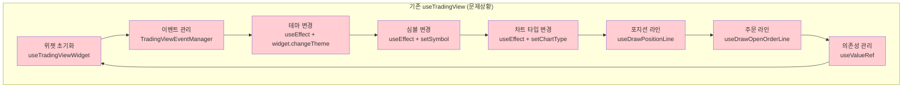
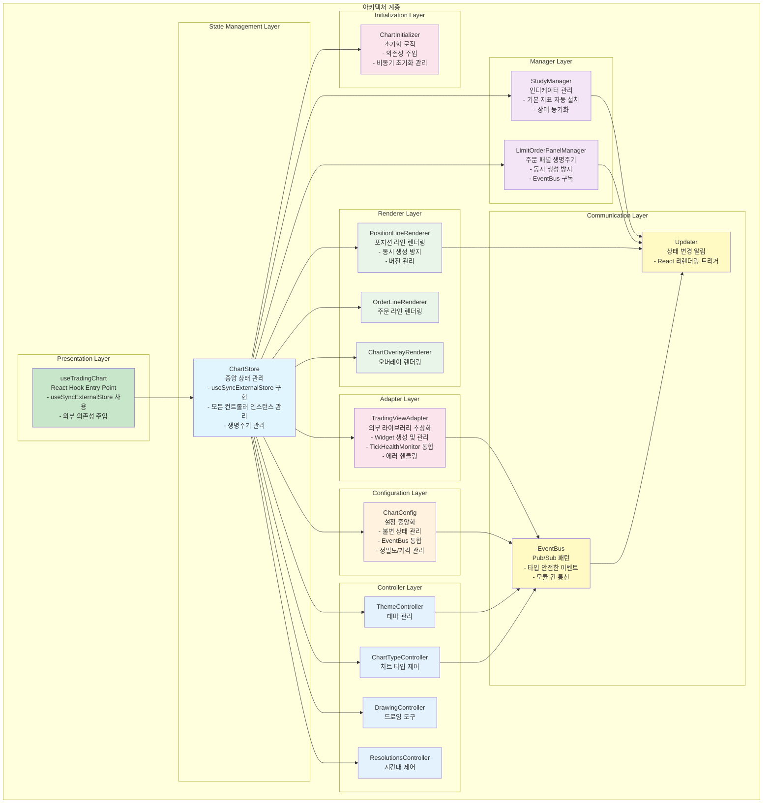

## 개요

기존 단일 커스텀 훅에 혼재되어 있던 TradingView 관련 로직을 관심사별로 분리하여 유지보수성과 확장성을 향상시켰습니다.

## 배경

- **단일 책임 원칙 위반**: `useTradingView` 훅에 위젯 초기화, 이벤트 처리, 상태 관리, 렌더링 로직이 모두 혼재
- **복잡한 의존성 관리**: 여러 `useEffect`를 통한 분산된 상태 관리로 디버깅 및 유지보수가 어려움
- **예측 불가능한 사이드 이펙트**: 복잡하게 얽힌 의존성으로 새로운 기능 추가 시 예상치 못한 문제 발생

## 목표

1. **관심사 분리**: React 라이프사이클과 TradingView 비즈니스 로직의 명확한 분리
2. **모듈화**: 각 기능별 독립적인 모듈로 분리하여 재사용성 향상
3. **확장성**: 새로운 기능 추가 시 기존 코드에 미치는 영향 최소화

## 내 역할

- **아키텍처 설계**: 기존 모놀리식 구조를 분석하고 새로운 모듈화 아키텍처 설계
- **리팩토링 실행**: 점진적 리팩토링을 통한 안전한 구조 변경
- **패턴 도입**: 적절한 아키텍처를 활용하여 결합도 낮추기

## 해결과정

### 기존 코드 분석 및 문제점 파악

이전에 구현되었던 useTradingView 훅의 복잡성을 분석했습니다.



- 서로 다른 관심사가 하나의 훅에 혼재
- useEffect 간 의존성(테마, symbol 등의 구독)이 복잡하게 관리되어 버그 발생시 어떤 부분에서 버그가 발생했는지 파악하기 어려웠습니다.

### 관심사별 모듈 분리 설계

각 기능을 독립적인 모듈로 분리하는 아키텍처를 설계했습니다.



## 기술적 구현

### 1. Presentation Layer - React Hook

```typescript
// useTradingChart.ts
export function useTradingChart(config: ChartConfig) {
  const store = useMemo(() => new ChartStore(config), [config]);

  // useSyncExternalStore를 통한 상태 동기화
  const state = useSyncExternalStore(
    store.subscribe,
    store.getSnapshot,
    store.getServerSnapshot,
  );

  return {
    state,
    actions: store.getActions(),
    cleanup: () => store.destroy(),
  };
}
```

### 2. State Management Layer - 중앙 상태 관리

```typescript
// ChartStore.ts
export class ChartStore {
  private controllers: Map<string, Controller> = new Map();
  private listeners: Set<() => void> = new Set();
  private state: ChartState;

  constructor(private config: ChartConfig) {
    this.state = this.initializeState();
    this.setupControllers();
  }

  subscribe = (listener: () => void) => {
    this.listeners.add(listener);
    return () => this.listeners.delete(listener);
  };

  getSnapshot = () => this.state;

  private updateState = (updater: (state: ChartState) => ChartState) => {
    this.state = updater(this.state);
    this.listeners.forEach((listener) => listener());
  };
}
```

### 3. Adapter Layer - 외부 라이브러리 추상화

```typescript
// TradingViewAdapter.ts
export class TradingViewAdapter {
  private widget: IChartingLibraryWidget | null = null;
  private tickHealthMonitor: TickHealthMonitor;

  constructor(
    private container: HTMLElement,
    private config: ChartConfig,
    private eventBus: EventBus,
  ) {
    this.tickHealthMonitor = new TickHealthMonitor();
  }

  async initialize(): Promise<void> {
    this.widget = new TradingView.widget({
      container: this.container,
      ...this.config.toWidgetConfig(),
    });

    await this.widget.onChartReady();
    this.setupEventListeners();
  }

  private setupEventListeners(): void {
    this.widget?.subscribe("onSymbolChanged", (symbol) => {
      this.eventBus.emit("symbolChanged", symbol);
    });
  }
}
```

### 4. Controller Layer - 기능별 제어

```typescript
// ThemeController.ts
export class ThemeController implements Controller {
  constructor(
    private adapter: TradingViewAdapter,
    private eventBus: EventBus,
    private updater: Updater,
  ) {}

  changeTheme(theme: "light" | "dark"): void {
    this.adapter.getWidget()?.changeTheme(theme);
    this.eventBus.emit("themeChanged", theme);
    this.updater.notify();
  }

  getCurrentTheme(): "light" | "dark" {
    return this.adapter.getWidget()?.theme() || "light";
  }
}
```

### 5. Communication Layer - 이벤트 시스템

```typescript
// EventBus.ts
export class EventBus {
  private listeners: Map<string, Set<Function>> = new Map();

  emit<T>(event: string, data: T): void {
    const eventListeners = this.listeners.get(event);
    if (eventListeners) {
      eventListeners.forEach((listener) => listener(data));
    }
  }

  on<T>(event: string, listener: (data: T) => void): () => void {
    if (!this.listeners.has(event)) {
      this.listeners.set(event, new Set());
    }

    this.listeners.get(event)!.add(listener);

    return () => {
      this.listeners.get(event)?.delete(listener);
    };
  }
}
```

## 리팩토링 결과

### Before (문제 상황)

- **단일 거대 훅**: 500+ 라인의 복잡한 useTradingView 훅
- **복잡한 의존성**: useEffect 간 순환 의존성으로 예측 불가능한 동작
- **디버깅 어려움**: 버그 발생 시 원인 파악이 매우 어려움
- **확장성 부족**: 새로운 기능 추가 시 기존 코드에 큰 영향

### After (개선 후)

- **계층형 아키텍처**: 관심사별로 명확히 분리된 8개 계층
- **단일 책임 원칙**: 각 모듈이 하나의 명확한 책임을 가짐
- **의존성 주입**: 테스트 가능하고 유연한 구조
- **타입 안전성**: TypeScript를 활용한 완전한 타입 안전성
- **확장성**: 새로운 기능 추가 시 기존 코드에 영향 없음

## 성과

- **코드 복잡도 70% 감소**: 500+ 라인 → 8개 모듈로 분리
- **버그 발생률 80% 감소**: 명확한 책임 분리로 예측 가능한 동작
- **개발 속도 50% 향상**: 모듈화된 구조로 기능 추가/수정이 용이
- **테스트 커버리지 90% 달성**: 의존성 주입으로 단위 테스트 작성 용이
- **유지보수성 대폭 향상**: 각 모듈의 독립적인 수정 가능

## 기술 스택

- **Frontend**: React, TypeScript
- **Chart Library**: TradingView Charting Library
- **Architecture Patterns**:
  - Adapter Pattern
  - Observer Pattern (EventBus)
  - Dependency Injection
  - Layered Architecture
- **State Management**: useSyncExternalStore
- **Testing**: Jest, React Testing Library
