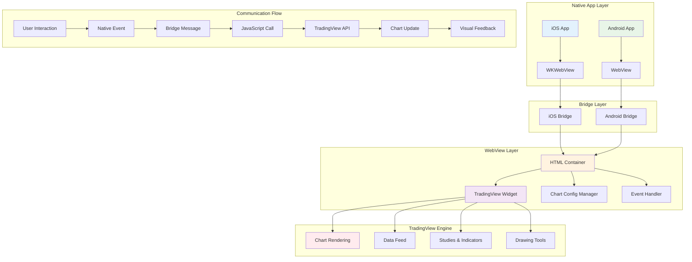

## 개요

기존 앱의 자체 구현 차트를 **TradingView 엔진으로 완전 마이그레이션**하고, **HTML WebView 기반 렌더링 레이어**를 설계하여 앱 차트를 개발했습니다.

## 배경

- **기존 차트 엔진의 한계**: 자체 구현 차트의 성능 및 기능적 제약
- **사용자 경험 일관성 부족**: 플랫폼별로 다른 차트 인터페이스와 기능
- **임베딩 방식**: 앱 내 **HTML(WebView) 렌더링 레이어**를 설계해 **Vanilla JS**로 초기 통합

## 목표

1. **차트 엔진 통합**: TradingView를 기반으로 앱·웹 차트 일원화
2. **사용자 경험 개선**: 플랫폼 간 일관된 차트 기능 제공

## 내 역할

- HTML 기반 차트 렌더링 시스템 유지보수
- JavaScript Bridge를 통한 앱-웹뷰 양방향 통신 구현

## 해결과정

### WebView 기반 렌더링 시스템 구축

#### HTML 기반 TradingView 통합

HTML을 통해 TradingView를 앱 내에서 실행할 수 있는 WebView 환경을 구축했습니다.

### 앱-차트(웹뷰) 통신 브릿지 구현

#### iOS WKWebView Bridge

```swift
// ChartWebViewBridge.swift
import WebKit

class ChartWebViewBridge: NSObject, WKScriptMessageHandler {
    private weak var webView: WKWebView?
    private var chartDelegate: ChartWebViewDelegate?

    init(webView: WKWebView, delegate: ChartWebViewDelegate) {
        super.init()
        self.webView = webView
        self.chartDelegate = delegate
        setupMessageHandler()
    }

    private func setupMessageHandler() {
        webView?.configuration.userContentController.add(self, name: "chartBridge")
    }

    // JavaScript에서 호출되는 메시지 처리
    func userContentController(_ userContentController: WKUserContentController, didReceive message: WKScriptMessage) {
        guard let messageBody = message.body as? [String: Any],
              let event = messageBody["event"] as? String,
              let data = messageBody["data"] as? [String: Any] else {
            return
        }

        handleChartEvent(event: event, data: data)
    }

    private func handleChartEvent(event: String, data: [String: Any]) {
        switch event {
        case "chart_ready":
            chartDelegate?.onChartReady(symbol: data["symbol"] as? String)

        case "symbol_changed":
            chartDelegate?.onSymbolChanged(symbol: data["symbol"] as? String)

        case "interval_changed":
            chartDelegate?.onIntervalChanged(interval: data["interval"] as? String)

        case "chart_clicked":
            if let time = data["time"] as? Double,
               let price = data["price"] as? Double {
                chartDelegate?.onChartClicked(time: time, price: price)
            }

        case "study_added":
            chartDelegate?.onStudyAdded(study: data["study"])

        case "study_removed":
            chartDelegate?.onStudyRemoved(study: data["study"])

        case "chart_error":
            chartDelegate?.onChartError(error: data["error"] as? String)

        default:
            print("Unknown chart event: \(event)")
        }
    }

    // 네이티브에서 웹뷰로 명령 전송
    func updateSymbol(_ symbol: String) {
        webView?.evaluateJavaScript("window.updateChartSymbol('\(symbol)')")
    }

    func updateTheme(_ theme: String) {
        webView?.evaluateJavaScript("window.updateChartTheme('\(theme)')")
    }

    func updateInterval(_ interval: String) {
        webView?.evaluateJavaScript("window.updateChartInterval('\(interval)')")
    }

    func addStudy(_ studyName: String) {
        webView?.evaluateJavaScript("window.addChartStudy('\(studyName)')")
    }

    func removeStudy(_ studyId: String) {
        webView?.evaluateJavaScript("window.removeChartStudy('\(studyId)')")
    }
}

protocol ChartWebViewDelegate: AnyObject {
    func onChartReady(symbol: String?)
    func onSymbolChanged(symbol: String?)
    func onIntervalChanged(interval: String?)
    func onChartClicked(time: Double, price: Double)
    func onStudyAdded(study: Any?)
    func onStudyRemoved(study: Any?)
    func onChartError(error: String?)
}
```

#### Android WebView Bridge

```kotlin
// ChartWebViewBridge.kt
class ChartWebViewBridge(private val webView: WebView) {

    init {
        setupWebView()
    }

    private fun setupWebView() {
        webView.settings.apply {
            javaScriptEnabled = true
            domStorageEnabled = true
            allowFileAccess = true
            allowContentAccess = true
        }

        // JavaScript 인터페이스 추가
        webView.addJavascriptInterface(ChartJavaScriptInterface(), "Android")
    }

    inner class ChartJavaScriptInterface {
        @JavascriptInterface
        fun onChartEvent(jsonData: String) {
            try {
                val jsonObject = JSONObject(jsonData)
                val event = jsonObject.getString("event")
                val data = jsonObject.getJSONObject("data")

                handleChartEvent(event, data)
            } catch (e: JSONException) {
                Log.e("ChartBridge", "JSON parsing error", e)
            }
        }

        private fun handleChartEvent(event: String, data: JSONObject) {
            when (event) {
                "chart_ready" -> {
                    val symbol = data.optString("symbol")
                    onChartReady(symbol)
                }
                "symbol_changed" -> {
                    val symbol = data.optString("symbol")
                    onSymbolChanged(symbol)
                }
                "interval_changed" -> {
                    val interval = data.optString("interval")
                    onIntervalChanged(interval)
                }
                "chart_clicked" -> {
                    val time = data.optDouble("time")
                    val price = data.optDouble("price")
                    onChartClicked(time, price)
                }
                "study_added" -> {
                    onStudyAdded(data.opt("study"))
                }
                "study_removed" -> {
                    onStudyRemoved(data.opt("study"))
                }
                "chart_error" -> {
                    val error = data.optString("error")
                    onChartError(error)
                }
            }
        }
    }

    // 네이티브에서 웹뷰로 명령 전송
    fun updateSymbol(symbol: String) {
        webView.post {
            webView.evaluateJavascript("window.updateChartSymbol('$symbol')", null)
        }
    }

    fun updateTheme(theme: String) {
        webView.post {
            webView.evaluateJavascript("window.updateChartTheme('$theme')", null)
        }
    }

    fun updateInterval(interval: String) {
        webView.post {
            webView.evaluateJavascript("window.updateChartInterval('$interval')", null)
        }
    }

    fun addStudy(studyName: String) {
        webView.post {
            webView.evaluateJavascript("window.addChartStudy('$studyName')", null)
        }
    }

    fun removeStudy(studyId: String) {
        webView.post {
            webView.evaluateJavascript("window.removeChartStudy('$studyId')", null)
        }
    }

    // 이벤트 콜백 (실제 구현에서는 인터페이스로 분리)
    private fun onChartReady(symbol: String?) {
        // 차트 준비 완료 처리
    }

    private fun onSymbolChanged(symbol: String?) {
        // 심볼 변경 처리
    }

    private fun onIntervalChanged(interval: String?) {
        // 인터벌 변경 처리
    }

    private fun onChartClicked(time: Double, price: Double) {
        // 차트 클릭 처리
    }

    private fun onStudyAdded(study: Any?) {
        // 스터디 추가 처리
    }

    private fun onStudyRemoved(study: Any?) {
        // 스터디 제거 처리
    }

    private fun onChartError(error: String?) {
        // 차트 오류 처리
    }
}
```

### 동적 파라미터 처리 시스템

```typescript
// ChartConfigManager.ts
class ChartConfigManager {
  private config: ChartConfig;
  private urlParams: URLSearchParams;

  constructor() {
    this.urlParams = new URLSearchParams(window.location.search);
    this.config = this.parseConfig();
  }

  private parseConfig(): ChartConfig {
    return {
      symbol: this.urlParams.get("symbol") || "BTCUSDT",
      theme: this.urlParams.get("theme") || "dark",
      interval: this.urlParams.get("interval") || "1h",
      height: this.urlParams.get("height") || "100%",
      width: this.urlParams.get("width") || "100%",
      locale: this.urlParams.get("locale") || "ko",
      timezone: this.urlParams.get("timezone") || "Asia/Seoul",
      studies: this.parseStudies(),
      toolbar: this.parseToolbarConfig(),
      features: this.parseFeatures(),
    };
  }

  private parseStudies(): string[] {
    const studiesParam = this.urlParams.get("studies");
    if (!studiesParam) return ["RSI@tv-basicstudies", "MACD@tv-basicstudies"];

    return studiesParam.split(",").map((study) => study.trim());
  }

  private parseToolbarConfig(): ToolbarConfig {
    return {
      showToolbar: this.urlParams.get("showToolbar") !== "false",
      showSideToolbar: this.urlParams.get("showSideToolbar") !== "false",
      showPopupButton: this.urlParams.get("showPopupButton") !== "false",
      allowSymbolChange: this.urlParams.get("allowSymbolChange") !== "false",
    };
  }

  private parseFeatures(): FeatureConfig {
    return {
      details: this.urlParams.get("details") !== "false",
      hotlist: this.urlParams.get("hotlist") !== "false",
      calendar: this.urlParams.get("calendar") !== "false",
      enablePublishing: this.urlParams.get("enablePublishing") === "true",
    };
  }

  updateConfig(newConfig: Partial<ChartConfig>): void {
    this.config = { ...this.config, ...newConfig };
    this.updateURL();
  }

  private updateURL(): void {
    const newParams = new URLSearchParams();

    Object.entries(this.config).forEach(([key, value]) => {
      if (value !== undefined && value !== null) {
        if (Array.isArray(value)) {
          newParams.set(key, value.join(","));
        } else {
          newParams.set(key, String(value));
        }
      }
    });

    const newURL = `${window.location.pathname}?${newParams.toString()}`;
    window.history.replaceState({}, "", newURL);
  }

  getConfig(): ChartConfig {
    return { ...this.config };
  }
}
```

## 시스템 아키텍처



## 주요 기능

### 1. WebView 기반 렌더링

- **HTML 컨테이너**: TradingView를 앱 내에서 실행할 수 있는 WebView 환경
- **동적 파라미터**: URL 쿼리 파라미터로 테마, 심볼, 인터벌 등 동적 설정
- **반응형 디자인**: 다양한 화면 크기에 대응하는 차트 레이아웃

### 2. 양방향 통신 브릿지

- **iOS WKWebView**: WKScriptMessageHandler를 통한 메시지 처리
- **Android WebView**: JavaScriptInterface를 통한 네이티브 통신
- **이벤트 기반**: 차트 이벤트를 실시간으로 네이티브 앱에 전달

### 3. 차트 기능 통합

- **심볼 변경**: 네이티브에서 차트 심볼 동적 변경
- **테마 전환**: 다크/라이트 테마 실시간 전환
- **인터벌 조정**: 시간 프레임 동적 변경
- **스터디 관리**: 인디케이터 추가/제거 기능

### 4. 에러 처리 및 복구

- **로딩 상태**: 차트 로딩 중 사용자 피드백
- **에러 핸들링**: 차트 오류 시 적절한 에러 메시지 표시
- **자동 복구**: 네트워크 오류 시 자동 재연결 시도

## 결과

- **차트 엔진 통합**: 앱과 웹의 차트 기능 완전 일원화
- **사용자 경험 일관성**: 플랫폼 간 동일한 차트 인터페이스 제공
- **개발 효율성**: 공통 차트 로직으로 유지보수 비용 절감
- **성능 향상**: TradingView 엔진의 고성능 차트 렌더링 활용

## 개선할 점

- **React 기반 마이그레이션**: 앱/웹 차트의 코드베이스 일원화를 위해 React 기반 WebView 구조로 마이그레이션 설계 진행
- **공통 UI/로직 재사용**: React 컴포넌트 기반으로 UI 로직 공유
- **배포 단순화**: 통합된 빌드 프로세스로 배포 효율성 향상

## 기술 스택

- **Frontend**: HTML5, Vanilla JavaScript, TradingView Charting Library
- **Mobile**: iOS WKWebView, Android WebView
- **Bridge**: WKScriptMessageHandler (iOS), JavaScriptInterface (Android)
- **Communication**: JSON-based Message Passing
- **Configuration**: URL Query Parameters, Dynamic Config Management
