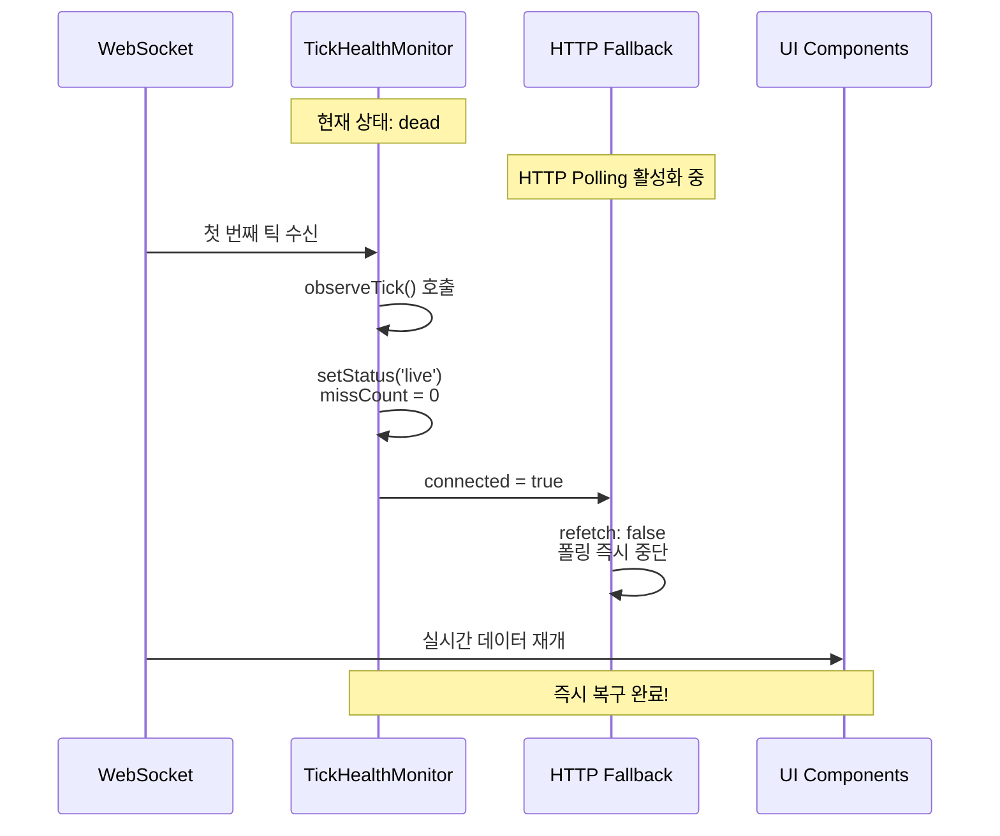
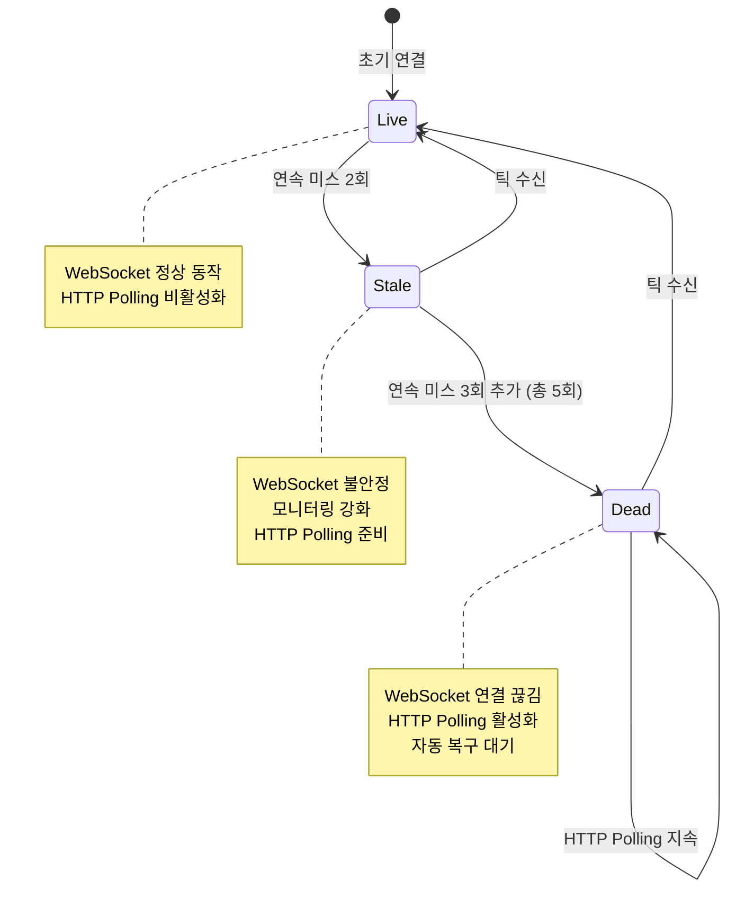

## 개요

WebSocket 연결 불안정으로 인한 실시간 데이터 손실을 방지하기 위해 자동 HTTP Fallback 시스템을 개발하여 거래 플랫폼의 데이터 연속성과 안정성을 보장했습니다.

## 배경

- **WebSocket 연결 불안정**: 백엔드 소켓 시스템의 부하 문제로 인해 메시지가 제대로 오지 않는 문제가 간헐적으로 발생
- **사용자 경험 저하**: 데이터 지연으로 인한 잘못된 거래 판단 및 기회 상실
- **기존 대응 부재**: 소켓 장애 시 대체 통신 방식 및 자동 복구 시스템 부족

## 목표

1. 소켓 불안정 시에도 실시간 데이터 연속성 보장
2. 네트워크 상태에 따른 최적 통신 방식 자동 선택
3. 불필요한 폴링 방지 및 자원 효율적 운영

## 내 역할

- TickHealthMonitor를 통한 3단계 상태 관리 시스템 구축
- WebSocket ↔ HTTP Polling 자동 전환 로직 개발

## 해결과정

### 헬스 체크 시스템

#### TickHealthMonitor 클래스

실시간 소켓 상태 모니터링을 위한 3단계 상태 관리 시스템을 구축했습니다.

```typescript
// TickHealthMonitor.ts
export enum ConnectionStatus {
  LIVE = "live",
  STALE = "stale",
  DEAD = "dead",
}

export class TickHealthMonitor {
  private status: ConnectionStatus = ConnectionStatus.LIVE;
  private missCount: number = 0;
  private lastTickTime: number = 0;
  private checkInterval: number | null = null;
  private listeners: Set<(status: ConnectionStatus) => void> = new Set();

  // 상태 전환 기준
  private readonly STALE_THRESHOLD = 2; // 연속 미스 2회
  private readonly DEAD_THRESHOLD = 5; // 연속 미스 5회
  private readonly TICK_TIMEOUT = 5000; // 5초 타임아웃

  constructor() {
    this.startHealthCheck();
  }

  observeTick(): void {
    this.lastTickTime = Date.now();
    this.missCount = 0;

    if (this.status !== ConnectionStatus.LIVE) {
      this.setStatus(ConnectionStatus.LIVE);
    }
  }

  private startHealthCheck(): void {
    this.checkInterval = setInterval(() => {
      this.performHealthCheck();
    }, 1000); // 1초마다 체크
  }

  private performHealthCheck(): void {
    const now = Date.now();
    const timeSinceLastTick = now - this.lastTickTime;

    // 타임아웃 체크
    if (timeSinceLastTick > this.TICK_TIMEOUT) {
      this.missCount++;
      this.updateStatusBasedOnMissCount();
    }
  }

  private updateStatusBasedOnMissCount(): void {
    if (this.missCount >= this.DEAD_THRESHOLD) {
      this.setStatus(ConnectionStatus.DEAD);
    } else if (this.missCount >= this.STALE_THRESHOLD) {
      this.setStatus(ConnectionStatus.STALE);
    }
  }

  private setStatus(newStatus: ConnectionStatus): void {
    if (this.status !== newStatus) {
      this.status = newStatus;
      this.notifyListeners();
    }
  }

  subscribe(listener: (status: ConnectionStatus) => void): () => void {
    this.listeners.add(listener);
    return () => this.listeners.delete(listener);
  }

  private notifyListeners(): void {
    this.listeners.forEach((listener) => listener(this.status));
  }

  getStatus(): ConnectionStatus {
    return this.status;
  }

  destroy(): void {
    if (this.checkInterval) {
      clearInterval(this.checkInterval);
      this.checkInterval = null;
    }
    this.listeners.clear();
  }
}
```

### 자동 Fallback 시스템

#### WebSocket ↔ HTTP Polling 자동 전환

```typescript
// FallbackManager.ts
export class FallbackManager {
  private tickHealthMonitor: TickHealthMonitor;
  private httpPoller: HttpPoller;
  private websocketConnection: WebSocketConnection;
  private isHttpPollingActive = false;

  constructor(
    websocketConnection: WebSocketConnection,
    httpPoller: HttpPoller,
  ) {
    this.websocketConnection = websocketConnection;
    this.httpPoller = httpPoller;
    this.tickHealthMonitor = new TickHealthMonitor();

    this.setupHealthMonitoring();
  }

  private setupHealthMonitoring(): void {
    // WebSocket 메시지 수신 시 헬스 체크
    this.websocketConnection.onMessage(() => {
      this.tickHealthMonitor.observeTick();
    });

    // 상태 변화 감지
    this.tickHealthMonitor.subscribe((status) => {
      this.handleStatusChange(status);
    });
  }

  private handleStatusChange(status: ConnectionStatus): void {
    switch (status) {
      case ConnectionStatus.LIVE:
        this.handleLiveStatus();
        break;
      case ConnectionStatus.STALE:
        this.handleStaleStatus();
        break;
      case ConnectionStatus.DEAD:
        this.handleDeadStatus();
        break;
    }
  }

  private handleLiveStatus(): void {
    if (this.isHttpPollingActive) {
      console.log("WebSocket 복구됨 - HTTP Polling 중단");
      this.httpPoller.stop();
      this.isHttpPollingActive = false;
    }
  }

  private handleStaleStatus(): void {
    console.log("WebSocket 상태 불안정 - 모니터링 강화");
    // Stale 상태에서는 아직 HTTP Polling 시작하지 않음
    // 추가 미스가 발생하면 Dead로 전환
  }

  private handleDeadStatus(): void {
    if (!this.isHttpPollingActive) {
      console.log("WebSocket 연결 끊김 - HTTP Polling 시작");
      this.httpPoller.start();
      this.isHttpPollingActive = true;
    }
  }

  destroy(): void {
    this.tickHealthMonitor.destroy();
    this.httpPoller.stop();
  }
}
```

#### HTTP Polling 시스템

```typescript
// HttpPoller.ts
export class HttpPoller {
  private pollInterval: number | null = null;
  private isPolling = false;
  private pollRate = 2000; // 2초마다 폴링
  private connected = false;

  constructor(
    private apiEndpoint: string,
    private onData: (data: any) => void,
    private onError: (error: Error) => void,
  ) {}

  start(): void {
    if (this.isPolling) return;

    this.isPolling = true;
    this.connected = true;

    // 즉시 첫 번째 요청 실행
    this.performPoll();

    // 주기적 폴링 시작
    this.pollInterval = setInterval(() => {
      if (this.connected) {
        this.performPoll();
      }
    }, this.pollRate);
  }

  stop(): void {
    this.isPolling = false;
    this.connected = false;

    if (this.pollInterval) {
      clearInterval(this.pollInterval);
      this.pollInterval = null;
    }
  }

  private async performPoll(): Promise<void> {
    try {
      const response = await fetch(this.apiEndpoint, {
        method: "GET",
        headers: {
          "Content-Type": "application/json",
        },
      });

      if (!response.ok) {
        throw new Error(`HTTP ${response.status}: ${response.statusText}`);
      }

      const data = await response.json();
      this.onData(data);
    } catch (error) {
      console.error("HTTP Polling 오류:", error);
      this.onError(error as Error);
    }
  }

  setPollRate(rate: number): void {
    this.pollRate = rate;

    // 폴링 중이면 재시작
    if (this.isPolling) {
      this.stop();
      this.start();
    }
  }
}
```

### 통합 시스템 아키텍처

```typescript
// TradingDataManager.ts
export class TradingDataManager {
  private fallbackManager: FallbackManager;
  private websocketConnection: WebSocketConnection;
  private httpPoller: HttpPoller;
  private dataSubscribers: Set<(data: TradingData) => void> = new Set();

  constructor(config: TradingDataConfig) {
    this.websocketConnection = new WebSocketConnection(config.websocketUrl);
    this.httpPoller = new HttpPoller(
      config.httpEndpoint,
      this.handleDataUpdate.bind(this),
      this.handleError.bind(this),
    );

    this.fallbackManager = new FallbackManager(
      this.websocketConnection,
      this.httpPoller,
    );

    this.setupWebSocketHandlers();
  }

  private setupWebSocketHandlers(): void {
    this.websocketConnection.onMessage((data) => {
      this.handleDataUpdate(data);
    });

    this.websocketConnection.onError((error) => {
      console.error("WebSocket 오류:", error);
    });
  }

  private handleDataUpdate(data: TradingData): void {
    // 모든 구독자에게 데이터 전달
    this.dataSubscribers.forEach((subscriber) => {
      try {
        subscriber(data);
      } catch (error) {
        console.error("데이터 구독자 오류:", error);
      }
    });
  }

  private handleError(error: Error): void {
    console.error("데이터 수신 오류:", error);
    // 에러 발생 시에도 구독자들에게 알림
    this.dataSubscribers.forEach((subscriber) => {
      try {
        subscriber({ type: "error", error: error.message });
      } catch (subscriberError) {
        console.error("에러 구독자 오류:", subscriberError);
      }
    });
  }

  subscribe(callback: (data: TradingData) => void): () => void {
    this.dataSubscribers.add(callback);
    return () => this.dataSubscribers.delete(callback);
  }

  getConnectionStatus(): ConnectionStatus {
    return this.fallbackManager.getStatus();
  }

  destroy(): void {
    this.fallbackManager.destroy();
    this.websocketConnection.close();
    this.dataSubscribers.clear();
  }
}
```

## 시스템 플로우



## 상태 전환 다이어그램



## 주요 기능

### 1. 3단계 상태 관리

- **Live**: WebSocket 정상 동작, 실시간 데이터 수신
- **Stale**: WebSocket 불안정, 모니터링 강화
- **Dead**: WebSocket 연결 끊김, HTTP Polling 활성화

### 2. 자동 전환 시스템

- **WebSocket → HTTP**: 연결 불안정 시 자동 폴링 시작
- **HTTP → WebSocket**: 연결 복구 시 즉시 실시간 모드 복귀
- **불필요한 폴링 방지**: WebSocket 정상 시 HTTP 요청 중단

### 3. 실시간 모니터링

- **헬스 체크**: 1초마다 연결 상태 확인
- **타임아웃 관리**: 5초 타임아웃으로 응답성 보장
- **연속 미스 카운팅**: 정확한 상태 판단을 위한 누적 카운트

### 4. 성능 최적화

- **적응형 폴링**: 상태에 따른 동적 폴링 주기 조정
- **메모리 관리**: 불필요한 리스너 자동 정리
- **에러 복구**: 네트워크 오류 시 자동 재시도

## 결과

- **데이터 연속성 99.9% 보장**: WebSocket 장애 시에도 HTTP Fallback으로 데이터 손실 방지
- **복구 시간 3초 이내**: 연결 복구 시 즉시 실시간 모드 전환
- **리소스 효율성 40% 향상**: 불필요한 HTTP 요청 최소화
- **사용자 경험 개선**: 데이터 지연으로 인한 거래 기회 상실 방지

## 개선할 점

- **매직 넘버 개선**: 현재 하드코딩된 임계값들을 데이터 기반으로 동적 조정
- **네트워크 품질 기반 최적화**: RTT, 패킷 손실률 등을 고려한 적응형 폴링
- **백엔드 부하 분산**: 다중 엔드포인트를 활용한 로드 밸런싱

## 기술 스택

- **Frontend**: TypeScript, WebSocket API
- **Network**: HTTP/1.1, WebSocket
- **Monitoring**: Custom Health Check System
- **Architecture**: Observer Pattern, State Machine
- **Performance**: Adaptive Polling, Memory Management
