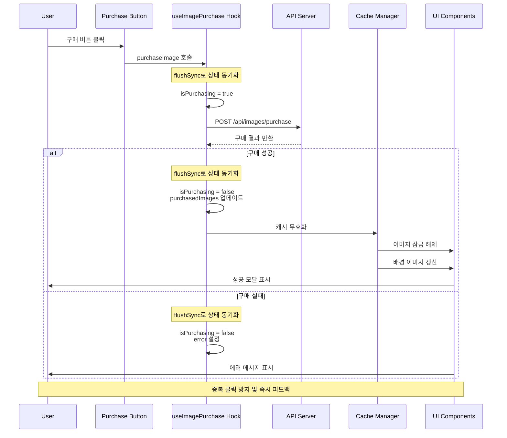

## 개요

AI 캐릭터 플랫폼에서 사용자가 트리거 이미지를 구매하고 업로드할 수 있는 기능을 구현했습니다. React 18의 flushSync를 활용해 이미지 구매 API를 중복 호출을 원천 차단하고, 구매 즉시 채팅 배경 동기화로 결제 안정성과 사용자 경험을 개선했습니다.

## 배경/문제

- **결제 버튼 연속 클릭**: API가 중복 호출되어 이중 결제/오류 위험이 존재했습니다
- **네트워크 지연**: 피드백이 늦어 사용자가 불안감을 느끼고 재클릭을 유발했습니다
- **UI 반영 지연**: 구매 완료 후 잠금 해제/배경 갱신이 일관되지 않게 보이는 문제가 있었습니다

## 목표

1. **결제 안정성 확보**: 중복 클릭으로 인한 이미지 구매 API 중복 호출 방지
2. **UI 동기화**: 구매 완료 시 이미지 잠금 해제, 배경 이미지 관련 컴포넌트를 실시간 갱신

## 역할

- **중복 호출 방지 훅 설계**: React 18의 flushSync를 활용한 동기적 상태 관리 시스템 구현
- **결제 플로우 최적화**: 트리거 이미지 구매 프로세스의 안정성 및 사용자 경험 개선

## 해결과정

### API 중복 호출 문제 해결

#### 문제 원인 분석

- **API 호출 타이밍**: 프로세스 처리 관련 상태 변경과 API 호출 사이의 시간 간격에서 발생하는 레이스 컨디션

#### flushSync 기반 동기적 상태 관리

```typescript
// useImagePurchase.ts
import { useState, useCallback } from "react";
import { flushSync } from "react-dom";

interface PurchaseState {
  isPurchasing: boolean;
  purchasedImages: string[];
  error: string | null;
}

export const useImagePurchase = () => {
  const [state, setState] = useState<PurchaseState>({
    isPurchasing: false,
    purchasedImages: [],
    error: null,
  });

  const purchaseImage = useCallback(async (imageId: string) => {
    // flushSync를 사용하여 상태를 동기적으로 업데이트
    flushSync(() => {
      setState((prev) => ({
        ...prev,
        isPurchasing: true,
        error: null,
      }));
    });

    try {
      const response = await fetch("/api/images/purchase", {
        method: "POST",
        headers: {
          "Content-Type": "application/json",
        },
        body: JSON.stringify({ imageId }),
      });

      if (!response.ok) {
        const errorData = await response.json();
        throw new Error(errorData.message || "Purchase failed");
      }

      const result = await response.json();

      // 구매 성공 시 상태를 동기적으로 업데이트
      flushSync(() => {
        setState((prev) => ({
          ...prev,
          isPurchasing: false,
          purchasedImages: [...prev.purchasedImages, imageId],
        }));
      });

      return result;
    } catch (error) {
      // 에러 발생 시 상태를 동기적으로 업데이트
      flushSync(() => {
        setState((prev) => ({
          ...prev,
          isPurchasing: false,
          error: error instanceof Error ? error.message : "Unknown error",
        }));
      });
      throw error;
    }
  }, []);

  return {
    ...state,
    purchaseImage,
  };
};
```

#### 중복 호출 방지 컴포넌트

```typescript
// ImagePurchaseButton.tsx
import React from 'react';
import { useImagePurchase } from './useImagePurchase';

interface ImagePurchaseButtonProps {
  imageId: string;
  price: number;
  onPurchaseSuccess?: (imageId: string) => void;
  onPurchaseError?: (error: string) => void;
}

export const ImagePurchaseButton: React.FC<ImagePurchaseButtonProps> = ({
  imageId,
  price,
  onPurchaseSuccess,
  onPurchaseError,
}) => {
  const { isPurchasing, error, purchaseImage } = useImagePurchase();

  const handlePurchase = async () => {
    if (isPurchasing) {
      return; // 이미 구매 중이면 중복 호출 방지
    }

    try {
      const result = await purchaseImage(imageId);
      onPurchaseSuccess?.(imageId);
    } catch (error) {
      onPurchaseError?.(error instanceof Error ? error.message : 'Purchase failed');
    }
  };

  return (
    <button
      onClick={handlePurchase}
      disabled={isPurchasing}
      className={`purchase-button ${isPurchasing ? 'purchasing' : ''}`}
    >
      {isPurchasing ? (
        <div className="purchasing-state">
          <div className="spinner" />
          <span>구매 중...</span>
        </div>
      ) : (
        <div className="purchase-content">
          <span className="price">{price.toLocaleString()}원</span>
          <span className="action">구매하기</span>
        </div>
      )}
      {error && (
        <div className="error-message">
          {error}
        </div>
      )}
    </button>
  );
};
```

### 에러 처리 및 사용자 피드백

#### 상황별 에러 처리 시스템

```typescript
// PurchaseErrorHandler.ts
export class PurchaseErrorHandler {
  static handleError(error: any): {
    message: string;
    type: "error" | "warning";
  } {
    if (error.response?.status === 400) {
      if (error.response.data?.code === "INSUFFICIENT_BALANCE") {
        return {
          message: "잔액이 부족합니다. 먼저 충전해주세요.",
          type: "error",
        };
      }
      if (error.response.data?.code === "ALREADY_PURCHASED") {
        return {
          message: "이미 구매한 이미지입니다.",
          type: "warning",
        };
      }
    }

    if (error.response?.status === 429) {
      return {
        message: "요청이 너무 많습니다. 잠시 후 다시 시도해주세요.",
        type: "warning",
      };
    }

    if (error.response?.status >= 500) {
      return {
        message:
          "서버에 일시적인 문제가 발생했습니다. 잠시 후 다시 시도해주세요.",
        type: "error",
      };
    }

    return {
      message: "구매 중 오류가 발생했습니다. 다시 시도해주세요.",
      type: "error",
    };
  }
}
```

#### 성공 피드백 및 UI 동기화

```typescript
// PurchaseSuccessHandler.tsx
import React, { useEffect } from "react";
import { flushSync } from "react-dom";

interface PurchaseSuccessHandlerProps {
  purchasedImageId: string;
  onImageUnlock: (imageId: string) => void;
  onBackgroundUpdate: (imageId: string) => void;
  onShowSuccessModal: (imageId: string) => void;
}

export const PurchaseSuccessHandler: React.FC<PurchaseSuccessHandlerProps> = ({
  purchasedImageId,
  onImageUnlock,
  onBackgroundUpdate,
  onShowSuccessModal,
}) => {
  useEffect(() => {
    if (purchasedImageId) {
      // 구매 완료 시 모든 UI 상태를 동기적으로 업데이트
      flushSync(() => {
        onImageUnlock(purchasedImageId);
        onBackgroundUpdate(purchasedImageId);
      });

      // 성공 모달 표시
      onShowSuccessModal(purchasedImageId);
    }
  }, [purchasedImageId, onImageUnlock, onBackgroundUpdate, onShowSuccessModal]);

  return null;
};
```

### 멀티 이미지 업로드 시스템

#### 드래그 앤 드롭 업로드

```typescript
// MultiImageUpload.tsx
import React, { useState, useCallback, useRef } from 'react';
import { flushSync } from 'react-dom';

interface UploadState {
  files: File[];
  uploading: boolean;
  progress: Record<string, number>;
  errors: Record<string, string>;
}

export const MultiImageUpload: React.FC = () => {
  const [state, setState] = useState<UploadState>({
    files: [],
    uploading: false,
    progress: {},
    errors: {},
  });

  const fileInputRef = useRef<HTMLInputElement>(null);

  const handleFileSelect = useCallback((files: FileList) => {
    const newFiles = Array.from(files).filter(file =>
      file.type.startsWith('image/') && file.size <= 10 * 1024 * 1024 // 10MB 제한
    );

    flushSync(() => {
      setState(prev => ({
        ...prev,
        files: [...prev.files, ...newFiles],
        errors: {},
      }));
    });
  }, []);

  const handleDrop = useCallback((e: React.DragEvent) => {
    e.preventDefault();
    const files = e.dataTransfer.files;
    handleFileSelect(files);
  }, [handleFileSelect]);

  const handleDragOver = useCallback((e: React.DragEvent) => {
    e.preventDefault();
  }, []);

  const uploadFiles = useCallback(async () => {
    if (state.files.length === 0) return;

    flushSync(() => {
      setState(prev => ({
        ...prev,
        uploading: true,
        progress: {},
        errors: {},
      }));
    });

    const uploadPromises = state.files.map(async (file, index) => {
      const formData = new FormData();
      formData.append('image', file);

      try {
        const response = await fetch('/api/images/upload', {
          method: 'POST',
          body: formData,
        });

        if (!response.ok) {
          throw new Error(`Upload failed for ${file.name}`);
        }

        const result = await response.json();

        // 업로드 진행률 업데이트
        flushSync(() => {
          setState(prev => ({
            ...prev,
            progress: {
              ...prev.progress,
              [file.name]: 100,
            },
          }));
        });

        return result;
      } catch (error) {
        flushSync(() => {
          setState(prev => ({
            ...prev,
            errors: {
              ...prev.errors,
              [file.name]: error instanceof Error ? error.message : 'Upload failed',
            },
          }));
        });
        throw error;
      }
    });

    try {
      await Promise.all(uploadPromises);

      flushSync(() => {
        setState(prev => ({
          ...prev,
          uploading: false,
          files: [],
        }));
      });
    } catch (error) {
      flushSync(() => {
        setState(prev => ({
          ...prev,
          uploading: false,
        }));
      });
    }
  }, [state.files]);

  return (
    <div className="multi-image-upload">
      <div
        className="upload-area"
        onDrop={handleDrop}
        onDragOver={handleDragOver}
        onClick={() => fileInputRef.current?.click()}
      >
        <div className="upload-content">
          <div className="upload-icon">📁</div>
          <p>이미지를 드래그하거나 클릭하여 업로드</p>
          <p className="upload-hint">최대 10MB, JPG/PNG/GIF 지원</p>
        </div>
      </div>

      <input
        ref={fileInputRef}
        type="file"
        multiple
        accept="image/*"
        onChange={(e) => e.target.files && handleFileSelect(e.target.files)}
        style=\{\{ display: 'none' \}\}
      />

      {state.files.length > 0 && (
        <div className="file-list">
          {state.files.map((file, index) => (
            <div key={index} className="file-item">
              <div className="file-info">
                <span className="file-name">{file.name}</span>
                <span className="file-size">
                  {(file.size / 1024 / 1024).toFixed(2)}MB
                </span>
              </div>
              {state.progress[file.name] && (
                <div className="progress-bar">
                  <div
                    className="progress-fill"
                    style=\{\{ width: `${state.progress[file.name]}%` \}\}
                  />
                </div>
              )}
              {state.errors[file.name] && (
                <div className="error-message">
                  {state.errors[file.name]}
                </div>
              )}
            </div>
          ))}
        </div>
      )}

      {state.files.length > 0 && (
        <button
          onClick={uploadFiles}
          disabled={state.uploading}
          className="upload-button"
        >
          {state.uploading ? '업로드 중...' : '업로드 시작'}
        </button>
      )}
    </div>
  );
};
```

### 캐시 무효화 및 데이터 갱신

#### 구매 완료 후 자동 갱신

```typescript
// useImageCache.ts
import { useCallback } from "react";
import { useQueryClient } from "@tanstack/react-query";

export const useImageCache = () => {
  const queryClient = useQueryClient();

  const invalidateImageData = useCallback(
    (imageId: string) => {
      // 관련 쿼리들을 무효화하여 자동 갱신
      queryClient.invalidateQueries(["images"]);
      queryClient.invalidateQueries(["user-purchases"]);
      queryClient.invalidateQueries(["chat-background"]);

      // 특정 이미지 데이터 갱신
      queryClient.invalidateQueries(["image", imageId]);
    },
    [queryClient],
  );

  const updateImageStatus = useCallback(
    (imageId: string, status: "locked" | "unlocked") => {
      queryClient.setQueryData(["image", imageId], (oldData: any) => ({
        ...oldData,
        status,
      }));
    },
    [queryClient],
  );

  return {
    invalidateImageData,
    updateImageStatus,
  };
};
```

## 시스템 아키텍처



## 주요 기능

### 1. 중복 호출 방지

- **flushSync 활용**: React 18의 동기적 상태 업데이트로 레이스 컨디션 방지
- **상태 기반 제어**: isPurchasing 상태로 중복 클릭 원천 차단
- **즉시 피드백**: 버튼 클릭 즉시 UI 상태 변경으로 사용자 안심

### 2. 상황별 에러 처리

- **잔액 부족**: 명확한 충전 안내 메시지
- **중복 구매**: 이미 구매한 이미지에 대한 경고
- **서버 오류**: 상황별 적절한 재시도 안내
- **네트워크 오류**: 연결 상태 확인 안내

### 3. UI 동기화

- **실시간 잠금 해제**: 구매 완료 즉시 이미지 잠금 해제
- **배경 이미지 갱신**: 채팅 배경에 구매한 이미지 즉시 반영
- **성공 모달**: 구매 완료 시 시각적 확인 제공
- **캐시 무효화**: 관련 데이터 자동 갱신으로 일관성 보장

### 4. 멀티 이미지 업로드

- **드래그 앤 드롭**: 직관적인 파일 업로드 인터페이스
- **진행률 표시**: 개별 파일별 업로드 진행률 시각화
- **에러 처리**: 파일별 개별 에러 메시지 표시
- **파일 검증**: 크기 및 형식 제한으로 안정성 확보

## 결과

- **중복 결제 문제 해결**: flushSync를 통한 동기적 상태 관리로 중복 결제 문제가 완전히 사라졌습니다
- **사용자 경험 개선**: 즉시 피드백과 실시간 UI 동기화로 자연스러운 구매 경험 제공
- **안정성 확보**: 예외 상황에서도 안정적으로 상태가 복구되도록 구현했습니다
- **결제 신뢰성 향상**: 레이스 컨디션 방지로 결제 시스템의 신뢰성 대폭 향상

## 기술 스택

- **Frontend**: React 18, TypeScript
- **State Management**: React Hooks, flushSync
- **API**: RESTful API, FormData
- **Caching**: React Query (TanStack Query)
- **Error Handling**: Custom Error Classification
- **UI/UX**: Drag & Drop, Progress Indicators, Modal System
