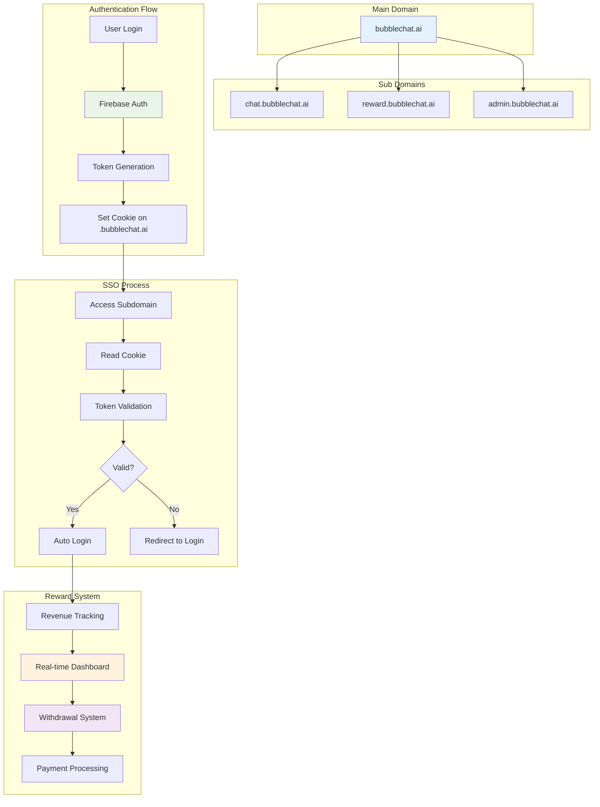

## 개요

AI 캐릭터 창작자와 플랫폼 간 투명한 수익 분배 시스템을 구축하여 창작자 생태계 활성화와 지속 가능한 플랫폼 성장을 동시에 달성하는 리워드 서비스를 개발했습니다.

이 과정에서 채팅 서비스([https://bubblechat.ai](https://bubblechat.ai/chat))와 리워드 서비스([reward.bubblechat.ai](http://reward.bubblechat.ai/)) 간 단일 로그인(SSO)을 구현하였습니다.

## 배경/문제

- **창작자 유입 부족**: 양질의 AI 캐릭터/콘텐츠 창작자 확보 및 생태계 선순환 구조 부재
- **출금 시스템 부재**: 창작자가 수익을 실제 현금으로 전환할 수 있는 안전한 출금 시스템 필요

## 목표

1. **투명한 수익 추적**: 일별/주별/월별 수익 현황을 실시간으로 확인할 수 있는 대시보드 제공
2. **단일 로그인 경험**: 한 번 로그인으로 모든 서브도메인에서 인증 상태 유지

## 역할

- **실시간 대시보드 개발**: 차트 기반 수익 추적 및 랭킹 시스템 구축
- **SSO 인증 시스템**: 서브도메인 간 쿠키 기반 Single Sign-On 구현으로 사용자 경험 개선
- **출금 시스템 구축**: 중복 호출 방지 및 세금 계산이 포함된 안전한 현금 출금 기능 개발

## 해결과정

### 실시간 수익 추적 대시보드

창작자가 자신의 수익 현황을 한눈에 파악할 수 있는 종합 대시보드를 구현했습니다.

#### 다차원 수익 분석

- **기간별 분석**: 일별, 주별, 월별 수익 트렌드 추적
- **콘텐츠 타입별 분석**: 캐릭터, 유니버스, 씬별 수익 분포
- **사용자 행동 분석**: 채팅 횟수, 평균 대화 길이, 재방문율 등 상세 지표

#### 시각적 차트 시스템

- **수익 트렌드 그래프**: 시간에 따른 수익 변화를 직관적으로 표시
- **콘텐츠별 수익 분포**: 파이 차트로 각 콘텐츠의 수익 기여도 시각화
- **랭킹 시스템**: 전체 창작자 중 상위 랭킹 및 성과 지표 표시

### 크로스 도메인 쿠키 기반 토큰 공유

상위 도메인 쿠키를 활용하여 모든 서브도메인에서 접근 가능한 인증 시스템을 구현했습니다.

#### 쿠키 설정 전략

- **상위 도메인 쿠키**: `.bubblechat.ai` 도메인에 인증 토큰 저장
- **보안 설정**: HttpOnly, Secure, SameSite 옵션으로 보안 강화
- **만료 시간 관리**: 토큰 갱신 주기에 맞춘 적절한 만료 시간 설정

#### 서브도메인 간 토큰 공유

- **자동 인증**: 서브도메인 접근 시 상위 도메인 쿠키에서 토큰 자동 읽기
- **상태 동기화**: 모든 서브도메인에서 동일한 인증 상태 유지
- **로그아웃 연동**: 한 도메인에서 로그아웃 시 모든 도메인에서 동시 로그아웃

### 자동 토큰 검증 및 재인증 시스템

페이지 접근 시 쿠키에서 토큰을 자동으로 읽어와 검증하는 시스템을 구현했습니다.

#### 자동 검증 프로세스

- **페이지 로드 시 검증**: 초기 로드 시 쿠키 토큰을 서버에서 자동 검증
- **토큰 유효성 확인**: Firebase Auth를 통한 토큰 유효성 실시간 검증
- **자동 갱신**: 검증 성공 시 새로운 토큰 발급 및 쿠키 업데이트

#### 실패 처리 시스템

- **검증 실패 시**: 쿠키 삭제 및 로그아웃 상태로 자동 전환
- **네트워크 오류**: 재시도 로직 및 사용자 알림 시스템
- **토큰 만료**: 자동 갱신 실패 시 로그인 페이지로 리다이렉트

### 안전한 출금 시스템

#### 중복 호출 방지

- **flushSync API 활용**: 출금 API 중복 호출을 완전히 차단하는 시스템
- **상태 기반 제어**: 출금 진행 중 추가 요청 자동 차단
- **사용자 피드백**: 출금 진행 상태를 실시간으로 사용자에게 표시

#### 최소 출금 단위 관리

- **만원 단위 출금**: 소액 출금 방지 및 수수료 최적화
- **수수료 계산**: 출금 수수료 자동 계산 및 차감
- **세금 처리**: 소득세 계산 및 자동 차감 시스템

## 시스템 아키텍처

## 주요 기능

### 1. 실시간 수익 추적

- **다차원 분석**: 기간별, 콘텐츠 타입별 수익 추적
- **시각적 차트**: 수익 트렌드를 직관적으로 파악할 수 있는 그래프
- **랭킹 시스템**: 전체 창작자 중 상위 랭킹 및 성과 지표

### 2. 크로스 도메인 SSO

- **상위 도메인 쿠키**: `.bubblechat.ai` 도메인에 인증 토큰 저장
- **자동 인증**: 서브도메인 접근 시 토큰 자동 읽기 및 검증
- **상태 동기화**: 모든 서브도메인에서 동일한 인증 상태 유지

### 3. 자동 토큰 관리

- **자동 검증**: 페이지 로드 시 쿠키 토큰을 서버에서 자동 검증
- **토큰 갱신**: 검증 성공 시 새로운 Firebase Auth 토큰 발급
- **실패 처리**: 검증 실패 시 쿠키 삭제 및 로그아웃 상태 전환

### 4. 안전한 출금 시스템

- **중복 호출 방지**: flushSync API를 활용한 출금 API 중복 호출 차단
- **최소 출금 단위**: 만원 단위 출금으로 소액 출금 방지
- **수수료 최적화**: 출금 수수료 자동 계산 및 세금 처리

## 결과

- **창작자 생태계 활성화**: 투명한 수익 분배로 양질의 창작자 유입이 크게 증가했습니다
- **사용자 만족도 향상**: 실시간 수익 추적으로 창작자의 플랫폼 신뢰도가 대폭 개선되었습니다
- **플랫폼 성장**: 지속 가능한 수익 모델로 플랫폼의 장기적 성장 기반 마련
- **기술적 안정성**: 크로스 도메인 SSO로 사용자 경험 향상 및 기술적 복잡성 해결

## 기술 스택

- **Authentication**: Firebase Auth, Cross-domain Cookies
- **Dashboard**: Real-time Charts, Data Visualization
- **Payment**: Withdrawal System, Tax Calculation
- **Security**: HttpOnly Cookies, Token Validation
- **Performance**: Real-time Updates, Optimized API Calls
