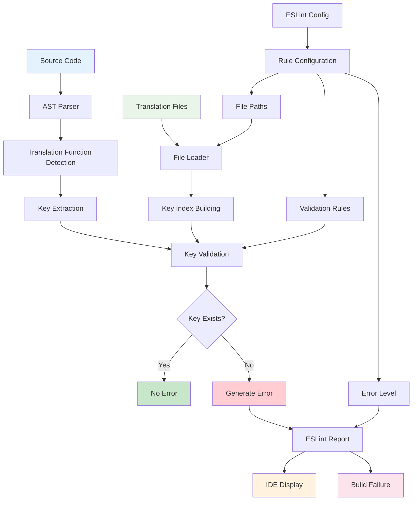

## 개요

다국어 서비스에서 번역키 누락으로 인한 UI 깨짐을 방지하기 위해 AST 파싱 기반 커스텀 ESLint Rule을 개발했습니다.

개발 중 실시간으로 번역키 존재 여부를 검증하여 프로덕션 배포 전 모든 번역 문제를 사전에 차단했습니다.

## 배경/문제

- **번역키 누락**: 개발자가 새로운 텍스트 추가 시 일부 언어의 번역키를 빠뜨리는 휴먼 에러 빈발
- **런타임 발견**: 프로덕션 배포 후에야 번역키 누락을 발견하여 긴급 핫픽스가 필요한 상황
- **다국어 복잡성**: 버블챗/팅글챗 서비스별로 한국어/영어/중국어/태국어 등 8개 번역 파일 관리의 어려움
- **수동 검토 한계**: 수백 개의 번역키를 수동으로 확인하기 어려워 누락이 지속적으로 발생

## 목표

- **실시간 검증**: 개발 중 번역키 누락을 즉시 감지하여 IDE에서 경고 표시
- **다국어 지원**: 여러 언어별 번역 파일을 동시에 검증하여 일관성 보장
- **서비스별 분리**: 버블챗과 팅글챗의 별도 번역 파일 관리 및 검증
- **확장 가능성**: 새로운 언어나 서비스 추가 시 쉽게 확장 가능한 구조

## 역할

1. **실시간 검증**: 개발 중 번역키 누락을 즉시 감지하여 IDE에서 경고 표시
2. **다국어 지원**: 여러 언어별 번역 파일을 동시에 검증하여 일관성 보장
3. **서비스별 분리**: 버블챗과 팅글챗의 독립적인 번역 파일 관리 및 검증

## 해결과정

### AST 기반 번역키 호출 감지

JavaScript/TypeScript 코드에서 번역 함수 호출을 실시간으로 추적하는 시스템을 구현했습니다.

#### 정적 분석 시스템

- **컴파일 타임 감지**: 모든 번역키 호출을 컴파일 단계에서 미리 감지
- **AST 파싱**: JavaScript/TypeScript 코드를 추상 구문 트리로 파싱하여 번역 함수 호출 추출
- **패턴 매칭**: 다양한 번역 함수 호출 패턴을 정확히 인식

#### 타입 안전성 보장

- **정적 문자열 검증**: 컴파일 타임에 결정되는 정적 문자열만 검증
- **동적 키 제외**: 런타임에 생성되는 동적 번역키는 검증 대상에서 제외
- **타입 추론**: TypeScript 타입 정보를 활용한 정확한 번역키 추출

#### 다양한 호출 패턴 지원

- **함수 호출**: `t('key')`, `translate('key')` 등의 함수 호출 패턴
- **JSX 컴포넌트**: `<Trans>key</Trans>` 등의 JSX 컴포넌트 패턴
- **메서드 체이닝**: `i18n.t('key')` 등의 메서드 체이닝 패턴

### 동적 번역 파일 관리

외부 번역 파일들을 효율적으로 관리하는 시스템을 구현했습니다.

#### 유연한 구조 설계

- **외부 주입**: 번역 파일을 외부에서 주입받아 다양한 프로젝트에서 재사용 가능
- **설정 기반**: ESLint 설정을 통해 번역 파일 경로 및 구조 유연하게 설정
- **플러그인 방식**: 새로운 번역 시스템 추가 시 기존 코드 수정 없이 확장

#### 중첩 객체 지원

- **Dot Notation**: `user.profile.name` 등의 깊은 구조의 번역키 정확히 검증
- **중첩 탐색**: 객체의 중첩된 구조를 재귀적으로 탐색하여 키 존재 여부 확인
- **타입 안전성**: 중첩된 객체 구조에서도 타입 안전한 키 검증

#### 네임스페이스 관리

- **서비스별 분리**: 버블챗과 팅글챗의 번역 파일을 독립적으로 관리
- **언어별 분리**: 한국어, 영어, 중국어, 태국어 등 각 언어별 번역 파일 관리
- **스코프 관리**: 각 서비스와 언어별로 독립적인 번역키 스코프 제공

### 프로젝트별 ESLint 설정 통합

번역 파일을 읽어와 ESLint Rule에 주입하는 시스템을 구현했습니다.

#### 설정 기반 통합

- **ESLint 설정**: `.eslintrc.js`에서 번역 파일 경로 및 검증 규칙 설정
- **환경별 설정**: 개발/스테이징/프로덕션 환경별로 다른 검증 레벨 설정
- **프로젝트별 커스터마이징**: 각 프로젝트의 번역 구조에 맞는 설정 제공

#### 에러 레벨 설정

- **빌드 실패**: 번역키 누락 시 빌드 실패로 설정하여 배포 차단
- **경고 모드**: 개발 중에는 경고로, 프로덕션 빌드에서는 에러로 설정
- **선택적 검증**: 특정 파일이나 디렉토리만 선택적으로 검증

### 상세한 오류 메시지 및 디버깅 지원

개발자가 문제를 빠르게 해결할 수 있도록 구체적인 안내를 제공했습니다.

#### 구체적 안내 시스템

- **정확한 위치**: 어느 파일의 어느 라인에서 번역키가 누락되었는지 명확히 표시
- **언어별 정보**: 어떤 언어의 번역 파일에서 누락되었는지 구체적으로 안내
- **제안 사항**: 누락된 번역키를 추가하는 방법에 대한 구체적인 가이드 제공

#### 테스트 기반 검증

- **단위 테스트**: ESLint Rule의 정확성을 보장하는 포괄적인 테스트 케이스
- **통합 테스트**: 실제 프로젝트 환경에서의 동작 검증
- **엣지 케이스**: 다양한 번역키 패턴과 예외 상황에 대한 테스트

#### IDE 통합

- **VS Code 지원**: VS Code에서 실시간으로 번역키 누락 경고 표시
- **IntelliSense**: 번역키 자동완성 및 존재 여부 실시간 확인
- **퀵 픽스**: 누락된 번역키를 자동으로 추가하는 퀵 픽스 기능

## 시스템 아키텍처

## 주요 기능

### 1. 실시간 번역키 검증

- **AST 기반 분석**: JavaScript/TypeScript 코드를 파싱하여 번역 함수 호출 실시간 감지
- **정적 분석**: 컴파일 타임에 모든 번역키 존재 여부 검증
- **다양한 패턴 지원**: 함수 호출, JSX 컴포넌트, 메서드 체이닝 등 모든 번역 패턴 지원

### 2. 다국어 일관성 보장

- **동시 검증**: 여러 언어별 번역 파일을 동시에 검증하여 일관성 보장
- **중첩 구조 지원**: Dot notation으로 깊은 구조의 번역키도 정확히 검증
- **네임스페이스 관리**: 서비스별/언어별 번역 파일을 독립적으로 관리

### 3. 개발자 경험 최적화

- **IDE 통합**: VS Code에서 실시간 경고 표시 및 자동완성 지원
- **상세한 오류 메시지**: 누락된 번역키의 정확한 위치와 해결 방법 안내
- **퀵 픽스**: 누락된 번역키를 자동으로 추가하는 기능

### 4. 빌드 통합

- **에러 레벨 설정**: 번역키 누락 시 빌드 실패로 설정하여 배포 차단
- **환경별 설정**: 개발/스테이징/프로덕션 환경별로 다른 검증 레벨
- **선택적 검증**: 특정 파일이나 디렉토리만 선택적으로 검증

## 결과

- **번역 품질 보장**: 개발 중 번역키 누락이 즉시 감지되어 프로덕션 배포 전 모든 문제가 해결되었습니다
- **개발 효율성 향상**: 수동 검토 과정이 자동화되어 개발자의 번역 관리 부담이 대폭 감소했습니다
- **휴먼 에러 방지**: ESLint 에러로 인한 빌드 실패로 번역 누락이 완전히 차단되었습니다

#### AS-IS

#### TO-BE

## 개선할 점

- CI/CD 파이프라인에 번역키 누락 방지 테스트가 추가되면 더 안정성 있는 서비스가 될 수 있을 것 같습니다.

## 기술 스택

- **Static Analysis**: ESLint, AST Parsing, JavaScript/TypeScript
- **i18n**: Multi-language Support, Translation Key Management
- **Developer Tools**: VS Code Integration, IntelliSense, Quick Fix
- **Build Integration**: ESLint Rules, Build Pipeline, Error Handling
- **Testing**: Unit Tests, Integration Tests, Edge Case Coverage
- **Architecture**: Plugin Architecture, Configuration-based, Extensible Design
