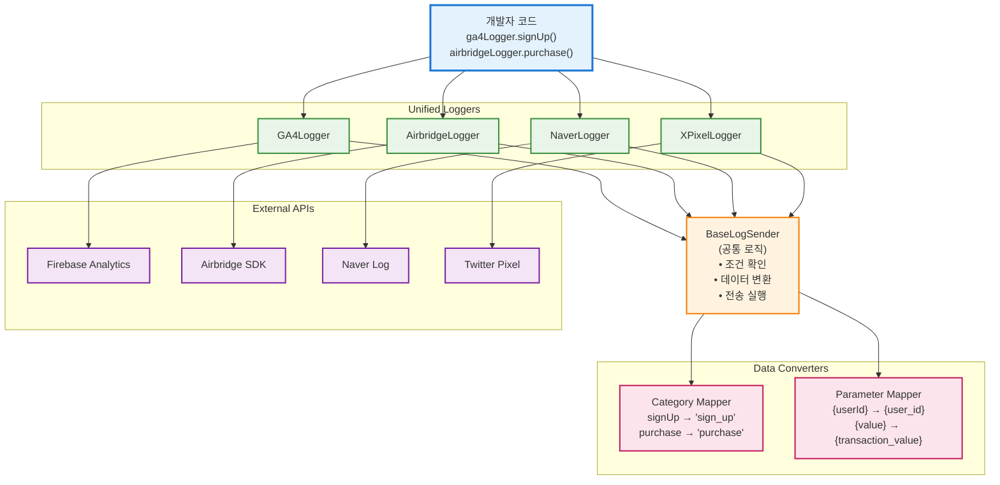

## 개요

GA4, Airbridge, Naver Log, X Pixel 등 4개의 서로 다른 분석 플랫폼에 동일한 사용자 이벤트를 일관성 있게 전송하는 통합 로그 수집 시스템을 구축했습니다.

## 배경/문제

- **플랫폼별 상이한 API**: GA4는 Firebase Analytics, Airbridge는 자체 SDK, Naver는 wcs 객체 등 각기 다른 방식으로 이벤트를 전송해야 했습니다
- **중복 코드 발생**: 동일한 '회원가입' 이벤트를 4개 플랫폼에 보내려면 각각 다른 함수를 4번 호출해야 했습니다
- **데이터 불일치**: 수동으로 여러 플랫폼에 전송하다 보니 일부 플랫폼에는 누락되거나 잘못된 데이터가 전송되는 경우가 빈번했습니다
- **유지보수 어려움**: 새로운 이벤트 추가 시 4개 플랫폼 모두에 개별적으로 코드를 작성해야 하는 번거로움이 있었습니다

## 목표

1. **타입 안전성**: 잘못된 파라미터 전달 시 컴파일 단계에서 에러 발생
2. **쉬운 확장**: 새로운 플랫폼 추가 시 기존 코드 수정 없이 플러그인 방식으로 추가
3. **환경별 제어**: 개발/스테이징/프로덕션 환경에 따라 선택적으로 로그 전송

## 역할

- **시스템 아키텍처 설계**: 객체지향 설계 패턴을 활용한 확장 가능한 로그 시스템 구조 설계
- **TypeScript 타입 시스템**: 컴파일 타임 타입 검증으로 런타임 에러 방지
- **통합 인터페이스 개발**: 개발자가 쉽게 사용할 수 있는 단순한 API 설계
- **플랫폼 어댑터 구현**: 각 분석 플랫폼의 고유한 API 스펙에 맞는 변환 로직 구현

## 해결과정

### 공통 인터페이스 정의

모든 로그 시스템이 따라야 할 공통 규칙을 정의했습니다.

#### 추상 클래스로 공통 로직 구현

- **BaseLogSender 클래스**: 각 플랫폼별 로거가 상속받을 기본 클래스 생성
- **공통 메서드**: 조건 확인, 데이터 변환, 전송 실행 등의 공통 로직 구현
- **중복 코드 제거**: 플랫폼별로 반복되는 로직을 상위 클래스로 추상화

#### 타입 안전성 보장

- **인터페이스 정의**: 각 플랫폼별로 필요한 파라미터 타입을 명확히 정의
- **컴파일 타임 검증**: 잘못된 파라미터 전달 시 TypeScript 컴파일러가 에러 발생
- **제네릭 활용**: 플랫폼별 특화된 타입을 유지하면서 공통 인터페이스 제공

### 플랫폼별 구체 클래스 구현

각 분석 플랫폼의 특성에 맞는 로거로 확장했습니다.

#### GA4 Logger

- **Firebase Analytics 연동**: Google Analytics 4의 이벤트 전송 방식 구현
- **이벤트 매핑**: 공통 이벤트를 GA4 형식으로 변환하는 로직
- **파라미터 변환**: GA4 스펙에 맞는 파라미터명 및 데이터 타입 변환

#### Airbridge Logger

- **SDK 연동**: Airbridge 자체 SDK를 활용한 이벤트 전송
- **커스텀 이벤트**: Airbridge 전용 이벤트 타입 및 파라미터 처리
- **사용자 속성**: 사용자 식별 및 속성 설정 로직

#### Naver Logger

- **wcs 객체 활용**: Naver의 웹 로그 수집 시스템 연동
- **이벤트 변환**: Naver 로그 형식에 맞는 데이터 구조 변환
- **파라미터 매핑**: Naver 스펙에 맞는 파라미터명 변환

#### X Pixel Logger

- **Twitter Pixel 연동**: X(구 Twitter) 픽셀을 통한 이벤트 전송
- **컨버전 추적**: 구매, 회원가입 등 주요 컨버전 이벤트 처리
- **사용자 매칭**: X 픽셀의 사용자 식별 시스템 연동

### 데이터 변환 시스템

공통 이벤트를 각 플랫폼별 형식으로 변환하는 매퍼를 구현했습니다.

#### Category Mapper

- **이벤트명 변환**: `signUp` → `sign_up`, `purchase` → `purchase` 등
- **플랫폼별 규칙**: 각 플랫폼의 이벤트명 규칙에 맞는 변환 로직
- **일관성 유지**: 동일한 의미의 이벤트가 모든 플랫폼에서 일관되게 전송

#### Parameter Mapper

- **파라미터명 변환**: `{userId}` → `{user_id}`, `{value}` → `{transaction_value}` 등
- **데이터 타입 변환**: 문자열, 숫자, 불린 등 각 플랫폼 요구사항에 맞는 타입 변환
- **필수 파라미터 검증**: 각 플랫폼별 필수 파라미터 존재 여부 확인

### 환경별 제어 시스템

개발/스테이징/프로덕션 환경에 따라 선택적으로 로그를 전송하는 시스템을 구현했습니다.

#### 환경 설정

- **환경 변수**: `NODE_ENV`에 따른 플랫폼별 활성화/비활성화 제어
- **개발 모드**: 개발 환경에서는 로그 전송 없이 콘솔 출력만 수행
- **스테이징 모드**: 테스트용 플랫폼에만 로그 전송

#### 조건부 전송

- **플래그 기반**: 각 플랫폼별 활성화 플래그로 전송 여부 결정
- **사용자 기반**: 특정 사용자 그룹에 대해서만 로그 전송
- **이벤트 기반**: 특정 이벤트 타입에 대해서만 선택적 전송

## 시스템 아키텍처

## 주요 기능

### 1. 통합 인터페이스

- **일관된 API**: 모든 플랫폼에 대해 동일한 방식으로 이벤트 전송
- **타입 안전성**: TypeScript를 통한 컴파일 타임 타입 검증
- **간단한 사용법**: 복잡한 플랫폼별 API 숨기고 단순한 인터페이스 제공

### 2. 확장 가능한 아키텍처

- **플러그인 방식**: 새로운 플랫폼 추가 시 기존 코드 수정 없이 확장
- **객체지향 설계**: 상속과 다형성을 활용한 유연한 구조
- **모듈화**: 각 플랫폼별 로직이 독립적으로 관리

### 3. 데이터 일관성 보장

- **자동 변환**: 공통 이벤트를 각 플랫폼 형식으로 자동 변환
- **파라미터 매핑**: 플랫폼별 파라미터명 및 데이터 타입 자동 변환
- **검증 시스템**: 필수 파라미터 및 데이터 형식 자동 검증

### 4. 환경별 제어

- **환경 설정**: 개발/스테이징/프로덕션 환경별 다른 동작
- **조건부 전송**: 플래그 기반 선택적 로그 전송
- **디버깅 지원**: 개발 환경에서 상세한 로그 출력

## 결과

- **개발 생산성 향상**: 새로운 이벤트 추가 시 한 곳에서만 정의하면 모든 플랫폼에 자동 적용되어 개발 시간이 대폭 단축되었습니다
- **데이터 일관성 보장**: 모든 분석 플랫폼에서 동일한 이벤트 데이터를 수집하여 크로스 플랫폼 분석의 정확성이 크게 향상되었습니다
- **타입 안전성 확보**: 컴파일 타임 타입 검증으로 런타임 에러가 완전히 제거되고 코드 품질이 향상되었습니다
- **유지보수성 개선**: 플랫폼별 로직이 명확히 분리되어 새로운 분석 도구 추가나 기존 로직 수정이 매우 간편해졌습니다
