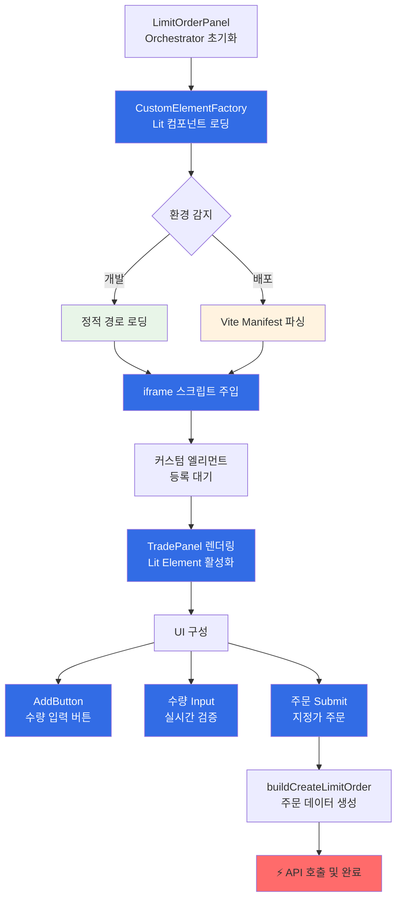
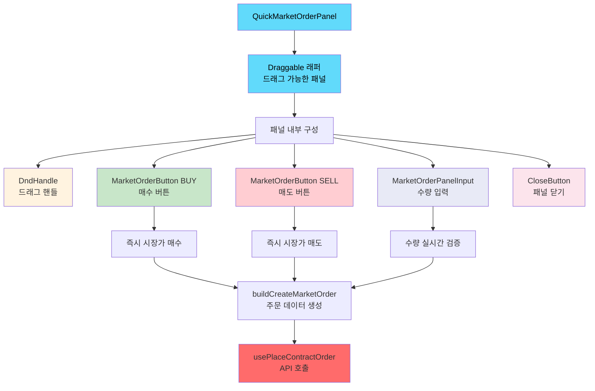
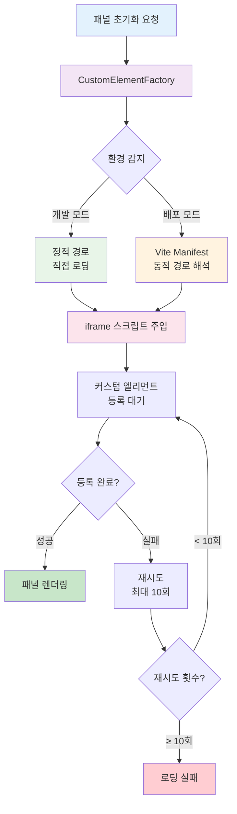

차트 내 지정가 주문 UI 추가

차트 내 시장가 주문 UI 추가

## **개요**

TradingView 차트 내에서 빠른 주문 실행을 위한 Market Order와 Limit Order 패널 시스템을 개발하여 사용자가 차트를 보면서 즉시 거래할 수 있는 인터페이스를 구현했습니다

## **배경**

- 차트 분석 후 별도 주문 폼으로 이동해야 하는 번거로움이 존재했습니다
- 차트 가격을 보면서 즉시 주문 실행 가능한 UI 필요하다고 판단하였습니다

## **목표**

1. **사용자 경험 향상**: 차트에서 원클릭으로 주문 실행이 되면 좋을 것이라 판단하였습니다
2. **거래 효율성 증대**: 분석과 주문 실행을 하나의 화면에서 처리하는 것이 인지적인 측면에 도움이 될거라 판단하였습니다

## 역할

- **아키텍처 설계**: 계층형 모듈 구조 설계하고 이를 구현했습니다
- **기술 선택**:
  - 시장가 주문: 리액트 기반의 컴포넌트 구현
  - 지정가 주문: Lit Web Components 도입
    - 도입 배경: Vanilla JS 대비 선언적 렌더링, 반응형 상태 관리, 생명주기 관리에 장점이 있다고 판단하여 Lit을 도입하였습니다
- **UI 컴포넌트 구현**: 드래그 앤 드롭 인터페이스 및 패널 UI 구현
- 코드 문서화 작업과 기술 부채를 해소하기 위해 해결 과정을 공유하는 시간을 가졌습니다

## 해결과정

1. **지정가 주문 기능**
   - 아키텍처 설계
     - 계층별 모듈화 아키텍처를 구축하여 관심사별로 클래스를 분리하였습니다
       - **Orchestrator Layer**: 전체 시스템 조율 및 의존성 주입 관리
       - **View Layer**: DOM 조작 및 사용자 인터랙션 처리
       - **Service Layer**: 주문 생성, 검증 등 거래 비즈니스 로직
       - **Infrastructure Layer**: iframe DOM 접근 및 TradingView API 연동
     - EventBus 패턴을 통한 iframe과 메인 앱 간 실시간 양방향 통신이 가능하도록 설계했습니다
   - **UI 컴포넌트 개발:** Lit 라이브러리를 통한 UI 컴포넌트를 개발하였습니다
   - **iframe 내 Lit 컴포넌트(거래 패널 UI) 주입을 위한 모듈 로딩 신뢰성 개선 작업을 진행했습니다**
     - **iframe 전용 모듈 로더 개발**:
       - 커스텀 엘리먼트 등록 완료까지 Promise 기반 대기 메커니즘 구현
       - 로딩 순서와 완료 시점을 명확히 관리하는 파이프라인 구축
     - **Vite manifest 기반 동적 경로 해석**:
       - 빌드 시 생성되는 manifest.json을 활용해 실제 번들 경로를 동적으로 탐지하여 환경별 해시 청크 경로 차이를 해결했습니다
     - **환경별 분기 로딩 전략:**
       - 개발: Lit 컴포넌트 파일 경로를 정의한 상수를 사용해 iframe에 모듈 주입
       - 배포: vite의 manifest.json 기반 해시 번들 경로 활용하여 iframe에 모듈 주입
2. **시장가 주문 기능**
   - Trading View 영역 위에 오버레이 되는 리액트 컴포넌트를 구현하였습니다
   - 해당 패널에 대해 드래그 앤 드롭이 가능하도록 기능을 추가하였습니다

## Limit Order Panel

## Market Order Panel

## 모듈 로딩 안정화 시스템

## 결과

- **사용자 경험 향상**: 차트에서 원클릭으로 주문 실행 가능
- **거래 효율성 증대**: 분석과 주문 실행을 하나의 화면에서 처리
- **기술적 안정성**: 환경별 로딩 실패율 0% 달성
- **확장성**: 모듈화된 아키텍처로 유지보수성 향상
- **성능**: Web Components와 React의 하이브리드 접근으로 최적화된 렌더링
