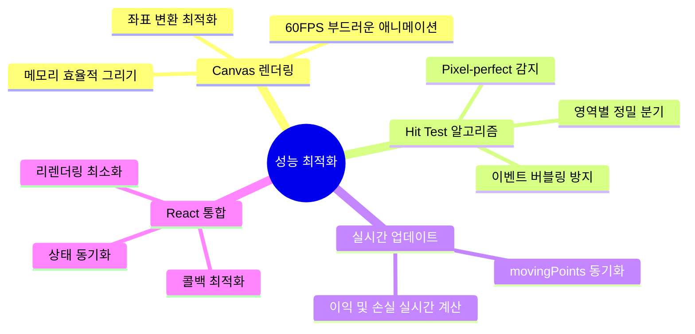
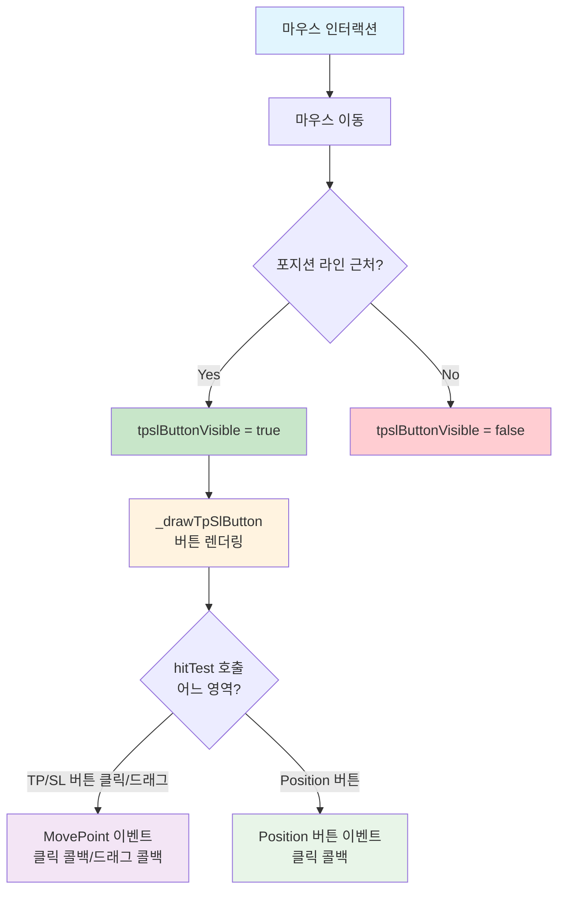
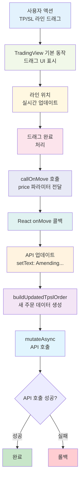
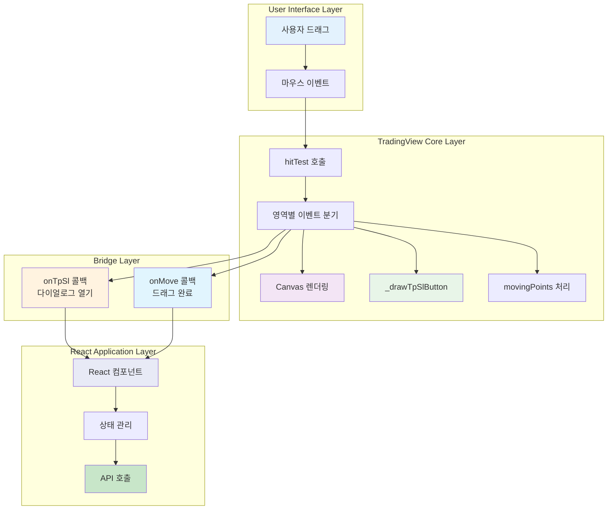
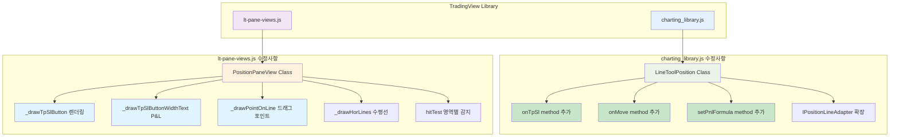

## 개요

공개 API 내에 TPSL 설정 기능이 부재하여 리버스 엔지니어링을 통해 TradingView 기반 차트에 드래그형 TP/SL 인터페이스를 직접 추가하였습니다.
이를 통해 차트 위에서 시각적으로 TP/SL 설정을 할 수 있게 되었고, 실시간 수익,손실 피드백을 제공하여 거래 효율을 높였습니다

## 배경/문제

- **TradingView API 한계**
  - 공식 API에서 체결 포지션 표시까지 지원하지만, TP/SL(익절/손절) 설정 API가 없었습니다
  - onMove API에서 price 가격 데이터를 차트로부터 받아올 수 없었습니다
- **UX 단절**
  - 사용자가 차트에서 포지션을 보더라도 TP/SL 조정은 별도 폼 UI로 이동해야 하여 이 과정에서 맥락 전환 및 시간 소모가 발생할 수 있다고 판단하였습니다
- **상호작용/피드백 부족**
  - 차트 상에서 직접 조작 가능한 UI와 실시간 손익(P&L) 가이드가 부재하여 자신이 청산 위기에 놓여있는지 판단하기 어려웠습니다

## 목표

1. 차트 위에서 직접 TP/SL 버튼을 드래그해 설정/수정할 수 있는 인터페이스 제공
2. 드래그 중 실시간 P&L 피드백을 제공
3. React과 TradingView 사이의 이벤트 및 렌더링 파이프라인을 안전하게 연결

## 역할

- 문제 제안 및 드래그 기반 TP/SL을 제공하기 위한 기획을 하였습니다
- Chrome 디버거로 번들 내부 구조를 분석하고 확장 포인트를 검증하여 라이브러리 코드를 수정하였습니다
- 내부 메서드/렌더/히트테스트를 구현하고, 실 서비스에 운용할 수 있도록 안정화 작업을 실시했습니다
- 산출물을 문서화하고 변경 내용을 발표를 통해 팀 내에 전파하였습니다

## 해결 과정

### 1. Reverse Engineering

번들 내부의 `LineToolPosition`, `Renderer`, `PositionPaneView` 등 핵심 클래스를 분석하였습니다.
히트테스트(hitTest) → 이벤트 → 렌더 흐름을 파악하여 수정 가능한 지점을 확인하였습니다.

### 2. 내부 확장 포인트 설계

공개 인터페이스와 내부 비즈니스 로직을 분리하여 설계했습니다.

**공개 인터페이스:**

- `onTpSl(callback)`: TP/SL 버튼 클릭 시 다이얼로그 오픈
- `onMove(callback)`: 드래그 완료 시 **최종 가격** 전달
- `setPnlFormula(fn)`: 실시간 P&L 계산 포뮬러 주입(롱/숏, 수량, 진입가 반영)

**내부 비즈니스 (TradingView 비즈니스 코드):**

- **Order Line**: `callOnMove(price)` 수정 → 내부에서 관리하던 `e.logical.price`를 onMove 공개 API에 전달하도록 수정
- **Position Line**: `onTpSl`, `onMove`, `setPnlFormula` 메서드 **추가**.
- **pane(렌더러)**: `tpslButton` 렌더 함수 등 UI 렌더 함수 추가, `hitTest` 로직 추가

**TPSL 버튼 노출 규칙:**

- 포지션 라인 근접도 기반 UI 노출
- 드래그 시 가이드 라인 / 툴팁 / P&L 갱신

### 3. 디버깅 시 고민했던 포인트

## 마우스 인터랙션 플로우 (hittest)

- **마우스 이동** → 포지션 라인 근접 `hitTest` → TP/SL 버튼 노출.
- **드래그 경로**: 버튼 드래그 → `movingPoints` 업데이트 → 가이드라인/예상 손익 표시 → `callOnMove(price)` → React `onMove(price)` → 주문 데이터 갱신.
- **클릭 경로**: 버튼 클릭 → `callOnTpSl()` → React `onTpSl()` → **TP/SL 다이얼로그 오픈**.
- API 호출 시나리오
  - `onMove(price)` 수신 → UI에 `setText("Amending…")` 등 즉시 피드백.
  - `buildUpdatedTpslOrder(price)` → 서버 `mutateAsync` 호출.
  - 성공: `queryClient.setData`로 캐시 반영 및 라인 상태 확정.
  - 실패: 에러 토스트/롤백 처리, 버튼 상태 복구.

## 드래그 이벤트 상세 처리

## 시스템 아키텍처 레이어

## 대략적인 수정 내용

## 결과

- 차트 내에서 드래그 앤 드롭으로 TP/SL 설정 가능
- 실시간 P&L 계산 및 시각적 피드백 제공
- 사용자 거래 편의성 대폭 향상
- 차트와 거래 기능의 완전한 통합으로 UX 개선
