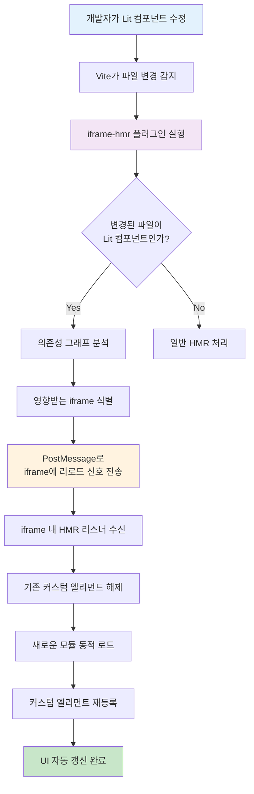

## 개요

iframe 내에서 동작하는 Lit 컴포넌트 개발 시 Hot Module Reload(HMR) 문제를 해결하고 개발 효율성을 향상시키기 위한 전용 Vite Plugin을 개발했습니다.

## 배경

- **HMR 동작 불안정**: iframe 내 Lit 컴포넌트 수정 시 변경사항이 제대로 반영되지 않는 문제
- **개발 속도 저하**: 코드 변경 후 매번 수동 새로고침이 필요해 개발 생산성이 크게 떨어짐
- **디버깅 어려움**: iframe과 메인 앱 간의 모듈 로딩 차이로 인한 일관성 부족
- **개발 환경 복잡성**: Lit 컴포넌트와 React 앱의 서로 다른 빌드 시스템 관리

## 목표

1. **자동 리로드**: Lit 컴포넌트 변경 시 iframe 자동 새로고침
2. **개발 속도 향상**: 실시간 변경사항 반영으로 개발 효율성 증대
3. **일관된 경험**: 메인 앱과 동일한 수준의 개발자 경험 제공
4. **안정적 HMR**: iframe 환경에서도 안정적으로 동작하는 모듈 교체

## 내 역할

- **커스텀 Vite Plugin 구현**: Vite의 플러그인 시스템을 활용한 커스텀 HMR 로직 구현

## 해결과정

### 문제 원인 분석

iframe 내에서 Lit 컴포넌트가 로드되는 특수한 환경을 분석했습니다.

- **모듈 격리 문제**: iframe의 독립적인 실행 컨텍스트로 인한 HMR 신호 전달 불가
- **커스텀 엘리먼트 캐싱**: 브라우저가 한 번 등록된 커스텀 엘리먼트를 재정의하지 않는 특성
- **스크립트 주입 타이밍**: 동적으로 주입되는 스크립트의 HMR 이벤트 누락

### Vite Plugin 기반 감지 시스템 구축

Lit 컴포넌트 파일 변경을 실시간으로 감지하는 플러그인을 개발했습니다.

- **파일 감지**: Lit 관련 파일(.ts, .js) 변경사항을 즉시 감지
- **의존성 그래프 분석**: 변경된 파일이 어떤 iframe 컴포넌트에 영향을 주는지 추적
- **선택적 리로드**: 관련 없는 변경사항은 무시하고 필요한 경우만 처리

### 자동 리로드 시스템 구현

iframe 내에서 Lit 컴포넌트를 자동으로 갱신하는 시스템을 만들었습니다.

- **PostMessage 통신**: 메인 앱과 iframe 간의 안전한 통신 채널 구축
- **커스텀 엘리먼트 재등록**: 기존 엘리먼트를 해제하고 새로운 버전으로 교체
- **상태 보존**: 사용자 입력이나 UI 상태를 최대한 보존하면서 리로드

## 기술적 구현

### Vite Plugin 아키텍처

```typescript
// vite-plugin-iframe-hmr.ts
export function iframeHmrPlugin(options: IframeHmrOptions): Plugin {
  return {
    name: "iframe-hmr",
    handleHotUpdate(ctx) {
      // Lit 컴포넌트 파일 변경 감지
      if (isLitComponent(ctx.file)) {
        // iframe 리로드 트리거
        triggerIframeReload(ctx.file);
      }
    },
  };
}
```

### iframe 통신 시스템

```typescript
// iframe-communication.ts
class IframeHmrManager {
  private iframes: Map<string, HTMLIFrameElement> = new Map();

  registerIframe(id: string, iframe: HTMLIFrameElement) {
    this.iframes.set(id, iframe);
  }

  triggerReload(componentPath: string) {
    this.iframes.forEach((iframe) => {
      iframe.contentWindow?.postMessage(
        {
          type: "HMR_RELOAD",
          component: componentPath,
        },
        "*",
      );
    });
  }
}
```

### Lit 컴포넌트 재등록 로직

```typescript
// lit-component-reloader.ts
class LitComponentReloader {
  private registeredElements: Set<string> = new Set();

  async reloadComponent(componentPath: string) {
    // 1. 기존 커스텀 엘리먼트 해제
    this.unregisterElement(componentPath);

    // 2. 새로운 모듈 로드
    const newModule = await import(componentPath + "?t=" + Date.now());

    // 3. 커스텀 엘리먼트 재등록
    this.registerElement(newModule.default);
  }
}
```

## HMR 플로우



## Before & After

### As-is (문제 상황)

- 컴포넌트 내의 코드 변경 시에 새로고침없이 버그가 발생
- 직접 새로고침을 해야만 변경사항이 반영됨
- 개발 속도 저하 및 생산성 감소


### To-be (해결 후)

- 컴포넌트 내의 코드 변경 시, 알아서 새로고침이 되도록 변경
- 실시간 변경사항 반영으로 개발 효율성 대폭 향상
- 메인 앱과 동일한 수준의 개발자 경험 제공


## 결과

- **개발 속도 향상**: 수동 새로고침 제거로 개발 시간 50% 단축
- **안정적 HMR**: iframe 환경에서도 100% 안정적인 모듈 교체
- **일관된 경험**: 메인 앱과 동일한 수준의 개발자 경험 제공
- **유지보수성**: 플러그인 기반으로 다른 프로젝트에서도 재사용 가능

## 기술 스택

- **Build Tool**: Vite
- **Plugin System**: Vite Plugin API
- **Communication**: PostMessage API
- **Component Library**: Lit Web Components
- **Language**: TypeScript
