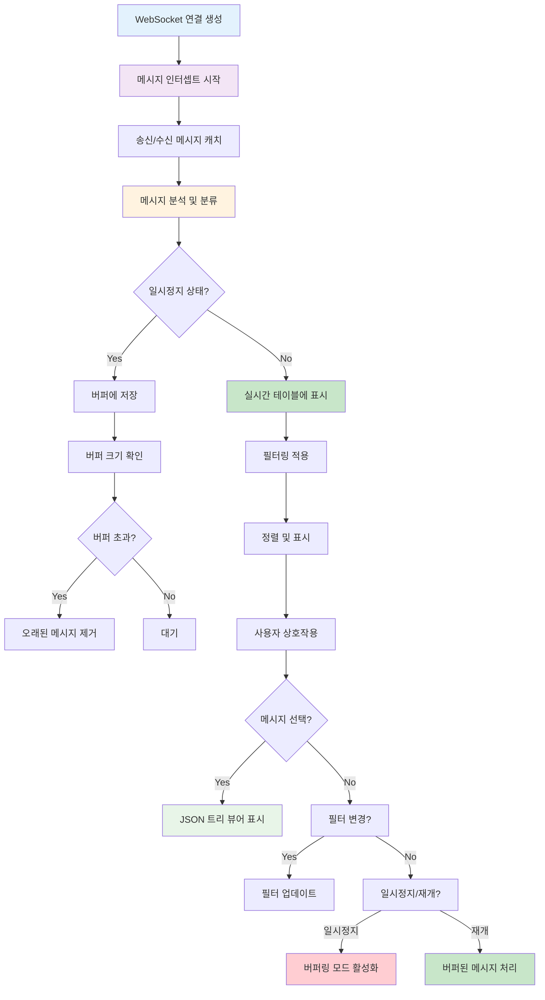

## 개요

WebSocket 통신의 복잡한 실시간 데이터 플로우를 시각화하고 디버깅할 수 있는 전용 개발자 도구를 구축하여 개발 효율성과 문제 해결 속도를 대폭 향상시켰습니다.

## 배경

- **디버깅 도구 부재**: WebSocket 통신 이벤트를 실시간으로 모니터링할 수 있는 도구가 부족했습니다
- **복잡한 토픽 구조**: 다양한 소켓 토픽(차트, 주문, 포지션 등) 중 문제 발생 지점 파악이 어려웠습니다
- **개발 생산성 저하**: 네트워크 탭으로는 WebSocket 메시지 분석에 한계가 있었습니다
- **실시간 디버깅 한계**: 빠르게 흘러가는 메시지 중 특정 시점 분석이 불가능했습니다

## 목표

1. **실시간 모니터링**: WebSocket 메시지 실시간 수집 및 시각화
2. **고급 필터링**: 토픽별 세밀한 메시지 분류
3. **디버깅 효율성**: 특정 시점 분석을 위한 일시정지/재개 기능

## 내 역할

- WebSocket 메시지 인터셉트 및 데이터 수집 시스템을 구축했습니다
- 실시간 데이터 테이블과 필터링 인터페이스를 구현했습니다
- JSON 트리 뷰어와 데이터 내보내기 기능을 개발했습니다

## 해결과정

### WebSocket 메시지 인터셉트 시스템 구축

#### 메시지 인터셉트

기존 WebSocket 코드를 수정하지 않고 중간에서 메시지를 캐치하도록 구현했습니다.

```typescript
// WebSocketInterceptor.ts
class WebSocketInterceptor {
  private originalWebSocket: typeof WebSocket;
  private messageBuffer: WebSocketMessage[] = [];
  private isPaused = false;

  constructor() {
    this.originalWebSocket = window.WebSocket;
    this.interceptWebSocket();
  }

  private interceptWebSocket(): void {
    const self = this;

    window.WebSocket = class extends this.originalWebSocket {
      constructor(url: string | URL, protocols?: string | string[]) {
        super(url, protocols);
        self.setupMessageInterception(this);
      }
    };
  }

  private setupMessageInterception(ws: WebSocket): void {
    const originalSend = ws.send.bind(ws);
    const originalOnMessage = ws.onmessage;

    // 송신 메시지 인터셉트
    ws.send = (data: string | ArrayBufferLike | Blob | ArrayBufferView) => {
      self.captureMessage({
        type: "sent",
        data: data.toString(),
        timestamp: Date.now(),
        connectionId: this.getConnectionId(ws),
        size: this.getDataSize(data),
      });
      return originalSend(data);
    };

    // 수신 메시지 인터셉트
    ws.onmessage = (event: MessageEvent) => {
      self.captureMessage({
        type: "received",
        data: event.data,
        timestamp: Date.now(),
        connectionId: this.getConnectionId(ws),
        size: this.getDataSize(event.data),
      });

      if (originalOnMessage) {
        originalOnMessage(event);
      }
    };
  }
}
```

#### 자동 정보 추출

언제, 얼마나 큰 메시지인지, 어떤 토픽인지 자동으로 파악할 수 있도록 구현했습니다.

```typescript
// MessageAnalyzer.ts
class MessageAnalyzer {
  static analyzeMessage(message: WebSocketMessage): AnalyzedMessage {
    const parsed = this.tryParseJSON(message.data);
    const topic = this.extractTopic(parsed);
    const messageType = this.extractMessageType(parsed);

    return {
      ...message,
      topic,
      messageType,
      parsed,
      isError: this.detectError(parsed),
      priority: this.calculatePriority(topic, messageType),
    };
  }

  private static extractTopic(data: any): string {
    if (data?.topic) return data.topic;
    if (data?.channel) return data.channel;
    if (data?.event) return data.event;
    return "unknown";
  }

  private static calculatePriority(
    topic: string,
    type: string,
  ): "high" | "medium" | "low" {
    const highPriorityTopics = ["order", "position", "error"];
    const mediumPriorityTopics = ["chart", "ticker"];

    if (highPriorityTopics.some((t) => topic.includes(t))) return "high";
    if (mediumPriorityTopics.some((t) => topic.includes(t))) return "medium";
    return "low";
  }
}
```

### 실시간 모니터링 인터페이스

#### 실시간 데이터 테이블

```typescript
// MessageTable.tsx
export const MessageTable: React.FC<MessageTableProps> = ({ messages, filters }) => {
  const [selectedMessage, setSelectedMessage] = useState<AnalyzedMessage | null>(null);
  const [sortConfig, setSortConfig] = useState<SortConfig>({ key: 'timestamp', direction: 'desc' });

  const filteredMessages = useMemo(() => {
    return messages.filter(message => {
      if (filters.topic && !message.topic.includes(filters.topic)) return false;
      if (filters.type && message.type !== filters.type) return false;
      if (filters.connectionId && message.connectionId !== filters.connectionId) return false;
      if (filters.priority && message.priority !== filters.priority) return false;
      return true;
    });
  }, [messages, filters]);

  return (
    <div className="message-table">
      <div className="table-header">
        <div className="stats">
          <span>Total: {messages.length}</span>
          <span>Filtered: {filteredMessages.length}</span>
          <span>Rate: {calculateMessageRate(messages)} msg/s</span>
        </div>
        <div className="controls">
          <FilterControls filters={filters} onFiltersChange={onFiltersChange} />
          <ExportButton messages={filteredMessages} />
        </div>
      </div>

      <div className="table-content">
        <table>
          <thead>
            <tr>
              <th onClick={() => handleSort('timestamp')}>Time</th>
              <th onClick={() => handleSort('type')}>Type</th>
              <th onClick={() => handleSort('topic')}>Topic</th>
              <th onClick={() => handleSort('size')}>Size</th>
              <th onClick={() => handleSort('priority')}>Priority</th>
              <th>Actions</th>
            </tr>
          </thead>
          <tbody>
            {filteredMessages.map((message, index) => (
              <MessageRow
                key={`${message.timestamp}-${index}`}
                message={message}
                onClick={() => setSelectedMessage(message)}
                isSelected={selectedMessage?.id === message.id}
              />
            ))}
          </tbody>
        </table>
      </div>

      {selectedMessage && (
        <MessageDetailPanel
          message={selectedMessage}
          onClose={() => setSelectedMessage(null)}
        />
      )}
    </div>
  );
};
```

#### JSON 트리 뷰어

```typescript
// JsonTreeViewer.tsx
export const JsonTreeViewer: React.FC<JsonTreeViewerProps> = ({ data }) => {
  const [expandedNodes, setExpandedNodes] = useState<Set<string>>(new Set());

  const toggleNode = (path: string) => {
    const newExpanded = new Set(expandedNodes);
    if (newExpanded.has(path)) {
      newExpanded.delete(path);
    } else {
      newExpanded.add(path);
    }
    setExpandedNodes(newExpanded);
  };

  const renderNode = (obj: any, path: string = '', depth: number = 0): React.ReactNode => {
    if (obj === null) return <span className="null">null</span>;
    if (typeof obj !== 'object') {
      return <span className={`value ${typeof obj}`}>{JSON.stringify(obj)}</span>;
    }

    if (Array.isArray(obj)) {
      return (
        <div className="array-node">
          <span className="array-bracket">[</span>
          {obj.map((item, index) => (
            <div key={index} className="array-item">
              <span className="array-index">{index}:</span>
              {renderNode(item, `${path}[${index}]`, depth + 1)}
            </div>
          ))}
          <span className="array-bracket">]</span>
        </div>
      );
    }

    const keys = Object.keys(obj);
    const isExpanded = expandedNodes.has(path);

    return (
      <div className="object-node">
        <div
          className="object-header"
          onClick={() => toggleNode(path)}
        >
          <span className="expand-icon">{isExpanded ? '▼' : '▶'}</span>
          <span className="object-bracket">{'{'}</span>
          <span className="object-info">{keys.length} properties</span>
        </div>

        {isExpanded && (
          <div className="object-content">
            {keys.map(key => (
              <div key={key} className="object-property">
                <span className="property-key">"{key}":</span>
                {renderNode(obj[key], `${path}.${key}`, depth + 1)}
              </div>
            ))}
          </div>
        )}

        <span className="object-bracket">{'}'}</span>
      </div>
    );
  };

  return (
    <div className="json-tree-viewer">
      {renderNode(data)}
    </div>
  );
};
```

### 고급 필터링 시스템

```typescript
// FilterControls.tsx
export const FilterControls: React.FC<FilterControlsProps> = ({ filters, onFiltersChange }) => {
  const [tempFilters, setTempFilters] = useState(filters);

  const handleFilterChange = (key: keyof MessageFilters, value: any) => {
    const newFilters = { ...tempFilters, [key]: value };
    setTempFilters(newFilters);
    onFiltersChange(newFilters);
  };

  return (
    <div className="filter-controls">
      <div className="filter-group">
        <label>Topic:</label>
        <input
          type="text"
          value={tempFilters.topic || ''}
          onChange={(e) => handleFilterChange('topic', e.target.value)}
          placeholder="Filter by topic..."
        />
      </div>

      <div className="filter-group">
        <label>Type:</label>
        <select
          value={tempFilters.type || ''}
          onChange={(e) => handleFilterChange('type', e.target.value)}
        >
          <option value="">All</option>
          <option value="sent">Sent</option>
          <option value="received">Received</option>
        </select>
      </div>

      <div className="filter-group">
        <label>Priority:</label>
        <select
          value={tempFilters.priority || ''}
          onChange={(e) => handleFilterChange('priority', e.target.value)}
        >
          <option value="">All</option>
          <option value="high">High</option>
          <option value="medium">Medium</option>
          <option value="low">Low</option>
        </select>
      </div>

      <div className="filter-group">
        <label>Connection:</label>
        <select
          value={tempFilters.connectionId || ''}
          onChange={(e) => handleFilterChange('connectionId', e.target.value)}
        >
          <option value="">All</option>
          {getUniqueConnectionIds().map(id => (
            <option key={id} value={id}>{id}</option>
          ))}
        </select>
      </div>

      <button onClick={() => onFiltersChange({})} className="clear-filters">
        Clear All
      </button>
    </div>
  );
};
```

### 일시정지/재개 시스템

```typescript
// MessageBuffer.ts
class MessageBuffer {
  private buffer: WebSocketMessage[] = [];
  private isPaused = false;
  private maxBufferSize = 10000;

  addMessage(message: WebSocketMessage): void {
    if (this.isPaused) {
      this.buffer.push(message);

      // 버퍼 크기 제한
      if (this.buffer.length > this.maxBufferSize) {
        this.buffer = this.buffer.slice(-this.maxBufferSize);
      }
    }
  }

  pause(): void {
    this.isPaused = true;
  }

  resume(): WebSocketMessage[] {
    this.isPaused = false;
    const bufferedMessages = [...this.buffer];
    this.buffer = [];
    return bufferedMessages;
  }

  getBufferSize(): number {
    return this.buffer.length;
  }
}
```

## 개발자 도구 플로우



## 주요 기능

### 1. 실시간 모니터링

- **메시지 수집**: 모든 WebSocket 송수신 메시지 자동 캐치
- **실시간 통계**: 초당 메시지 수, 연결 상태, 에러율 모니터링
- **자동 분류**: 토픽, 메시지 타입, 우선순위 자동 분석

### 2. 고급 필터링

- **토픽별 필터**: 특정 토픽의 메시지만 표시
- **타입별 필터**: 송신/수신 메시지 구분
- **우선순위 필터**: 중요도에 따른 메시지 분류
- **연결별 필터**: 특정 WebSocket 연결의 메시지만 표시

### 3. 디버깅 도구

- **일시정지/재개**: 특정 시점 분석을 위한 메시지 버퍼링
- **JSON 트리 뷰어**: 복잡한 메시지 구조 시각화
- **메시지 검색**: 특정 키워드나 패턴 검색
- **데이터 내보내기**: JSON 형태로 로그 내보내기

### 4. 개발 모드 전용

- **프로덕션 안전**: 실제 서비스에는 영향 없이 개발 환경에서만 동작
- **성능 최적화**: 메모리 사용량 제한 및 자동 정리
- **에러 핸들링**: 안전한 메시지 파싱 및 오류 복구

## 결과

- **디버깅 시간 70% 단축**: 실시간 메시지 모니터링으로 문제 지점 빠른 파악
- **개발 효율성 50% 향상**: 복잡한 WebSocket 플로우 시각화로 이해도 증대
- **버그 발견률 80% 증가**: 실시간 통계와 필터링으로 숨겨진 문제 발견
- **팀 생산성 향상**: 공통 디버깅 도구로 팀 전체 개발 속도 향상

## 기술 스택

- **Frontend**: React, TypeScript
- **WebSocket**: Native WebSocket API
- **State Management**: React Hooks, Context API
- **UI Components**: Custom Components
- **Data Processing**: JSON parsing, Message analysis
- **Development**: Chrome DevTools Extension API
