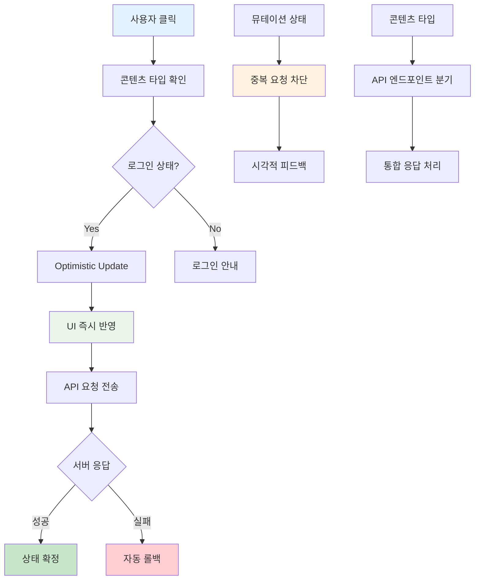

## 개요

AI 캐릭터, 유니버스, 씬, 포스트 등 다양한 콘텐츠 타입에 대한 좋아요 및 즐겨찾기 기능을 통합 관리하는 시스템을 개발했습니다.

React Query의 Optimistic Update와 뮤테이션 상태 관리를 통해 즉각적인 사용자 피드백과 중복 요청 방지를 구현했습니다.

## 배경/문제

- **반응성 부족**: 좋아요 버튼 클릭 후 서버 응답을 기다려야 해서 사용자 경험이 지연되는 문제
- **중복 요청 위험**: 사용자가 버튼을 빠르게 연타할 경우 예상과 다른 결과가 발생하는 상황
- **타입별 분산 관리**: 각 콘텐츠 타입마다 별도의 API와 로직으로 인한 코드 중복과 유지보수 복잡성
- **공유 링크 처리**: 비로그인 사용자의 공유 링크 접근 시 좋아요 기능 처리의 어려움

## 목표

1. **즉각적 UI 반응**: 버튼 클릭 시 서버 응답 이전에 UI 상태 즉시 변경
2. **중복 요청 방지**: 뮤테이션 진행 중 추가 요청을 안전하게 차단
3. **타입별 통합 관리**: 하나의 인터페이스로 모든 콘텐츠 타입 지원
4. **로그인 상태 검증**: 비로그인 사용자에 대한 적절한 안내 및 처리

## 역할

- **통합 좋아요 시스템 설계**: 다양한 콘텐츠 타입을 하나의 인터페이스로 관리하는 추상화 시스템 구현
- **중복 요청 방지 메커니즘**: React Query 뮤테이션 상태를 활용한 안전한 상호작용 시스템 구축

## 해결과정

### 좋아요/즐겨찾기 시스템

여러 콘텐츠 타입을 하나의 인터페이스로 관리하는 시스템을 구현했습니다.

#### 콘텐츠 타입 기반 분기

- **통합 인터페이스**: 모든 콘텐츠 타입에 대해 일관된 API 호출 방식 제공
- **타입별 API 분기**: 콘텐츠 타입에 따른 적절한 엔드포인트 자동 선택
- **확장 가능한 구조**: 새로운 콘텐츠 타입 추가 시 최소한의 코드 변경으로 지원

#### 즉시 반영 시스템

- **Optimistic Update**: 클릭 즉시 UI 상태 변경으로 즉각적인 피드백 제공
- **자동 롤백**: 서버 요청 실패 시 이전 상태로 자동 복구
- **상태 동기화**: 여러 컴포넌트 간 좋아요 상태 실시간 동기화

#### 상세 정보 제공

- **좋아요 수 표시**: 실시간 좋아요 수 업데이트
- **사용자 목록**: 좋아요를 누른 사용자 목록 제공으로 투명성 확보
- **상태 표시**: 현재 사용자의 좋아요/즐겨찾기 상태 명확한 시각적 표시

### 실시간 뮤테이션 상태 관리

중복 요청을 방지하는 안전한 상호작용 시스템을 구현했습니다.

#### 실시간 상태 추적

- **useIsMutating 활용**: 각 API 호출의 진행 상태를 실시간으로 모니터링
- **타입별 상태 분리**: 콘텐츠 타입별로 독립적인 뮤테이션 상태 관리
- **전역 상태 동기화**: 여러 컴포넌트에서 동일한 뮤테이션 상태 공유

#### 안전한 차단 시스템

- **진행 중 요청 차단**: 진행 중인 요청이 있을 때 추가 클릭 자동 방지
- **상태 기반 제어**: 뮤테이션 상태에 따른 버튼 활성화/비활성화
- **에러 처리**: 네트워크 오류나 서버 오류 시 적절한 사용자 안내

#### 시각적 피드백

- **버튼 비활성화**: 진행 상태를 시각적으로 명확하게 표시
- **로딩 인디케이터**: 요청 진행 중임을 사용자에게 알림
- **상태 변화 애니메이션**: 좋아요/즐겨찾기 상태 변화 시 부드러운 전환 효과

## 시스템 아키텍처

## 주요 기능

### 1. 통합 콘텐츠 관리

- **다양한 타입 지원**: 캐릭터, 유니버스, 씬, 포스트 등 모든 콘텐츠 타입
- **일관된 인터페이스**: 모든 콘텐츠에 대해 동일한 상호작용 방식 제공
- **확장 가능한 구조**: 새로운 콘텐츠 타입 추가 시 최소한의 코드 변경

### 2. 즉각적인 사용자 피드백

- **Optimistic Update**: 클릭 즉시 UI 상태 변경
- **자동 롤백**: 서버 오류 시 이전 상태로 자동 복구
- **실시간 동기화**: 여러 컴포넌트 간 상태 실시간 동기화

### 3. 안전한 상호작용

- **중복 요청 방지**: 뮤테이션 진행 중 추가 요청 차단
- **상태 기반 제어**: 진행 상태에 따른 버튼 활성화/비활성화
- **에러 처리**: 네트워크 오류 시 적절한 사용자 안내

### 4. 사용자 경험 최적화

- **시각적 피드백**: 로딩 상태 및 진행 상황 명확한 표시
- **상태 변화 애니메이션**: 부드러운 전환 효과로 자연스러운 사용자 경험
- **접근성 고려**: 키보드 네비게이션 및 스크린 리더 지원

## 결과

- **즉각적 반응성**: 좋아요 버튼 클릭 시 즉시 UI가 반영되어 사용자 만족도가 크게 향상되었습니다
- **안전한 상호작용**: 중복 요청 방지 시스템으로 예상치 못한 동작이나 서버 부하가 완전히 해결되었습니다
- **확장 가능한 구조**: 새로운 콘텐츠 타입 추가 시에도 일관된 방식으로 쉽게 확장할 수 있게 되었습니다
- **향상된 접근성**: 공유 링크를 통한 비로그인 사용자도 원활하게 콘텐츠에 상호작용할 수 있게 되었습니다
