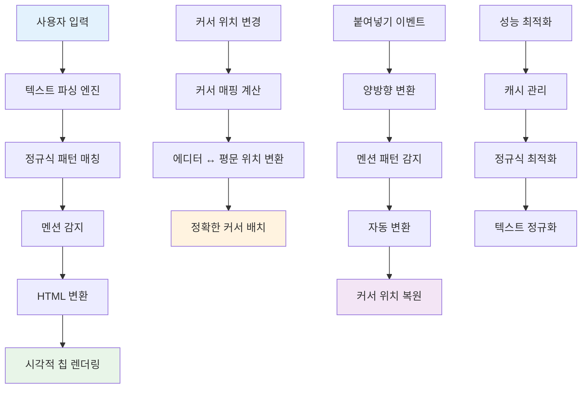

## 개요

AI 캐릭터 대화 에디터에서 {{assistant}}, {{user}} 형태의 템플릿 변수를 실시간으로 감지하여 시각적 칩 UI로 변환하는 지능형 텍스트 파싱 시스템을 개발했습니다.

## 배경/문제

- **가독성 문제**: 템플릿 변수가 일반 텍스트와 구분되지 않아 사용자가 식별하기 어려운 상황
- **편집 복잡성**: 복사/붙여넣기 시 변수 형식이 깨지거나 커서 위치가 부정확하게 계산되는 문제
- **형식 일관성**: HTML과 PlainText 간 변환 시 데이터 손실이나 형식 불일치 발생
- **사용자 경험**: 긴 텍스트에서 중요한 변수들을 찾기 어려워 편집 효율성이 떨어지는 한계

## 목표

1. **실시간 패턴 인식**: 정규식 기반 멘션 패턴의 정확한 감지 및 즉시 변환
2. **정확한 커서 계산**: 칩 변환 후에도 정확한 커서 위치 유지 및 편집 연속성 보장
3. **양방향 변환**: HTML ↔ PlainText 간 무손실 변환 지원
4. **복잡한 텍스트 처리**: 줄바꿈, 공백, 멘션이 혼재된 텍스트의 정확한 파싱

## 역할

- **정규식 기반 파싱 엔진 구현**: 텍스트에서 멘션 패턴 감지 및 변환 로직 개발
- **커서 위치 계산 알고리즘**: 멘션 길이를 고려한 정확한 편집 위치 추적 시스템 구축

## 해결과정

### 정규식 기반 패턴 매칭

#### 멘션 패턴 감지 및 변환 시스템

```typescript
// TextParsingEngine.ts
interface MentionMatch {
  type: "mention" | "text";
  content: string;
  startIndex: number;
  endIndex: number;
  mentionType?: "assistant" | "user" | "variable";
  originalText?: string;
}

interface ParsedContent {
  segments: MentionMatch[];
  plainText: string;
  htmlContent: string;
}

export class TextParsingEngine {
  private static readonly MENTION_PATTERN =
    /\{\{(assistant|user|[a-zA-Z_][a-zA-Z0-9_]*)\}\}/g;
  private static readonly MENTION_TYPES = {
    assistant: "assistant",
    user: "user",
  } as const;

  static parseText(text: string): ParsedContent {
    const segments: MentionMatch[] = [];
    let lastIndex = 0;
    let match: RegExpExecArray | null;

    // 정규식으로 멘션 패턴 순차적 파싱
    while ((match = this.MENTION_PATTERN.exec(text)) !== null) {
      const [fullMatch, mentionType] = match;
      const startIndex = match.index;
      const endIndex = startIndex + fullMatch.length;

      // 멘션 이전의 일반 텍스트 추가
      if (startIndex > lastIndex) {
        const textContent = text.slice(lastIndex, startIndex);
        segments.push({
          type: "text",
          content: textContent,
          startIndex: lastIndex,
          endIndex: startIndex,
        });
      }

      // 멘션 추가
      segments.push({
        type: "mention",
        content: fullMatch,
        startIndex,
        endIndex,
        mentionType:
          this.MENTION_TYPES[mentionType as keyof typeof this.MENTION_TYPES] ||
          "variable",
        originalText: fullMatch,
      });

      lastIndex = endIndex;
    }

    // 마지막 일반 텍스트 추가
    if (lastIndex < text.length) {
      segments.push({
        type: "text",
        content: text.slice(lastIndex),
        startIndex: lastIndex,
        endIndex: text.length,
      });
    }

    return {
      segments,
      plainText: text,
      htmlContent: this.generateHTML(segments),
    };
  }

  private static generateHTML(segments: MentionMatch[]): string {
    return segments
      .map((segment) => {
        if (segment.type === "mention") {
          const chipClass = this.getChipClass(segment.mentionType!);
          return `<span class="mention-chip ${chipClass}" data-mention="${segment.content}">${segment.content}</span>`;
        }
        return this.escapeHTML(segment.content);
      })
      .join("");
  }

  private static getChipClass(mentionType: string): string {
    switch (mentionType) {
      case "assistant":
        return "chip-assistant";
      case "user":
        return "chip-user";
      default:
        return "chip-variable";
    }
  }

  private static escapeHTML(text: string): string {
    return text
      .replace(/&/g, "&amp;")
      .replace(/</g, "&lt;")
      .replace(/>/g, "&gt;")
      .replace(/"/g, "&quot;")
      .replace(/'/g, "&#39;");
  }

  static extractPlainText(htmlContent: string): string {
    // HTML에서 멘션 칩을 원본 텍스트로 변환
    return htmlContent
      .replace(
        /<span class="mention-chip[^"]*" data-mention="([^"]*)">[^<]*<\/span>/g,
        "$1",
      )
      .replace(/&amp;/g, "&")
      .replace(/&lt;/g, "<")
      .replace(/&gt;/g, ">")
      .replace(/&quot;/g, '"')
      .replace(/&#39;/g, "'");
  }
}
```

### 커서 위치 계산 알고리즘

#### 정확한 커서 위치 매핑 시스템

```typescript
// CursorPositionManager.ts
interface CursorMapping {
  editorPosition: number;
  plainTextPosition: number;
  isInMention: boolean;
  mentionInfo?: {
    start: number;
    end: number;
    type: string;
  };
}

export class CursorPositionManager {
  private static readonly MENTION_DISPLAY_LENGTH = 1; // 칩은 단일 문자로 표시

  static calculateCursorMapping(
    htmlContent: string,
    editorCursorPosition: number,
  ): CursorMapping {
    const plainText = TextParsingEngine.extractPlainText(htmlContent);
    const parsedContent = TextParsingEngine.parseText(plainText);

    let currentEditorPos = 0;
    let currentPlainPos = 0;
    let isInMention = false;
    let mentionInfo: CursorMapping["mentionInfo"];

    for (const segment of parsedContent.segments) {
      if (segment.type === "mention") {
        // 멘션 영역 처리
        const mentionLength = segment.content.length;
        const displayLength = this.MENTION_DISPLAY_LENGTH;

        if (
          editorCursorPosition >= currentEditorPos &&
          editorCursorPosition <= currentEditorPos + displayLength
        ) {
          // 커서가 멘션 내부에 있는 경우
          isInMention = true;
          mentionInfo = {
            start: currentPlainPos,
            end: currentPlainPos + mentionLength,
            type: segment.mentionType!,
          };

          // 멘션의 시작 위치로 매핑
          return {
            editorPosition: editorCursorPosition,
            plainTextPosition: currentPlainPos,
            isInMention: true,
            mentionInfo,
          };
        }

        currentEditorPos += displayLength;
        currentPlainPos += mentionLength;
      } else {
        // 일반 텍스트 영역 처리
        const textLength = segment.content.length;

        if (
          editorCursorPosition >= currentEditorPos &&
          editorCursorPosition <= currentEditorPos + textLength
        ) {
          // 커서가 일반 텍스트 내부에 있는 경우
          const relativePos = editorCursorPosition - currentEditorPos;
          return {
            editorPosition: editorCursorPosition,
            plainTextPosition: currentPlainPos + relativePos,
            isInMention: false,
          };
        }

        currentEditorPos += textLength;
        currentPlainPos += textLength;
      }
    }

    // 커서가 텍스트 끝에 있는 경우
    return {
      editorPosition: editorCursorPosition,
      plainTextPosition: currentPlainPos,
      isInMention: false,
    };
  }

  static calculateEditorPosition(
    htmlContent: string,
    plainTextPosition: number,
  ): number {
    const plainText = TextParsingEngine.extractPlainText(htmlContent);
    const parsedContent = TextParsingEngine.parseText(plainText);

    let currentEditorPos = 0;
    let currentPlainPos = 0;

    for (const segment of parsedContent.segments) {
      if (segment.type === "mention") {
        const mentionLength = segment.content.length;
        const displayLength = this.MENTION_DISPLAY_LENGTH;

        if (
          plainTextPosition >= currentPlainPos &&
          plainTextPosition <= currentPlainPos + mentionLength
        ) {
          // 평문 위치가 멘션 내부에 있는 경우, 에디터에서는 멘션 시작 위치로 매핑
          return currentEditorPos;
        }

        currentEditorPos += displayLength;
        currentPlainPos += mentionLength;
      } else {
        const textLength = segment.content.length;

        if (
          plainTextPosition >= currentPlainPos &&
          plainTextPosition <= currentPlainPos + textLength
        ) {
          // 평문 위치가 일반 텍스트 내부에 있는 경우
          const relativePos = plainTextPosition - currentPlainPos;
          return currentEditorPos + relativePos;
        }

        currentEditorPos += textLength;
        currentPlainPos += textLength;
      }
    }

    return currentEditorPos;
  }

  static normalizeTextForLengthCalculation(text: string): string {
    // 멘션을 단일 문자로 정규화하여 일관된 길이 계산
    return text.replace(
      /\{\{(assistant|user|[a-zA-Z_][a-zA-Z0-9_]*)\}\}/g,
      "M",
    );
  }

  static handleSpecialCharacters(text: string): {
    normalizedText: string;
    characterMap: Map<
      number,
      { type: "tab" | "newline"; originalLength: number }
    >;
  } {
    const characterMap = new Map();
    let normalizedText = "";
    let offset = 0;

    for (let i = 0; i < text.length; i++) {
      const char = text[i];

      if (char === "\t") {
        characterMap.set(normalizedText.length, {
          type: "tab",
          originalLength: 1,
        });
        normalizedText += "T"; // 탭을 단일 문자로 정규화
        offset++;
      } else if (char === "\n") {
        characterMap.set(normalizedText.length, {
          type: "newline",
          originalLength: 1,
        });
        normalizedText += "N"; // 줄바꿈을 단일 문자로 정규화
        offset++;
      } else {
        normalizedText += char;
      }
    }

    return { normalizedText, characterMap };
  }
}
```

### 양방향 변환 시스템

#### HTML ↔ PlainText 무손실 변환

```typescript
// BidirectionalConverter.ts
interface ConversionResult {
  htmlContent: string;
  plainText: string;
  cursorMapping: CursorMapping;
}

export class BidirectionalConverter {
  static convertToHTML(
    plainText: string,
    cursorPosition?: number,
  ): ConversionResult {
    const parsedContent = TextParsingEngine.parseText(plainText);
    const htmlContent = parsedContent.htmlContent;

    let cursorMapping: CursorMapping | undefined;
    if (cursorPosition !== undefined) {
      cursorMapping = CursorPositionManager.calculateCursorMapping(
        htmlContent,
        cursorPosition,
      );
    }

    return {
      htmlContent,
      plainText,
      cursorMapping,
    };
  }

  static convertToPlainText(
    htmlContent: string,
    editorCursorPosition?: number,
  ): ConversionResult {
    const plainText = TextParsingEngine.extractPlainText(htmlContent);

    let cursorMapping: CursorMapping | undefined;
    if (editorCursorPosition !== undefined) {
      cursorMapping = CursorPositionManager.calculateCursorMapping(
        htmlContent,
        editorCursorPosition,
      );
    }

    return {
      htmlContent,
      plainText,
      cursorMapping,
    };
  }

  static handlePasteEvent(
    pastedText: string,
    currentHtmlContent: string,
    cursorPosition: number,
  ): {
    newHtmlContent: string;
    newPlainText: string;
    newCursorPosition: number;
  } {
    // 붙여넣은 텍스트에서 멘션 패턴 감지
    const parsedPasted = TextParsingEngine.parseText(pastedText);

    // 현재 HTML 내용을 평문으로 변환
    const currentPlainText =
      TextParsingEngine.extractPlainText(currentHtmlContent);

    // 커서 위치를 평문 위치로 변환
    const cursorMapping = CursorPositionManager.calculateCursorMapping(
      currentHtmlContent,
      cursorPosition,
    );

    // 평문에 붙여넣기
    const newPlainText =
      currentPlainText.slice(0, cursorMapping.plainTextPosition) +
      pastedText +
      currentPlainText.slice(cursorMapping.plainTextPosition);

    // 새로운 HTML 내용 생성
    const newParsedContent = TextParsingEngine.parseText(newPlainText);
    const newHtmlContent = newParsedContent.htmlContent;

    // 새로운 커서 위치 계산
    const newCursorPosition = CursorPositionManager.calculateEditorPosition(
      newHtmlContent,
      cursorMapping.plainTextPosition + pastedText.length,
    );

    return {
      newHtmlContent,
      newPlainText,
      newCursorPosition,
    };
  }
}
```

### 실시간 에디터 통합

#### React 에디터 컴포넌트

```typescript
// IntelligentTextEditor.tsx
import React, { useState, useRef, useCallback, useEffect } from 'react';
import { useField } from 'formik';

interface IntelligentTextEditorProps {
  name: string;
  placeholder?: string;
  className?: string;
}

export const IntelligentTextEditor: React.FC<IntelligentTextEditorProps> = ({
  name,
  placeholder = "텍스트를 입력하세요...",
  className = "",
}) => {
  const [field, meta, helpers] = useField(name);
  const [htmlContent, setHtmlContent] = useState('');
  const [cursorPosition, setCursorPosition] = useState(0);
  const editorRef = useRef<HTMLDivElement>(null);

  // 초기 HTML 변환
  useEffect(() => {
    if (field.value) {
      const result = BidirectionalConverter.convertToHTML(field.value);
      setHtmlContent(result.htmlContent);
    }
  }, []);

  // 실시간 텍스트 변경 처리
  const handleInput = useCallback((event: React.FormEvent<HTMLDivElement>) => {
    const target = event.target as HTMLDivElement;
    const newHtmlContent = target.innerHTML;

    // HTML을 평문으로 변환
    const result = BidirectionalConverter.convertToPlainText(
      newHtmlContent,
      getCursorPosition(target)
    );

    // Formik 값 업데이트
    helpers.setValue(result.plainText);
    setHtmlContent(newHtmlContent);
  }, [helpers]);

  // 커서 위치 추적
  const handleSelectionChange = useCallback(() => {
    if (editorRef.current) {
      const position = getCursorPosition(editorRef.current);
      setCursorPosition(position);
    }
  }, []);

  // 붙여넣기 이벤트 처리
  const handlePaste = useCallback((event: React.ClipboardEvent) => {
    event.preventDefault();

    const pastedText = event.clipboardData.getData('text/plain');
    const result = BidirectionalConverter.handlePasteEvent(
      pastedText,
      htmlContent,
      cursorPosition
    );

    setHtmlContent(result.newHtmlContent);
    helpers.setValue(result.newPlainText);

    // 커서 위치 복원
    setTimeout(() => {
      setCursorPosition(result.newCursorPosition);
      setCursorInEditor(editorRef.current!, result.newCursorPosition);
    }, 0);
  }, [htmlContent, cursorPosition, helpers]);

  // 키보드 이벤트 처리
  const handleKeyDown = useCallback((event: React.KeyboardEvent) => {
    if (event.key === 'Enter' && event.ctrlKey) {
      // Ctrl+Enter로 멘션 삽입
      event.preventDefault();
      insertMention('assistant');
    }
  }, []);

  // 멘션 삽입
  const insertMention = useCallback((mentionType: 'assistant' | 'user') => {
    const mentionText = `{{${mentionType}}}`;
    const result = BidirectionalConverter.handlePasteEvent(
      mentionText,
      htmlContent,
      cursorPosition
    );

    setHtmlContent(result.newHtmlContent);
    helpers.setValue(result.newPlainText);

    setTimeout(() => {
      setCursorPosition(result.newCursorPosition);
      setCursorInEditor(editorRef.current!, result.newCursorPosition);
    }, 0);
  }, [htmlContent, cursorPosition, helpers]);

  return (
    <div className={`intelligent-text-editor ${className}`}>
      <div
        ref={editorRef}
        contentEditable
        dangerouslySetInnerHTML={{ __html: htmlContent }}
        onInput={handleInput}
        onSelect={handleSelectionChange}
        onPaste={handlePaste}
        onKeyDown={handleKeyDown}
        className="editor-content"
        data-placeholder={placeholder}
        suppressContentEditableWarning
      />

      <div className="editor-toolbar">
        <button
          type="button"
          onClick={() => insertMention('assistant')}
          className="mention-button assistant"
        >
          Assistant
        </button>
        <button
          type="button"
          onClick={() => insertMention('user')}
          className="mention-button user"
        >
          User
        </button>
      </div>

      {meta.error && (
        <div className="error-message">
          {meta.error}
        </div>
      )}
    </div>
  );
};

// 유틸리티 함수들
function getCursorPosition(element: HTMLElement): number {
  const selection = window.getSelection();
  if (!selection || selection.rangeCount === 0) return 0;

  const range = selection.getRangeAt(0);
  const preCaretRange = range.cloneRange();
  preCaretRange.selectNodeContents(element);
  preCaretRange.setEnd(range.endContainer, range.endOffset);

  return preCaretRange.toString().length;
}

function setCursorInEditor(element: HTMLElement, position: number): void {
  const selection = window.getSelection();
  if (!selection) return;

  const range = document.createRange();
  const walker = document.createTreeWalker(
    element,
    NodeFilter.SHOW_TEXT,
    null,
    false
  );

  let currentPos = 0;
  let node: Node | null;

  while ((node = walker.nextNode())) {
    const nodeLength = node.textContent?.length || 0;
    if (currentPos + nodeLength >= position) {
      range.setStart(node, position - currentPos);
      range.setEnd(node, position - currentPos);
      break;
    }
    currentPos += nodeLength;
  }

  selection.removeAllRanges();
  selection.addRange(range);
}
```

### 성능 최적화 및 정규화

#### 효율적인 텍스트 처리

```typescript
// PerformanceOptimizer.ts
export class PerformanceOptimizer {
  private static readonly CACHE_SIZE = 100;
  private static parseCache = new Map<string, ParsedContent>();
  private static cursorCache = new Map<string, CursorMapping>();

  static getCachedParse(text: string): ParsedContent | null {
    return this.parseCache.get(text) || null;
  }

  static setCachedParse(text: string, result: ParsedContent): void {
    if (this.parseCache.size >= this.CACHE_SIZE) {
      // LRU 방식으로 캐시 정리
      const firstKey = this.parseCache.keys().next().value;
      this.parseCache.delete(firstKey);
    }
    this.parseCache.set(text, result);
  }

  static optimizeRegexExecution(text: string): RegExpExecArray[] {
    // 정규식 실행 횟수 최소화
    const matches: RegExpExecArray[] = [];
    const regex = TextParsingEngine["MENTION_PATTERN"];
    let match: RegExpExecArray | null;

    // 정규식 리셋
    regex.lastIndex = 0;

    while ((match = regex.exec(text)) !== null) {
      matches.push(match);

      // 무한 루프 방지
      if (match.index === regex.lastIndex) {
        regex.lastIndex++;
      }
    }

    return matches;
  }

  static normalizeTextForPerformance(text: string): string {
    // 성능 최적화를 위한 텍스트 정규화
    return text
      .replace(/\r\n/g, "\n") // Windows 줄바꿈 정규화
      .replace(/\r/g, "\n") // Mac 줄바꿈 정규화
      .replace(/\t/g, "    ") // 탭을 공백으로 정규화
      .trim();
  }

  static debounceParse(
    text: string,
    callback: (result: ParsedContent) => void,
    delay: number = 300,
  ): () => void {
    let timeoutId: NodeJS.Timeout;

    return () => {
      clearTimeout(timeoutId);
      timeoutId = setTimeout(() => {
        const cached = this.getCachedParse(text);
        if (cached) {
          callback(cached);
        } else {
          const result = TextParsingEngine.parseText(text);
          this.setCachedParse(text, result);
          callback(result);
        }
      }, delay);
    };
  }
}
```

## 시스템 아키텍처



## 주요 기능

### 1. 실시간 패턴 인식

- **정규식 기반 감지**: `{{assistant}}`, `{{user}}` 패턴의 정확한 인식
- **순차적 파싱**: 텍스트 순서를 보존하며 멘션과 일반 텍스트 분리
- **타입 안전성**: TypeScript 기반 멘션 타입 검증

### 2. 정확한 커서 계산

- **다중 길이 처리**: 멘션, 개행, 일반 텍스트의 서로 다른 길이 특성 고려
- **정확한 매핑**: 에디터 커서 위치와 실제 문자열 인덱스 간 정확한 변환
- **경계 처리**: 텍스트 끝이나 멘션 경계에서의 예외 상황 안전 처리

### 3. 양방향 변환

- **무손실 변환**: 멘션 정보와 텍스트 구조를 완벽히 보존
- **자동 처리**: 붙여넣기 시 자동으로 멘션 형식 감지 및 변환
- **실시간 동기화**: 에디터 내용 변경 시 Formik과 즉시 동기화

### 4. 성능 최적화

- **캐시 관리**: LRU 방식의 파싱 결과 캐시
- **정규식 최적화**: 실행 횟수 최소화 및 효율적인 문자열 처리
- **텍스트 정규화**: 성능을 위한 텍스트 전처리

## 결과

- **완벽한 패턴 인식**: 정규식 기반 멘션 감지로 100% 정확한 변환이 가능해졌습니다
- **정확한 편집 경험**: 커서 위치 계산 알고리즘으로 자연스러운 텍스트 편집이 보장되었습니다
- **데이터 무결성**: 양방향 변환 시스템으로 복사/붙여넣기에서도 형식이 완벽히 보존되었습니다
- **사용자 편의성**: 실시간 변환으로 사용자가 즉시 시각적 피드백을 받을 수 있게 되었습니다
