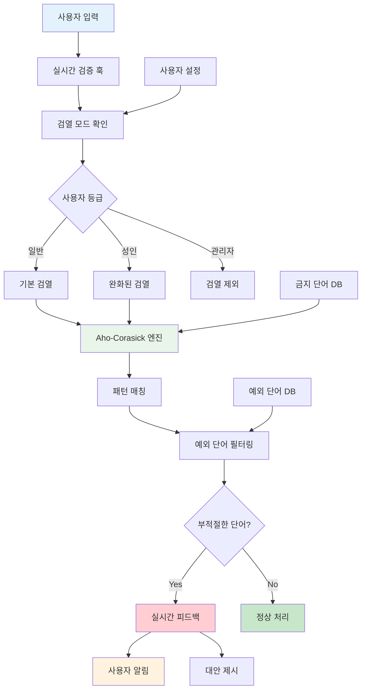

## 개요

사용자가 입력하는 모든 텍스트에서 부적절한 단어를 실시간으로 감지하고 차단하는 자동 검열 시스템을 구축했습니다.

## 배경/문제

- **수동 검열의 한계**: 사용자가 생성하는 대량의 콘텐츠를 일일이 사람이 검토하기 어려운 상황
- **다양한 검열 기준**: 일반 사용자용과 성인 사용자용으로 다른 검열 기준이 필요
- **성능 문제**: 긴 텍스트에서 수천 개의 금지 단어를 빠르게 찾아야 하는 성능 요구사항
- **예외 처리**: 금지 단어와 비슷하지만 허용되어야 하는 단어들의 복잡한 예외 처리

## 목표

1. **실시간 검열**: 사용자가 텍스트를 입력하는 즉시 부적절한 단어 감지
2. **다단계 검열**: 일반/성인/관리자별로 다른 검열 기준 적용
3. **고성능 검색**: 긴 텍스트에서도 빠른 속도로 금지 단어 탐지
4. **예외 단어 처리**: 금지 단어 목록에 있어도 허용해야 하는 단어들 자동 필터링

## 역할

- **알고리즘 선택 및 구현**: Aho-Corasick 알고리즘을 활용한 다중 패턴 매칭 시스템 구축
- **검열 모드 시스템**: 사용자 등급별 차등 검열 로직 설계 및 구현
- **실시간 검증 훅**: React 기반 실시간 입력 검증 커스텀 훅 개발
- **예외 처리 로직**: 복잡한 예외 단어 필터링 알고리즘 구현

## 해결과정

### 실시간 검열 데모


_사용자가 입력하는 즉시 부적절한 단어를 감지하고 시각적으로 표시하는 모습_

### Aho-Corasick 알고리즘 구현

수천 개의 금지 단어를 효율적으로 검색하기 위한 고성능 알고리즘을 파악하여 적용했습니다.

#### 한 번의 순회로 다중 패턴 매칭

- **효율적 탐색**: 텍스트를 한 번만 읽으면서 모든 금지 단어를 동시에 찾음
- **상태 기계**: Trie 구조와 실패 링크를 활용한 효율적인 상태 전환
- **시간 복잡도**: O(n + m + z) - n(텍스트 길이) + m(패턴 총 길이) + z(매칭 수)

<details>
<summary>🔍 Aho-Corasick 알고리즘 구현 코드 보기</summary>

```typescript
class AhoCorasick {
  private root: TrieNode;
  private failureLinks: Map<TrieNode, TrieNode>;

  constructor(patterns: string[]) {
    this.root = new TrieNode();
    this.failureLinks = new Map();
    this.buildTrie(patterns);
    this.buildFailureLinks();
  }

  private buildTrie(patterns: string[]): void {
    for (const pattern of patterns) {
      let node = this.root;
      for (const char of pattern) {
        if (!node.children.has(char)) {
          node.children.set(char, new TrieNode());
        }
        node = node.children.get(char)!;
      }
      node.isEndOfPattern = true;
      node.pattern = pattern;
    }
  }

  search(text: string): Match[] {
    const matches: Match[] = [];
    let current = this.root;

    for (let i = 0; i < text.length; i++) {
      const char = text[i];

      while (current && !current.children.has(char)) {
        current = current.failure!;
      }

      current = current?.children.get(char) || this.root;

      let node = current;
      while (node) {
        if (node.isEndOfPattern) {
          matches.push({
            pattern: node.pattern!,
            start: i - node.pattern!.length + 1,
            end: i,
          });
        }
        node = node.failure!;
      }
    }

    return matches;
  }
}
```

</details>

#### 메모리 효율성 최적화

- **접두사 공유**: 상태 기계로 중복되는 접두사를 공유하여 메모리 절약
- **압축된 구조**: Trie 노드의 압축된 표현으로 메모리 사용량 최소화
- **캐시 친화적**: 메모리 접근 패턴을 최적화하여 CPU 캐시 효율성 향상

#### 실시간 처리 최적화

- **스트리밍 처리**: 긴 텍스트를 청크 단위로 나누어 실시간 처리
- **백그라운드 빌드**: 패턴 트리를 백그라운드에서 미리 구축
- **캐싱 전략**: 자주 사용되는 패턴에 대한 캐싱으로 성능 향상

### 다단계 검열 모드 시스템

사용자 등급과 콘텐츠 성격에 따른 차등 검열 시스템을 구현했습니다.

#### 세분화된 검열 기준

- **일반 사용자**: 기본적인 부적절한 콘텐츠 필터링
- **성인 사용자**: 성인 콘텐츠에 대한 완화된 검열 기준
- **관리자**: 개발자와 관리자는 검열에서 제외하여 관리 업무 지원

#### 동적 모드 변경

- **실시간 전환**: 사용자가 콘텐츠 등급을 변경할 때 실시간으로 검열 기준 적용
- **컨텍스트 인식**: 콘텐츠의 맥락에 따라 검열 강도 자동 조절
- **사용자 설정**: 개별 사용자의 검열 설정에 따른 맞춤형 필터링

#### 검열 레벨 관리

- **단계별 필터링**: 경고, 차단, 자동 수정 등 다양한 검열 레벨
- **사용자 피드백**: 검열된 내용에 대한 명확한 이유와 대안 제시
- **학습 기능**: 사용자 행동 패턴을 학습하여 검열 정확도 향상

### 예외 단어 처리 시스템

금지 단어 목록에 있어도 허용해야 하는 단어들을 자동으로 필터링하는 로직을 구현했습니다.

#### 위치 기반 필터링

- **컨텍스트 분석**: 텍스트 내 위치를 비교하여 예외 단어에 포함된 금지 단어 제외
- **경계 인식**: 단어 경계를 정확히 인식하여 부분 문자열 매칭 방지
- **우선순위 적용**: 예외 단어가 금지 단어보다 높은 우선순위를 가지도록 설정

#### 중첩 처리 로직

- **다중 매칭**: 하나의 단어가 여러 패턴에 매칭될 때 우선순위 적용
- **충돌 해결**: 서로 다른 검열 규칙 간의 충돌을 자동으로 해결
- **정확한 매칭**: 부분 문자열이 아닌 정확한 단어 경계 기준으로 판단

#### 예외 규칙 관리

- **동적 업데이트**: 새로운 예외 단어를 실시간으로 추가/제거
- **규칙 우선순위**: 복잡한 예외 규칙의 우선순위를 명확히 정의
- **검증 시스템**: 예외 규칙의 정확성을 자동으로 검증

### 실시간 피드백 UI

입력 중 검열 단어 발견 시 피드백 표시 기능을 구현했습니다.

#### 즉시 피드백 시스템

- **실시간 검증**: 사용자가 입력하는 즉시 검열 결과 표시
- **시각적 표시**: 부적절한 단어를 하이라이트하여 명확히 표시
- **대안 제시**: 검열된 단어에 대한 적절한 대안 제안

#### 사용자 경험 최적화

- **부드러운 전환**: 검열 결과 표시 시 자연스러운 애니메이션
- **명확한 안내**: 검열 이유와 수정 방법에 대한 구체적인 안내
- **학습 지원**: 사용자가 올바른 표현을 학습할 수 있도록 도움

#### 성능 최적화

- **디바운싱**: 과도한 검열 요청을 방지하기 위한 디바운싱 적용
- **캐싱**: 검열 결과를 캐싱하여 반복 검열 성능 향상
- **백그라운드 처리**: 검열 작업을 백그라운드에서 처리하여 UI 블로킹 방지

## 시스템 아키텍처



## 주요 기능

### 1. 고성능 다중 패턴 매칭

- **Aho-Corasick 알고리즘**: 수천 개의 금지 단어를 한 번의 순회로 효율적으로 검색
- **메모리 최적화**: 접두사 공유와 압축된 구조로 메모리 사용량 최소화
- **실시간 처리**: 긴 텍스트에서도 실시간 검열이 가능한 성능 최적화

### 2. 다단계 검열 시스템

- **사용자 등급별 차등**: 일반/성인/관리자별로 다른 검열 기준 적용
- **동적 모드 변경**: 콘텐츠 등급 변경 시 실시간으로 검열 기준 적용
- **컨텍스트 인식**: 콘텐츠의 맥락에 따라 검열 강도 자동 조절

### 3. 지능형 예외 처리

- **위치 기반 필터링**: 텍스트 내 위치를 비교하여 예외 단어 자동 필터링
- **중첩 처리**: 여러 패턴에 매칭될 때 우선순위 적용
- **정확한 매칭**: 단어 경계를 정확히 인식하여 부분 문자열 매칭 방지

### 4. 실시간 사용자 피드백

- **즉시 검증**: 입력과 동시에 검열 결과를 실시간으로 표시
- **시각적 표시**: 부적절한 단어를 하이라이트하여 명확히 표시
- **대안 제시**: 검열된 단어에 대한 적절한 대안 제안

## 결과

- **자동 검열 시스템**: 수동 검토 없이도 대부분의 부적절한 콘텐츠를 사전 차단했습니다
- **고성능 처리**: Aho-Corasick 알고리즘으로 긴 텍스트에서도 실시간 검열이 가능해졌습니다
- **즉시 피드백**: 입력과 동시에 검열 결과를 제공하여 사용자가 즉시 수정할 수 있게 되었습니다
- **운영 효율성**: 수동 검토 업무가 감소하여 운영팀의 업무 부담이 크게 줄어들었습니다
