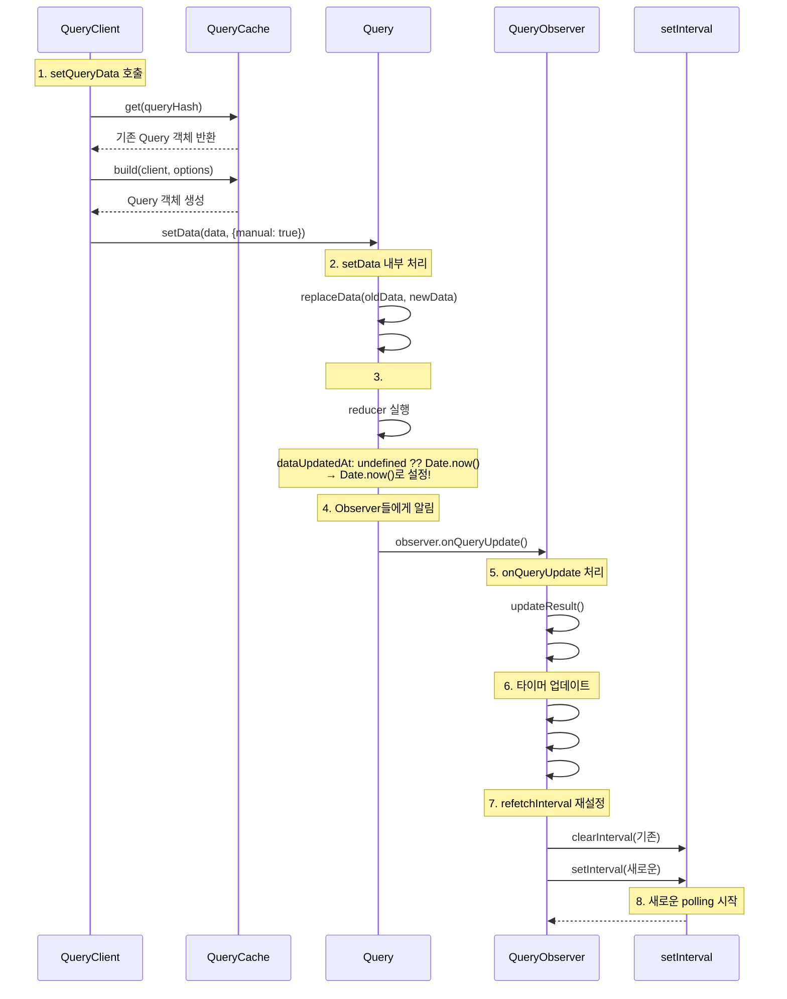

## **개요**

WebSocket 연결 불안정으로 인한 실시간 데이터 손실을 방지하기 위해 **React Query를 중심으로 한 자동 HTTP Fallback 시스템**을 개발하여 거래 플랫폼의 데이터 연속성과 안정성을 보장했습니다.

추가로 **차트 전용 TickHealthMonitor**를 통해 TradingView 차트의 실시간 데이터 품질을 독립적으로 모니터링합니다.

## **배경**

- **WebSocket 연결 불안정**: 백엔드 소켓 시스템의 부하 문제로 인해 메시지가 제대로 오지 않는 문제가 간헐적으로 발생
- **사용자 경험 저하**: 데이터 지연으로 인한 잘못된 거래 판단 및 기회 상실
- **기존 대응 부재**: 소켓 장애 시 대체 통신 방식 및 자동 복구 시스템 부족

## **목표**

1. 소켓 불안정 시에도 실시간 데이터 연속성 보장
2. 네트워크 상태에 따른 최적 통신 방식 자동 선택
3. 불필요한 폴링 방지 및 자원 효율적 운영
4. 차트 데이터 품질 독립적 모니터링 기능 추가

## **내 역할**

- TickHealthMonitor를 통한 3단계 상태 관리 시스템 구축
- WebSocket ↔ HTTP Polling 자동 전환 로직 개발

## **해결과정**

1. **React Query 기반 하이브리드 데이터 관리**

   시스템의 핵심은 **React Query의 캐시를 중심으로 한 WebSocket ↔ HTTP 통합 관리**입니다.

   ```mermaid
   graph TB
       subgraph "React Query Cache"
           A[QueryClient Cache]
       end

       subgraph "WebSocket Layer"
           B[useWebsocketWorkerClient] --> C[connected: boolean]
           C --> D[WebSocket Data]
           D --> E[setQueryData]
       end

       subgraph "HTTP Fallback Layer"
           F[HTTP Polling] --> G[refetchInterval]
           G --> H[connected ? 5000 : 1000]
           H --> I[HTTP Data]
           I --> J[setQueryData]
       end

       E --> A
       J --> A
       A --> K[UI Components]
   ```

   setQueryData 내부 소스코드에서 근거를 찾은 내용

   [Github Discussion](https://github.com/TanStack/query/discussions/4716)

   ```mermaid
   sequenceDiagram
       participant WS as WebSocket
       participant Hook as useKlineWebSocket
       participant Client as QueryClient
       participant Cache as QueryCache
       participant Query as Query
       participant Observer as QueryObserver
       participant Timer as setInterval

       Note over WS,Timer: 정상적인 경우 - WebSocket 데이터 수신
       WS->>Hook: 실시간 Kline 데이터
       Hook->>Client: setQueryData(queryKey, newData)

       Note over Client,Timer: React Query 내부 처리 과정
       Client->>Cache: get(queryHash)
       Cache-->>Client: 기존 Query 객체 반환
       Client->>Query: setData(data, {manual: true})

       Note over Query: setData 내부 처리
       Query->>Query: #dispatch({type: 'success', dataUpdatedAt: undefined})
       Query->>Query: dataUpdatedAt: undefined ?? Date.now() → Date.now()로 설정!

       Note over Query: Observer들에게 알림
       Query->>Observer: observer.onQueryUpdate()

       Note over Observer: 타이머 업데이트
       Observer->>Observer: #updateTimers()
       Observer->>Observer: #computeRefetchInterval()
       Observer->>Observer: #updateRefetchInterval(interval)

       Note over Observer: refetchInterval 재설정
       Observer->>Timer: clearInterval(기존)
       Observer->>Timer: setInterval(새로운)

       Note over Timer: HTTP polling 비활성화 (refetchInterval = false)
   ```

2. **차트 전용 TickHealthMonitor 시스템**

   TradingView 차트의 실시간 데이터 품질을 독립적으로 모니터링하는 3단계 상태 관리 시스템을 구축했습니다.

   **TickHealthMonitor 상태 전환:**
   - **Live → Stale**: 2회 연속 미스 (25초 초과)
   - **Stale → Dead**: 5회 연속 미스 (총 7회)
   - **Dead → Live**: 첫 번째 틱 수신 시 즉시 복구

3. **자동 Fallback 시스템**

   WebSocket → HTTP Polling 자동 전환, 소켓 연결 복구 시 WebSocket 자동 복귀

   ```mermaid
   sequenceDiagram
       participant UI as UI Components
       participant RQ as React Query System
       participant WS as WebSocket
       participant HTTP as HTTP API
       participant THM as TickHealthMonitor
       participant TV as TradingView Chart

       Note over UI,TV: 정상 연결 상태
       WS->>RQ: 실시간 데이터 수신
       RQ->>UI: 거래 데이터 업데이트

       TV->>THM: onTick 이벤트
       THM->>THM: 상태: Live
       THM->>TV: 차트 데이터 정상

       Note over UI,TV: 연결 불안정 상태
       WS--xRQ: 데이터 수신 실패
       HTTP->>RQ: 폴링 간격 1초로 단축
       RQ->>UI: HTTP 데이터로 연속성 유지

       TV--xTHM: onTick 이벤트 없음
       THM->>THM: 상태: Stale → Dead
       THM->>TV: 차트 데이터 품질 저하 감지

       Note over UI,TV: 연결 복구
       WS->>RQ: 첫 번째 데이터 수신
       HTTP->>RQ: 폴링 간격 5초로 확장

       TV->>THM: onTick 이벤트 재개
       THM->>THM: 상태: Dead → Live
       THM->>TV: 차트 데이터 품질 정상화
   ```

   **시스템 아키텍처**

   ```mermaid
   graph TB
       subgraph "거래 데이터 (React Query 기반)"
           A[useWebsocketWorkerClient] --> B[connected: boolean]
           B --> C[WebSocket Data]
           C --> D[setQueryData]
           E[HTTP Polling] --> F[refetchInterval 조정]
           F --> G[HTTP Data]
           G --> H[setQueryData]
           D --> I[React Query Cache]
           H --> I
       end

       subgraph "차트 데이터 (TickHealthMonitor 기반)"
           J[TradingView onTick] --> K[TickHealthMonitor]
           K --> L[Live/Stale/Dead 상태]
           L --> M[차트 데이터 품질 모니터링]
       end

       subgraph "UI Layer"
           I --> N[UI Component]
           M --> O[TradingView Chart]
       end
   ```

## 개선할 점

- 매직 넘버에 대한 기준 불명확 (데이터 기반으로 변경해야 함)
  - TickMonitor 내의 횟수 및 polling 시간이 데이터 기반으로 적절히 설정이 되어야 합니다.

## setQueryData 내부 로직 

queryClient 시 setQueryData 호출시 options.updatedAt을 매개변수로 넣지 않으면 Date.now()로 자동 설정
→ 이로 인해 WebSocket으로 실시간 데이터를 받을 때마다 refetchTime이 초기화되어, HTTP polling의 refetchInterval 계산이 초기화된다.

- 1단계: [setQueryData](https://github.com/TanStack/query/blob/2a00fb6504e777fa1a9c9a46ce9f1b7ccdb3835a/packages/query-core/src/queryClient.ts#L176) 호출

  ```tsx
  setQueryData<
      TQueryFnData = unknown,
      TTaggedQueryKey extends QueryKey = QueryKey,
      TInferredQueryFnData = InferDataFromTag<TQueryFnData, TTaggedQueryKey>,
    >(
      queryKey: TTaggedQueryKey,
      updater: Updater<
        NoInfer<TInferredQueryFnData> | undefined,
        NoInfer<TInferredQueryFnData> | undefined
      >,
      options?: SetDataOptions,
    ): NoInfer<TInferredQueryFnData> | undefined {
      const defaultedOptions = this.defaultQueryOptions<
        any,
        any,
        unknown,
        any,
        QueryKey
      >({ queryKey })

      const query = this.#queryCache.get<TInferredQueryFnData>(
        defaultedOptions.queryHash,
      )
      const prevData = query?.state.data
      const data = functionalUpdate(updater, prevData)

      if (data === undefined) {
        return undefined
      }

      return this.#queryCache
        .build(this, defaultedOptions)
        .setData(data, { ...options, manual: true })
    }
  ```
  - queryCache에서 기존 쿼리를 가져옴
  - 이전 데이터를 가져와서 functionalUpdate로 새 데이터 생성
  - queryCache.build()로 쿼리 객체를 생성하고 setData() 호출

- **2단계: queryCache.build() → [setData()](https://github.com/TanStack/query/blob/main/packages/query-core/src/query.ts#L228) 호출**

  ```tsx
  setData(
      newData: TData,
      options?: SetDataOptions & { manual: boolean },
    ): TData {
      const data = replaceData(this.state.data, newData, this.options)

      // Set data and mark it as cached
      this.#dispatch({
        data,
        type: 'success',
        dataUpdatedAt: options?.updatedAt,
        manual: options?.manual,
      })

      return data
    }
  ```

  **코드 분석:**
  - replaceData로 새 데이터 처리
  - #dispatch 호출하여 'success' 액션 전달
  - options?.updatedAt이 전달됨 (기본값은 undefined)

- 3단계: [\*\*#dispatch](https://github.com/TanStack/query/blob/main/packages/query-core/src/query.ts#L608) → dataUpdatedAt 갱신\*\*

  ```tsx
  #dispatch(action: Action<TData, TError>): void {
      const reducer = (
        state: QueryState<TData, TError>,
      ): QueryState<TData, TError> => {
        switch (action.type) {
          case 'failed':
            return {
              ...state,
              fetchFailureCount: action.failureCount,
              fetchFailureReason: action.error,
            }
          case 'pause':
            return {
              ...state,
              fetchStatus: 'paused',
            }
          case 'continue':
            return {
              ...state,
              fetchStatus: 'fetching',
            }
          case 'fetch':
            return {
              ...state,
              ...fetchState(state.data, this.options),
              fetchMeta: action.meta ?? null,
            }
          case 'success':
            return {
              ...state,
              data: action.data,
              dataUpdateCount: state.dataUpdateCount + 1,
              dataUpdatedAt: action.dataUpdatedAt ?? Date.now(),
              error: null,
              isInvalidated: false,
              status: 'success',
              ...(!action.manual && {
                fetchStatus: 'idle',
                fetchFailureCount: 0,
                fetchFailureReason: null,
              }),
            }
          case 'error':
            const error = action.error

            if (isCancelledError(error) && error.revert && this.#revertState) {
              return { ...this.#revertState, fetchStatus: 'idle' }
            }

            return {
              ...state,
              error,
              errorUpdateCount: state.errorUpdateCount + 1,
              errorUpdatedAt: Date.now(),
              fetchFailureCount: state.fetchFailureCount + 1,
              fetchFailureReason: error,
              fetchStatus: 'idle',
              status: 'error',
            }
          case 'invalidate':
            return {
              ...state,
              isInvalidated: true,
            }
          case 'setState':
            return {
              ...state,
              ...action.state,
            }
        }
      }

      this.state = reducer(this.state)

      notifyManager.batch(() => {
        this.observers.forEach((observer) => {
          observer.onQueryUpdate()
        })

        this.#cache.notify({ query: this, type: 'updated', action })
      })
    }
  ```
  - dataUpdatedAt: action.dataUpdatedAt ?? Date.now()
    - setQueryData에서 options?.updatedAt이 undefined이므로 **Date.now()로 설정됨**
  - dataUpdateCount도 증가
  - 모든 observer에게 onQueryUpdate() 호출
  - 이는 refetchInterval을 관리하는 QueryObserver들에게 알림을 보내는 핵심 부분

- 5단계: [\*\*QueryObserver.onQueryUpdate()](https://github.com/TanStack/query/blob/main/packages/query-core/src/queryObserver.ts#L721) 호출\*\*

  ```tsx
    onQueryUpdate(): void {
      this.updateResult()

      if (this.hasListeners()) {
        this.#updateTimers()
      }
    }
  ```
  - #updateTimers() 호출 - **여기서 refetchInterval 재계산 시작**

- **6단계: [#updateTimers()](https://github.com/TanStack/query/blob/main/packages/query-core/src/queryObserver.ts#L409) → #updateRefetchInterval() 호출 (queryObserver.ts 414-417번째 줄)**

  ```tsx
    #updateTimers(): void {
      this.#updateStaleTimeout()
      this.#updateRefetchInterval(this.#computeRefetchInterval())
    }

  ```
  - #computeRefetchInterval()로 새로운 interval 계산 후 #updateRefetchInterval() 호출

- **7단계: [#computeRefetchInterval()](https://github.com/TanStack/query/blob/main/packages/query-core/src/queryObserver.ts#L377C3-L383C4) 계산**
  ```tsx
   #computeRefetchInterval() {
      return (
        (typeof this.options.refetchInterval === 'function'
          ? this.options.refetchInterval(this.#currentQuery)
          : this.options.refetchInterval) ?? false
      )
    }
  ```
  **코드 분석:**
  - refetchInterval이 함수인지 확인하고, 함수면 현재 쿼리를 전달하여 계산
  - 기본값은 false
- **8단계: [#updateRefetchInterval()](https://github.com/TanStack/query/blob/main/packages/query-core/src/queryObserver.ts#L385) 실행**

  ```tsx
  #updateRefetchInterval(nextInterval: number | false): void {
      this.#clearRefetchInterval()

      this.#currentRefetchInterval = nextInterval

      if (
        isServer ||
        resolveEnabled(this.options.enabled, this.#currentQuery) === false ||
        !isValidTimeout(this.#currentRefetchInterval) ||
        this.#currentRefetchInterval === 0
      ) {
        return
      }

      this.#refetchIntervalId = setInterval(() => {
        if (
          this.options.refetchIntervalInBackground ||
          focusManager.isFocused()
        ) {
          this.#executeFetch()
        }
      }, this.#currentRefetchInterval)
    }

      #clearRefetchInterval(): void {
      if (this.#refetchIntervalId) {
        clearInterval(this.#refetchIntervalId)
        this.#refetchIntervalId = undefined
      }
    }
  ```

  **코드 분석:**
  - #clearRefetchInterval() - **기존 setInterval 정리**
  - 새로운 interval 값 저장
  - **새로운 setInterval 생성** - #executeFetch() 호출

---

요약

```tsx
// 1. setQueryData 호출
queryClient.setQueryData(queryKey, newData)
  ↓
// 2. queryCache에서 쿼리 가져오기 (queryClient.ts:217-219)
const query = this.#queryCache.get<TInferredQueryFnData>(defaultedOptions.queryHash)
  ↓
// 3. setData 호출 (queryClient.ts:227-229)
this.#queryCache.build(this, defaultedOptions).setData(data, { ...options, manual: true })
  ↓
// 4. #dispatch 호출 (query.ts:218-223)
this.#dispatch({
  data,
  type: 'success',
  dataUpdatedAt: options?.updatedAt,  // undefined
  manual: options?.manual,
})
  ↓
// 5. dataUpdatedAt 갱신 (query.ts:575)
dataUpdatedAt: action.dataUpdatedAt ?? Date.now()  // Date.now()로 설정!
  ↓
// 6. 모든 observer에게 알림 (query.ts:618-620)
this.observers.forEach((observer) => {
  observer.onQueryUpdate()
})
  ↓
// 7. QueryObserver.onQueryUpdate() 호출 (queryObserver.ts:735-740)
onQueryUpdate(): void {
  this.updateResult()
  if (this.hasListeners()) {
    this.#updateTimers()  // 🔥 여기서 refetchInterval 재계산!
  }
}
  ↓
// 8. #updateTimers() 호출 (queryObserver.ts:414-417)
#updateTimers(): void {
  this.#updateStaleTimeout()
  this.#updateRefetchInterval(this.#computeRefetchInterval())
}
  ↓
// 9. #computeRefetchInterval() 계산 (queryObserver.ts:382-388)
#computeRefetchInterval() {
  return (typeof this.options.refetchInterval === 'function'
    ? this.options.refetchInterval(this.#currentQuery)
    : this.options.refetchInterval) ?? false
}
  ↓
// 10. #updateRefetchInterval() 실행 (queryObserver.ts:390-412)
#updateRefetchInterval(nextInterval: number | false): void {
  this.#clearRefetchInterval()  // 기존 setInterval 정리
  this.#currentRefetchInterval = nextInterval

  // 새로운 setInterval 생성
  this.#refetchIntervalId = setInterval(() => {
    if (this.options.refetchIntervalInBackground || focusManager.isFocused()) {
      this.#executeFetch()
    }
  }, this.#currentRefetchInterval)
}
```

---

코드 매커니즘

**전체 흐름:**

1. **setQueryData 호출** → dataUpdatedAt이 Date.now()로 갱신
2. **#dispatch 실행** → 'success' 액션으로 상태 업데이트
3. **모든 observer에게 onQueryUpdate() 호출**
4. **onQueryUpdate()에서 #updateTimers() 호출**
5. **#updateTimers()에서 #updateRefetchInterval() 호출**
6. **#computeRefetchInterval()로 새로운 interval 계산**
7. **기존 setInterval 정리 후 새로운 setInterval 생성**



- 클래스별 역할

  ```mermaid
  classDiagram
      class QueryClient {
          -queryCache: QueryCache
          +setQueryData(queryKey, updater, options)
          +getQueryCache()
      }

      class QueryCache {
          -queries: Map
          +get(queryHash) Query
          +build(client, options) Query
          +notify(event)
      }

      class Query {
          -state: QueryState
          -observers: QueryObserver[]
          +setData(newData, options)
          -dispatch(action)
          +fetch()
      }

      class QueryObserver {
          -currentQuery: Query
          -refetchIntervalId: number
          -currentRefetchInterval: number
          +onQueryUpdate()
          -updateTimers()
          -updateRefetchInterval()
          -computeRefetchInterval()
          -executeFetch()
      }

      class QueryState {
          +data: any
          +dataUpdatedAt: number
          +dataUpdateCount: number
          +status: QueryStatus
      }

      QueryClient --> QueryCache : uses
      QueryCache --> Query : manages
      Query --> QueryObserver : notifies
      Query --> QueryState : contains
      QueryObserver --> Query : observes
  ```
